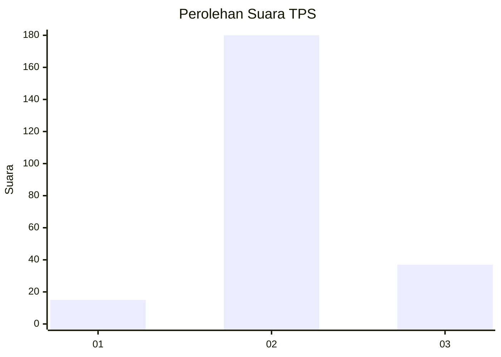
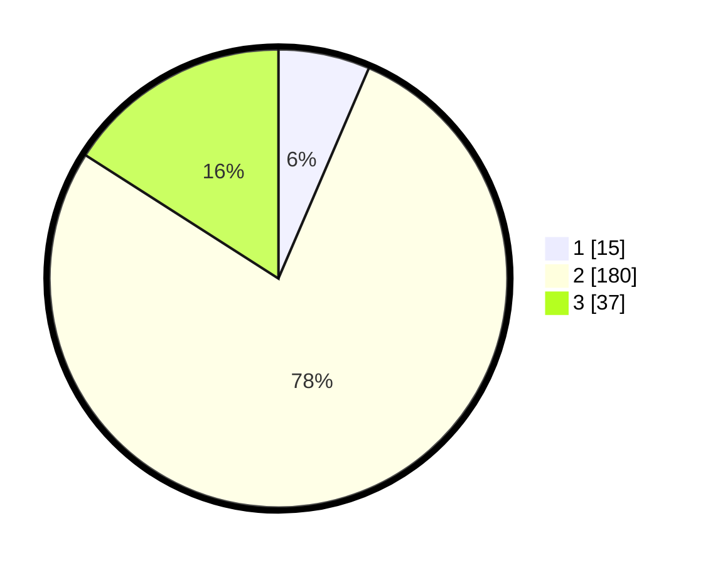

# Hasil

## Grafik

## Tabel

| No. | Nama Paslon    | Suara | Suara (raw) | Persentase |
|:--- |:-------------- | -----:| -----------:| ----------:|
| 1   | ANIES MUHAIMIN | 15    | [15][p-1]   | 6,47       |
| 2   | PRABOWO GIBRAN | 180   | [180][p-2]  | 77,59      |
| 3   | GANJAR MAHFUD  | 37    | [37][p-3]   | 15,95      |

[p-1]: https://github.com/gigit-pemilu/pemilu-2024/blob/main/pilpres/hitung-suara/sub/35-jawa-timur/sub/07-malang/sub/04-sumbermanjing-wetan/sub/2003-sekarbanyu/sub/008-tps/sub/paslon-1.txt
[p-2]: https://github.com/gigit-pemilu/pemilu-2024/blob/main/pilpres/hitung-suara/sub/35-jawa-timur/sub/07-malang/sub/04-sumbermanjing-wetan/sub/2003-sekarbanyu/sub/008-tps/sub/paslon-2.txt
[p-3]: https://github.com/gigit-pemilu/pemilu-2024/blob/main/pilpres/hitung-suara/sub/35-jawa-timur/sub/07-malang/sub/04-sumbermanjing-wetan/sub/2003-sekarbanyu/sub/008-tps/sub/paslon-3.txt

## Foto C Plano

https://sirekap-obj-formc.kpu.go.id/7030/pemilu/ppwp/35/07/04/20/03/3507042003008-20240219-141155--327f5ff7-80cb-4df7-b642-fb5e765fe243.jpg

https://sirekap-obj-formc.kpu.go.id/7030/pemilu/ppwp/35/07/04/20/03/3507042003008-20240219-131354--25491cb3-3edf-4629-9904-972a192cfb3b.jpg

https://sirekap-obj-formc.kpu.go.id/7030/pemilu/ppwp/35/07/04/20/03/3507042003008-20240219-131456--5b12020f-285c-4d7b-8720-0c9636a830e0.jpg

## Metadata

| Key        | Value               |
| ---------- | ------------------- |
| Time Stamp | 2024-02-19 19:00:00 |

