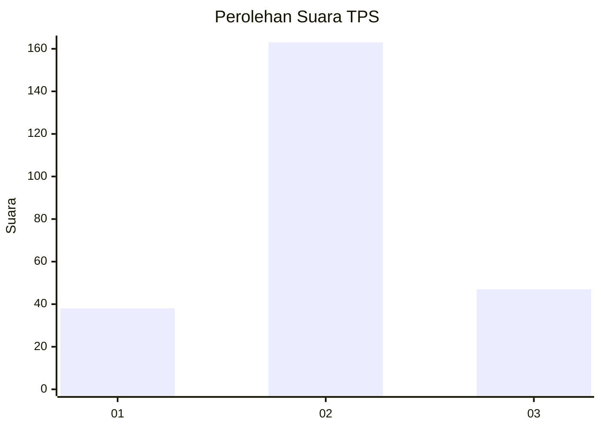
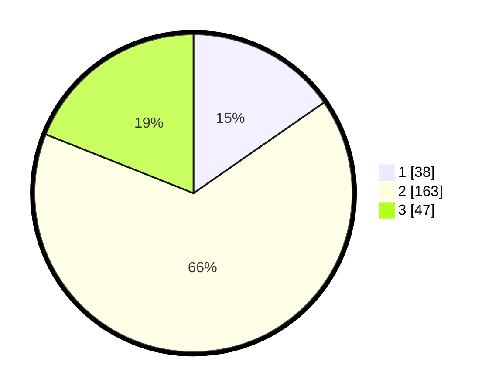

# Hasil

## Grafik

## Tabel

| No. | Nama Paslon    | Suara | Suara (raw) | Persentase |
|:--- |:-------------- | -----:| -----------:| ----------:|
| 1   | ANIES MUHAIMIN | 38    | [38][p-1]   | 15,32      |
| 2   | PRABOWO GIBRAN | 163   | [163][p-2]  | 65,73      |
| 3   | GANJAR MAHFUD  | 47    | [47][p-3]   | 18,95      |

[p-1]: https://github.com/gigit-pemilu/pemilu-2024-35-jawa-timur/blob/main/pilpres/hitung-suara/sub/35-jawa-timur/sub/07-malang/sub/04-sumbermanjing-wetan/sub/2004-klepu/sub/001-tps/sub/paslon-1.txt
[p-2]: https://github.com/gigit-pemilu/pemilu-2024-35-jawa-timur/blob/main/pilpres/hitung-suara/sub/35-jawa-timur/sub/07-malang/sub/04-sumbermanjing-wetan/sub/2004-klepu/sub/001-tps/sub/paslon-2.txt
[p-3]: https://github.com/gigit-pemilu/pemilu-2024-35-jawa-timur/blob/main/pilpres/hitung-suara/sub/35-jawa-timur/sub/07-malang/sub/04-sumbermanjing-wetan/sub/2004-klepu/sub/001-tps/sub/paslon-3.txt

## Foto C Plano

https://sirekap-obj-formc.kpu.go.id/e28f/pemilu/ppwp/35/07/04/20/04/3507042004001-20240217-175316--1e086d79-be7e-449b-93e2-fcd2d9fa5d2b.jpg

https://sirekap-obj-formc.kpu.go.id/e28f/pemilu/ppwp/35/07/04/20/04/3507042004001-20240217-175438--0afd3833-fc94-4e2f-9bc1-92789399fb69.jpg

https://sirekap-obj-formc.kpu.go.id/e28f/pemilu/ppwp/35/07/04/20/04/3507042004001-20240217-175603--f15773d3-9812-4510-be28-eefcd5f92b5f.jpg

## Metadata

| Key        | Value               |
| ---------- | ------------------- |
| Time Stamp | 2024-02-17 19:00:04 |

