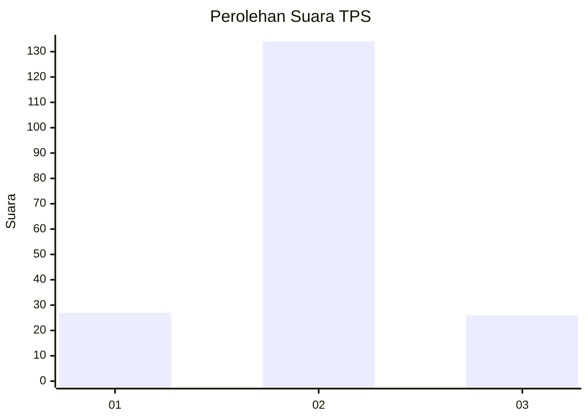
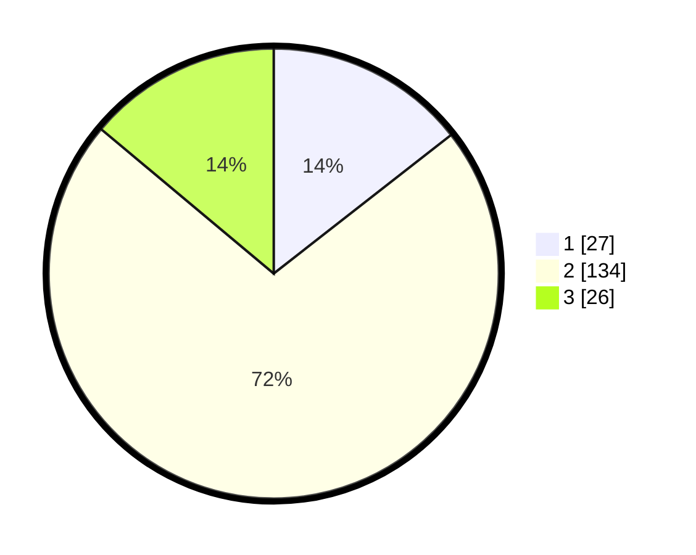

# Hasil

## Grafik

## Tabel

| No. | Nama Paslon    | Suara | Suara (raw) | Persentase |
|:--- |:-------------- | -----:| -----------:| ----------:|
| 1   | ANIES MUHAIMIN | 27    | [27][p-1]   | 14,44      |
| 2   | PRABOWO GIBRAN | 134   | [134][p-2]  | 71,66      |
| 3   | GANJAR MAHFUD  | 26    | [26][p-3]   | 13,90      |

[p-1]: https://github.com/gigit-pemilu/pemilu-2024/blob/main/pilpres/hitung-suara/sub/35-jawa-timur/sub/07-malang/sub/04-sumbermanjing-wetan/sub/2009-argotirto/sub/010-tps/sub/paslon-1.txt
[p-2]: https://github.com/gigit-pemilu/pemilu-2024/blob/main/pilpres/hitung-suara/sub/35-jawa-timur/sub/07-malang/sub/04-sumbermanjing-wetan/sub/2009-argotirto/sub/010-tps/sub/paslon-2.txt
[p-3]: https://github.com/gigit-pemilu/pemilu-2024/blob/main/pilpres/hitung-suara/sub/35-jawa-timur/sub/07-malang/sub/04-sumbermanjing-wetan/sub/2009-argotirto/sub/010-tps/sub/paslon-3.txt

## Foto C Plano

https://sirekap-obj-formc.kpu.go.id/914c/pemilu/ppwp/35/07/04/20/09/3507042009010-20240214-232058--b52fef04-bd5f-4a6e-8da7-b33b7b8f9c2a.jpg

https://sirekap-obj-formc.kpu.go.id/914c/pemilu/ppwp/35/07/04/20/09/3507042009010-20240214-232228--b983b0d5-8571-49d6-8993-f1390f910eb2.jpg

https://sirekap-obj-formc.kpu.go.id/914c/pemilu/ppwp/35/07/04/20/09/3507042009010-20240214-232306--0e8d8808-eb28-40c2-9e80-6e6b91552a9a.jpg

## Metadata

| Key        | Value               |
| ---------- | ------------------- |
| Time Stamp | 2024-02-22 12:00:00 |

