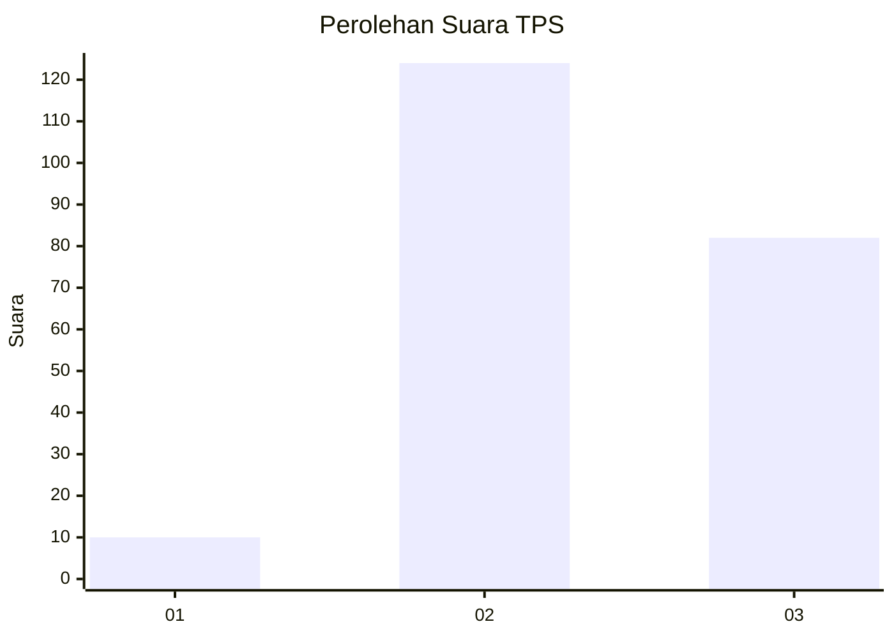
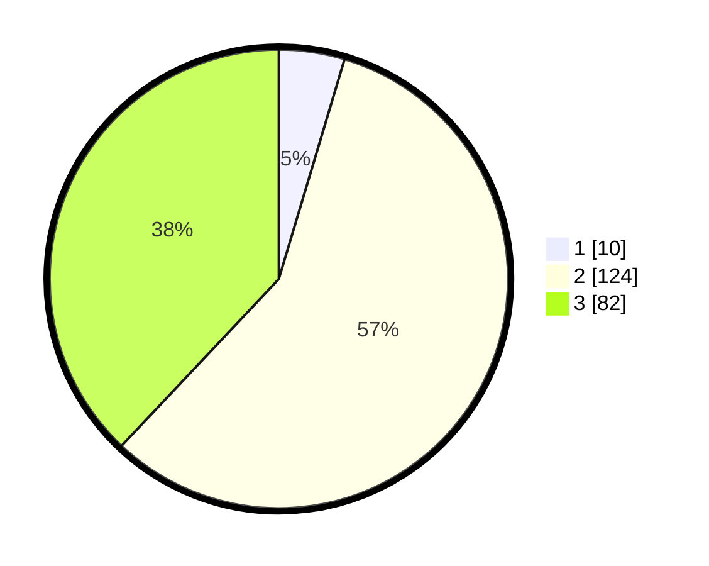

# Hasil

## Grafik

## Tabel

| No. | Nama Paslon    | Suara | Suara (raw) | Persentase |
|:--- |:-------------- | -----:| -----------:| ----------:|
| 1   | ANIES MUHAIMIN | 10    | [10][p-1]   | 4,63       |
| 2   | PRABOWO GIBRAN | 124   | [124][p-2]  | 57,41      |
| 3   | GANJAR MAHFUD  | 82    | [82][p-3]   | 37,96      |

[p-1]: https://github.com/gigit-pemilu/pemilu-2024/blob/main/pilpres/hitung-suara/sub/35-jawa-timur/sub/07-malang/sub/04-sumbermanjing-wetan/sub/2011-sumbermanjing-wetan/sub/005-tps/sub/paslon-1.txt
[p-2]: https://github.com/gigit-pemilu/pemilu-2024/blob/main/pilpres/hitung-suara/sub/35-jawa-timur/sub/07-malang/sub/04-sumbermanjing-wetan/sub/2011-sumbermanjing-wetan/sub/005-tps/sub/paslon-2.txt
[p-3]: https://github.com/gigit-pemilu/pemilu-2024/blob/main/pilpres/hitung-suara/sub/35-jawa-timur/sub/07-malang/sub/04-sumbermanjing-wetan/sub/2011-sumbermanjing-wetan/sub/005-tps/sub/paslon-3.txt

## Foto C Plano

https://sirekap-obj-formc.kpu.go.id/709d/pemilu/ppwp/35/07/04/20/11/3507042011005-20240219-164738--8e0b3a1b-09ca-4607-8570-e9f8a859961f.jpg

https://sirekap-obj-formc.kpu.go.id/709d/pemilu/ppwp/35/07/04/20/11/3507042011005-20240219-164911--742bb08a-3303-40e4-8c2b-ceb10e7505a0.jpg

https://sirekap-obj-formc.kpu.go.id/709d/pemilu/ppwp/35/07/04/20/11/3507042011005-20240219-164835--1a33a7f2-1660-4b42-a0e3-e89bc22e6d5b.jpg

## Metadata

| Key        | Value               |
| ---------- | ------------------- |
| Time Stamp | 2024-02-19 19:00:00 |

