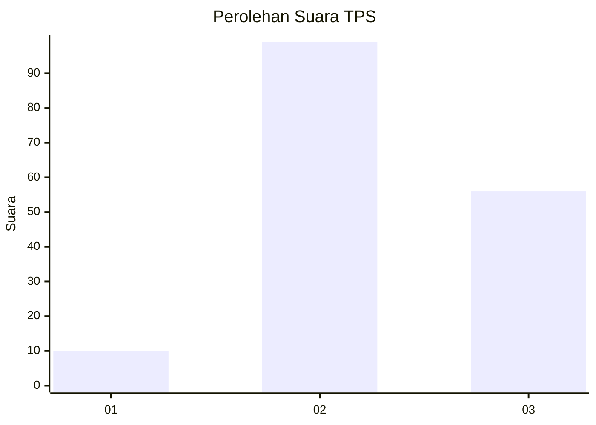
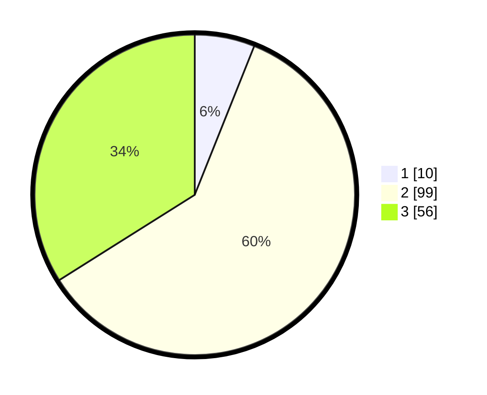

# Hasil

## Grafik

## Tabel

| No. | Nama Paslon    | Suara | Suara (raw) | Persentase |
|:--- |:-------------- | -----:| -----------:| ----------:|
| 1   | ANIES MUHAIMIN | 10    | [10][p-1]   | 6,06       |
| 2   | PRABOWO GIBRAN | 99    | [99][p-2]   | 60,00      |
| 3   | GANJAR MAHFUD  | 56    | [56][p-3]   | 33,94      |

[p-1]: https://github.com/gigit-pemilu/pemilu-2024-35-jawa-timur/blob/main/pilpres/hitung-suara/sub/35-jawa-timur/sub/07-malang/sub/04-sumbermanjing-wetan/sub/2011-sumbermanjing-wetan/sub/007-tps/sub/paslon-1.txt
[p-2]: https://github.com/gigit-pemilu/pemilu-2024-35-jawa-timur/blob/main/pilpres/hitung-suara/sub/35-jawa-timur/sub/07-malang/sub/04-sumbermanjing-wetan/sub/2011-sumbermanjing-wetan/sub/007-tps/sub/paslon-2.txt
[p-3]: https://github.com/gigit-pemilu/pemilu-2024-35-jawa-timur/blob/main/pilpres/hitung-suara/sub/35-jawa-timur/sub/07-malang/sub/04-sumbermanjing-wetan/sub/2011-sumbermanjing-wetan/sub/007-tps/sub/paslon-3.txt

## Foto C Plano

https://sirekap-obj-formc.kpu.go.id/e20a/pemilu/ppwp/35/07/04/20/11/3507042011007-20240219-192037--468bd076-9c24-4551-9bac-7f7c2872c8f2.jpg

https://sirekap-obj-formc.kpu.go.id/e20a/pemilu/ppwp/35/07/04/20/11/3507042011007-20240219-192807--5f2c4586-4a79-48e5-a11b-0a99c3bd04ed.jpg

https://sirekap-obj-formc.kpu.go.id/e20a/pemilu/ppwp/35/07/04/20/11/3507042011007-20240219-192313--645bcd07-4488-4f9c-aa5d-6acaa4583859.jpg

## Metadata

| Key        | Value               |
| ---------- | ------------------- |
| Time Stamp | 2024-02-19 20:00:00 |

