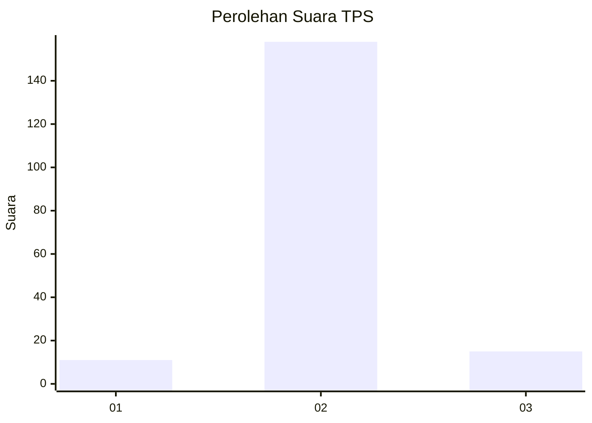
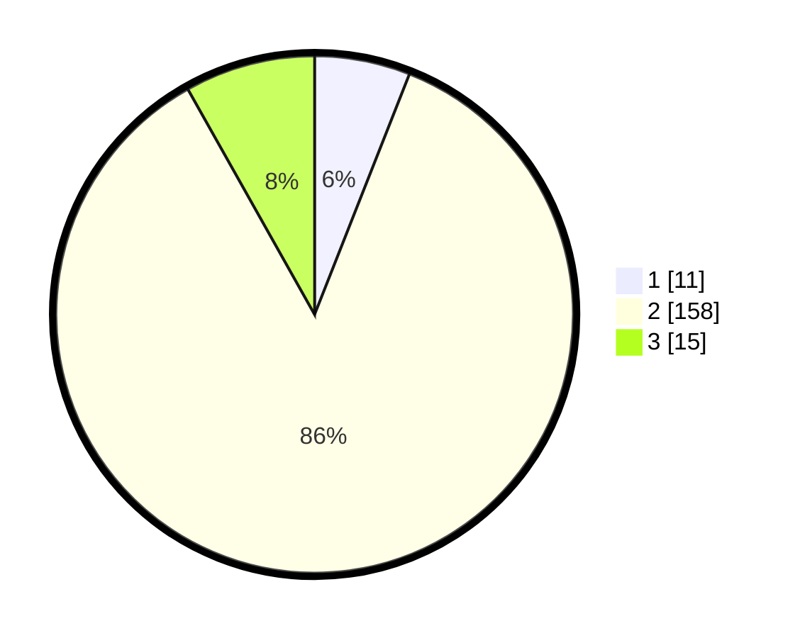

# Hasil

## Grafik

## Tabel

| No. | Nama Paslon    | Suara | Suara (raw) | Persentase |
|:--- |:-------------- | -----:| -----------:| ----------:|
| 1   | ANIES MUHAIMIN | 11    | [11][p-1]   | 5,98       |
| 2   | PRABOWO GIBRAN | 158   | [158][p-2]  | 85,87      |
| 3   | GANJAR MAHFUD  | 15    | [15][p-3]   | 8,15       |

[p-1]: https://github.com/gigit-pemilu/pemilu-2024/blob/main/pilpres/hitung-suara/sub/35-jawa-timur/sub/07-malang/sub/04-sumbermanjing-wetan/sub/2011-sumbermanjing-wetan/sub/011-tps/sub/paslon-1.txt
[p-2]: https://github.com/gigit-pemilu/pemilu-2024/blob/main/pilpres/hitung-suara/sub/35-jawa-timur/sub/07-malang/sub/04-sumbermanjing-wetan/sub/2011-sumbermanjing-wetan/sub/011-tps/sub/paslon-2.txt
[p-3]: https://github.com/gigit-pemilu/pemilu-2024/blob/main/pilpres/hitung-suara/sub/35-jawa-timur/sub/07-malang/sub/04-sumbermanjing-wetan/sub/2011-sumbermanjing-wetan/sub/011-tps/sub/paslon-3.txt

## Foto C Plano

https://sirekap-obj-formc.kpu.go.id/9862/pemilu/ppwp/35/07/04/20/11/3507042011011-20240219-201139--b390be2a-adcb-46be-9049-68f2ba06b348.jpg

https://sirekap-obj-formc.kpu.go.id/9862/pemilu/ppwp/35/07/04/20/11/3507042011011-20240219-201432--9ecabe1b-dd7a-451e-acea-8cd84c271c61.jpg

https://sirekap-obj-formc.kpu.go.id/9862/pemilu/ppwp/35/07/04/20/11/3507042011011-20240219-201555--20739a9d-b304-48b6-8c7a-6ea8293cdacc.jpg

## Metadata

| Key        | Value               |
| ---------- | ------------------- |
| Time Stamp | 2024-02-24 22:31:28 |

