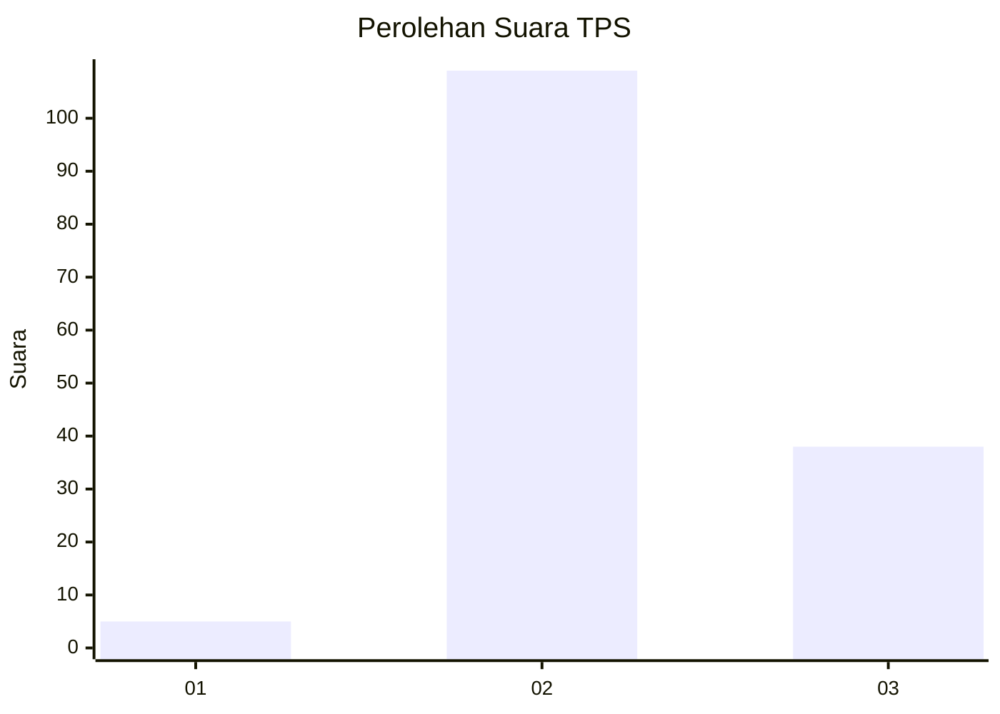
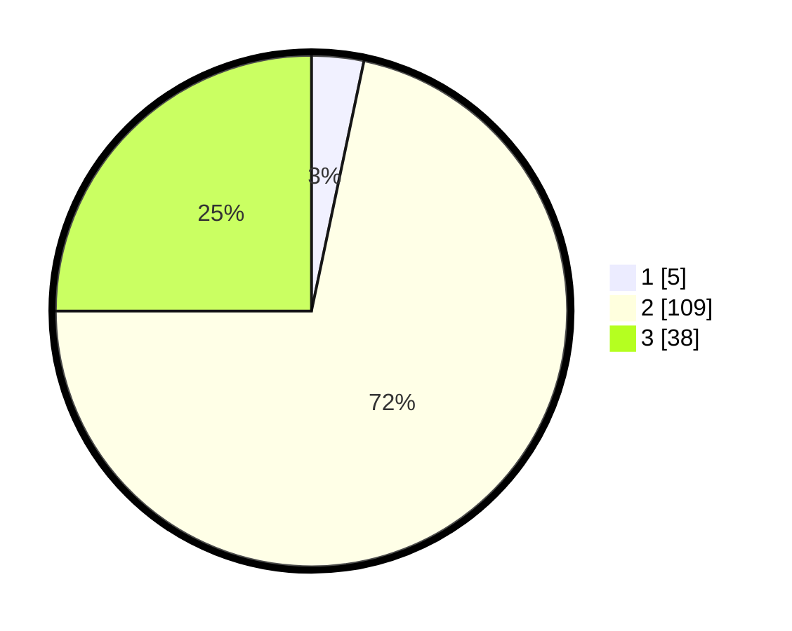

# Hasil

## Grafik

## Tabel

| No. | Nama Paslon    | Suara | Suara (raw) | Persentase |
|:--- |:-------------- | -----:| -----------:| ----------:|
| 1   | ANIES MUHAIMIN | 5     | [5][p-1]    | 3,29       |
| 2   | PRABOWO GIBRAN | 109   | [109][p-2]  | 71,71      |
| 3   | GANJAR MAHFUD  | 38    | [38][p-3]   | 25,00      |

[p-1]: https://github.com/gigit-pemilu/pemilu-2024/blob/main/pilpres/hitung-suara/sub/35-jawa-timur/sub/07-malang/sub/05-dampit/sub/1007-dampit/sub/010-tps/sub/paslon-1.txt
[p-2]: https://github.com/gigit-pemilu/pemilu-2024/blob/main/pilpres/hitung-suara/sub/35-jawa-timur/sub/07-malang/sub/05-dampit/sub/1007-dampit/sub/010-tps/sub/paslon-2.txt
[p-3]: https://github.com/gigit-pemilu/pemilu-2024/blob/main/pilpres/hitung-suara/sub/35-jawa-timur/sub/07-malang/sub/05-dampit/sub/1007-dampit/sub/010-tps/sub/paslon-3.txt

## Foto C Plano

https://sirekap-obj-formc.kpu.go.id/c7de/pemilu/ppwp/35/07/05/10/07/3507051007010-20240217-183002--4f8d6ea7-4e89-4f19-9e38-e56f85566c7d.jpg

https://sirekap-obj-formc.kpu.go.id/c7de/pemilu/ppwp/35/07/05/10/07/3507051007010-20240217-183223--41357269-7c22-4b8f-a2dc-a1e9e119fb4a.jpg

https://sirekap-obj-formc.kpu.go.id/c7de/pemilu/ppwp/35/07/05/10/07/3507051007010-20240217-183349--6372cfd5-9bce-46e5-92d4-4a3b8a5e4c87.jpg

## Metadata

| Key        | Value               |
| ---------- | ------------------- |
| Time Stamp | 2024-02-17 19:30:00 |

