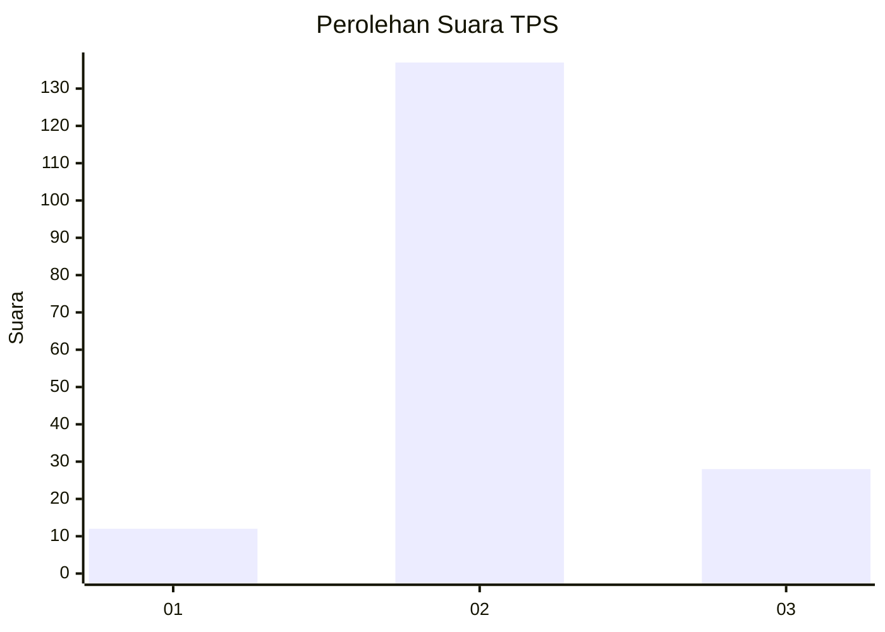
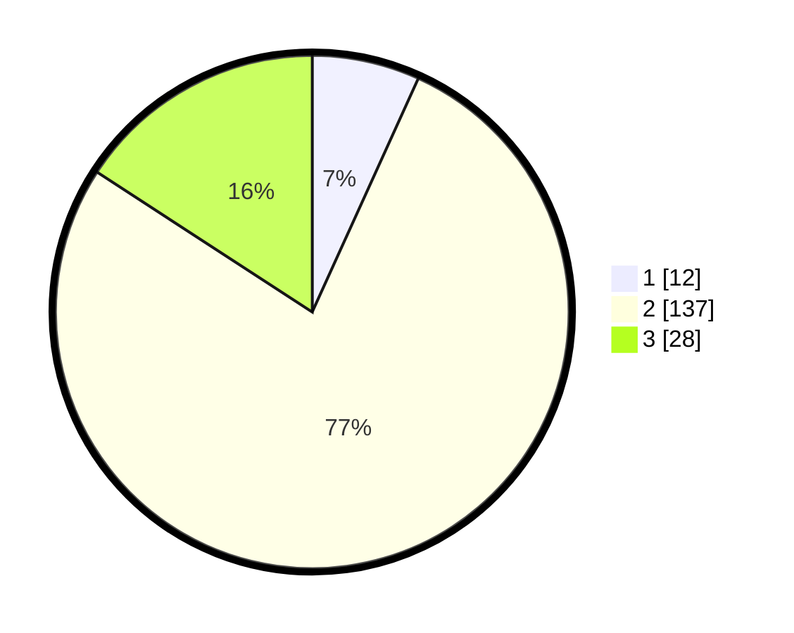

# Hasil

## Grafik

## Tabel

| No. | Nama Paslon    | Suara | Suara (raw) | Persentase |
|:--- |:-------------- | -----:| -----------:| ----------:|
| 1   | ANIES MUHAIMIN | 12    | [12][p-1]   | 6,78       |
| 2   | PRABOWO GIBRAN | 137   | [137][p-2]  | 77,40      |
| 3   | GANJAR MAHFUD  | 28    | [28][p-3]   | 15,82      |

[p-1]: https://github.com/gigit-pemilu/pemilu-2024/blob/main/pilpres/hitung-suara/sub/35-jawa-timur/sub/07-malang/sub/05-dampit/sub/2009-majangtengah/sub/036-tps/sub/paslon-1.txt
[p-2]: https://github.com/gigit-pemilu/pemilu-2024/blob/main/pilpres/hitung-suara/sub/35-jawa-timur/sub/07-malang/sub/05-dampit/sub/2009-majangtengah/sub/036-tps/sub/paslon-2.txt
[p-3]: https://github.com/gigit-pemilu/pemilu-2024/blob/main/pilpres/hitung-suara/sub/35-jawa-timur/sub/07-malang/sub/05-dampit/sub/2009-majangtengah/sub/036-tps/sub/paslon-3.txt

## Foto C Plano

https://sirekap-obj-formc.kpu.go.id/34c1/pemilu/ppwp/35/07/05/20/09/3507052009036-20240217-180026--f874502e-a7c3-40d8-b08c-344f5a552dd5.jpg

https://sirekap-obj-formc.kpu.go.id/34c1/pemilu/ppwp/35/07/05/20/09/3507052009036-20240217-175725--e942b0d6-9b0b-4ce1-81b7-1a0547afa670.jpg

https://sirekap-obj-formc.kpu.go.id/34c1/pemilu/ppwp/35/07/05/20/09/3507052009036-20240217-180519--6d484750-2070-4dd8-8e5e-f7c3ec6c5d48.jpg

## Metadata

| Key        | Value               |
| ---------- | ------------------- |
| Time Stamp | 2024-02-17 18:30:00 |

