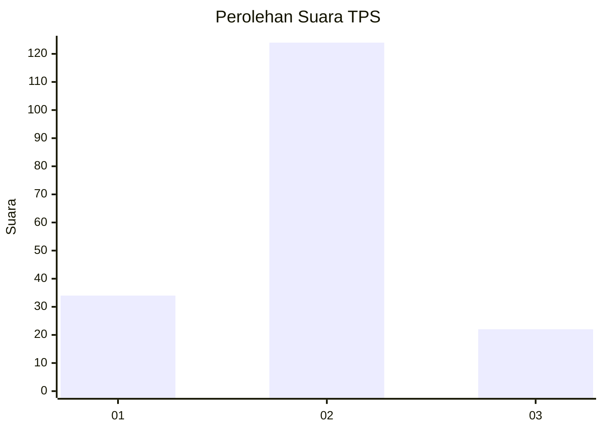
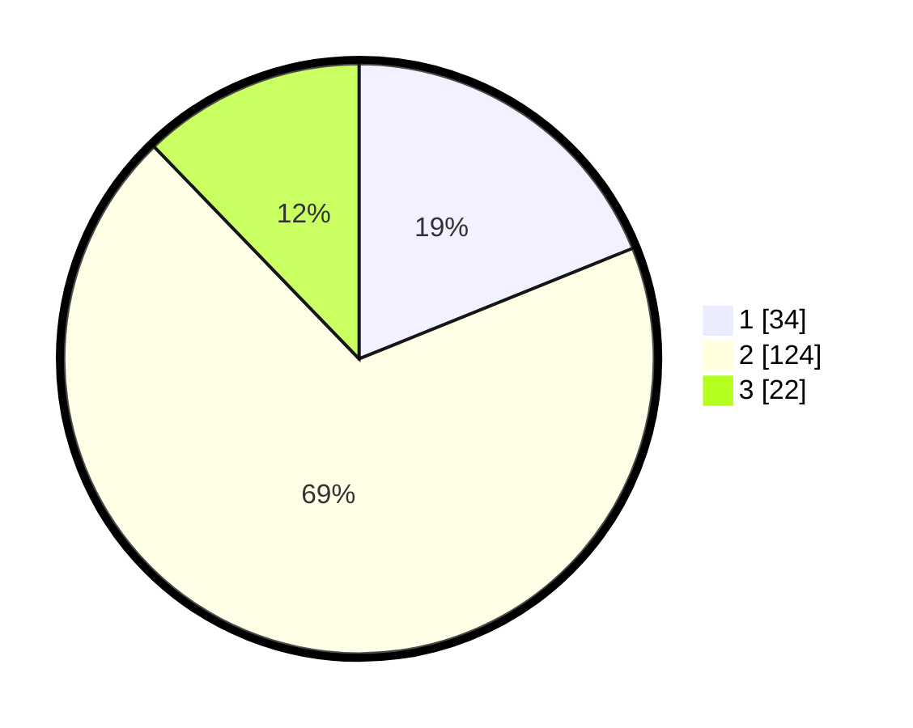

# Hasil

## Grafik

## Tabel

| No. | Nama Paslon    | Suara | Suara (raw) | Persentase |
|:--- |:-------------- | -----:| -----------:| ----------:|
| 1   | ANIES MUHAIMIN | 34    | [34][p-1]   | 18,89      |
| 2   | PRABOWO GIBRAN | 124   | [124][p-2]  | 68,89      |
| 3   | GANJAR MAHFUD  | 22    | [22][p-3]   | 12,22      |

[p-1]: https://github.com/gigit-pemilu/pemilu-2024/blob/main/pilpres/hitung-suara/sub/35-jawa-timur/sub/07-malang/sub/07-poncokusumo/sub/2001-dawuhan/sub/005-tps/sub/paslon-1.txt
[p-2]: https://github.com/gigit-pemilu/pemilu-2024/blob/main/pilpres/hitung-suara/sub/35-jawa-timur/sub/07-malang/sub/07-poncokusumo/sub/2001-dawuhan/sub/005-tps/sub/paslon-2.txt
[p-3]: https://github.com/gigit-pemilu/pemilu-2024/blob/main/pilpres/hitung-suara/sub/35-jawa-timur/sub/07-malang/sub/07-poncokusumo/sub/2001-dawuhan/sub/005-tps/sub/paslon-3.txt

## Foto C Plano

https://sirekap-obj-formc.kpu.go.id/f816/pemilu/ppwp/35/07/07/20/01/3507072001005-20240220-215340--90fc99d2-a38a-4eeb-afef-b1c720641083.jpg

https://sirekap-obj-formc.kpu.go.id/f816/pemilu/ppwp/35/07/07/20/01/3507072001005-20240220-215342--3a5abe1d-eb70-4b29-9ac8-701d2232e08f.jpg

https://sirekap-obj-formc.kpu.go.id/f816/pemilu/ppwp/35/07/07/20/01/3507072001005-20240220-215341--3862491b-33fe-460d-9b3d-6b9e6b348b99.jpg

## Metadata

| Key        | Value               |
| ---------- | ------------------- |
| Time Stamp | 2024-02-24 22:31:28 |

## DATA PEMILIH TETAP

Jumlah pemilih dalam DPT: **219**.
 * L: **106**.
 * P: **113**.

## DATA PENGGUNA HAK PILIH

Jumlah pengguna hak pilih dalam DPT: **183**.
 * L: **83**.
 * P: **100**.

Jumlah pengguna hak pilih dalam DPTb: **0**.
 * L: **0**.
 * P: **0**.

Jumlah pengguna hak pilih dalam DPK: **0**.
 * L: **0**.
 * P: **0**.

Jumlah pengguna hak pilih: **183**.
 * L: **83**.
 * P: **100**.

## JUMLAH SUARA SAH DAN TIDAK SAH

JUMLAH SELURUH SUARA SAH: **180**.

JUMLAH SUARA TIDAK SAH: **3**.

JUMLAH SELURUH SUARA SAH DAN SUARA TIDAK SAH: **183**.

