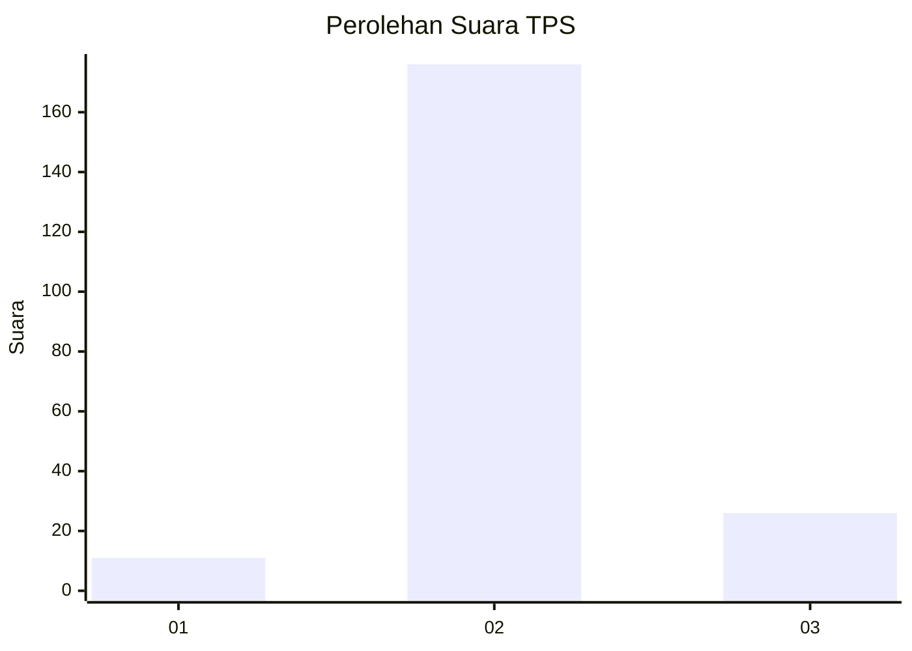
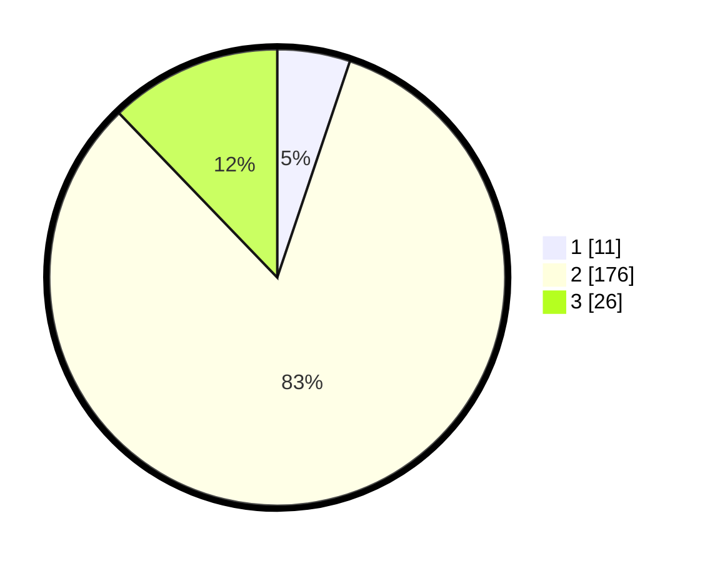

# Hasil

## Grafik

## Tabel

| No. | Nama Paslon    | Suara | Suara (raw) | Persentase |
|:--- |:-------------- | -----:| -----------:| ----------:|
| 1   | ANIES MUHAIMIN | 11    | [11][p-1]   | 5,16       |
| 2   | PRABOWO GIBRAN | 176   | [176][p-2]  | 82,63      |
| 3   | GANJAR MAHFUD  | 26    | [26][p-3]   | 12,21      |

[p-1]: https://github.com/gigit-pemilu/pemilu-2024/blob/main/pilpres/hitung-suara/sub/35-jawa-timur/sub/07-malang/sub/07-poncokusumo/sub/2002-sumberejo/sub/010-tps/sub/paslon-1.txt
[p-2]: https://github.com/gigit-pemilu/pemilu-2024/blob/main/pilpres/hitung-suara/sub/35-jawa-timur/sub/07-malang/sub/07-poncokusumo/sub/2002-sumberejo/sub/010-tps/sub/paslon-2.txt
[p-3]: https://github.com/gigit-pemilu/pemilu-2024/blob/main/pilpres/hitung-suara/sub/35-jawa-timur/sub/07-malang/sub/07-poncokusumo/sub/2002-sumberejo/sub/010-tps/sub/paslon-3.txt

## Foto C Plano

https://sirekap-obj-formc.kpu.go.id/9c7d/pemilu/ppwp/35/07/07/20/02/3507072002010-20240214-222807--fa3272cd-a7fa-4748-800b-5f52f5672296.jpg

https://sirekap-obj-formc.kpu.go.id/9c7d/pemilu/ppwp/35/07/07/20/02/3507072002010-20240214-223100--248fe77a-b25a-4f95-a913-312c5e7cd9e6.jpg

https://sirekap-obj-formc.kpu.go.id/9c7d/pemilu/ppwp/35/07/07/20/02/3507072002010-20240214-223238--d7a9e6bf-45f6-417a-b0ee-b7cd46cec7ad.jpg

## Metadata

| Key        | Value               |
| ---------- | ------------------- |
| Time Stamp | 2024-02-25 17:00:00 |

