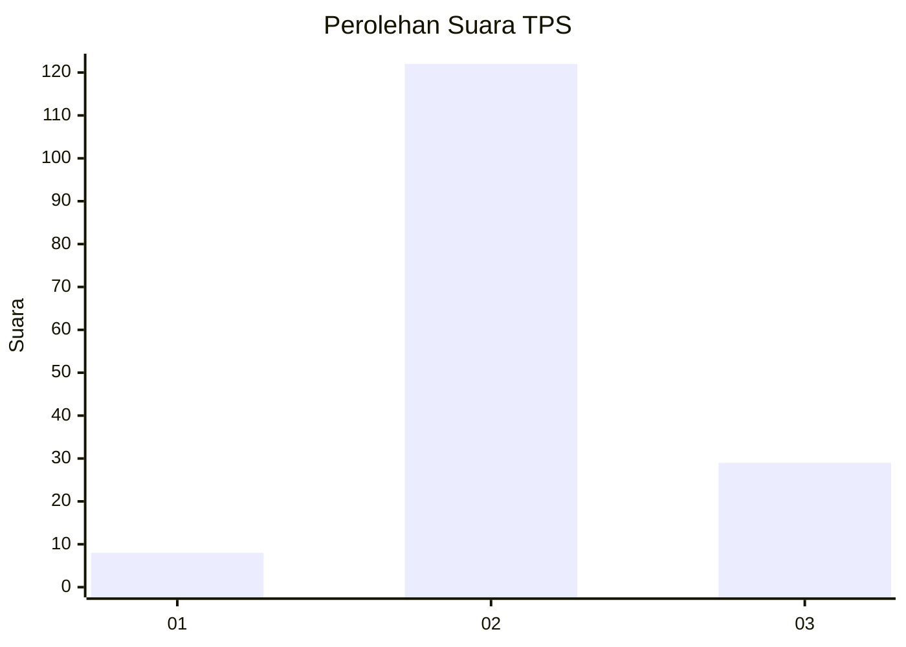
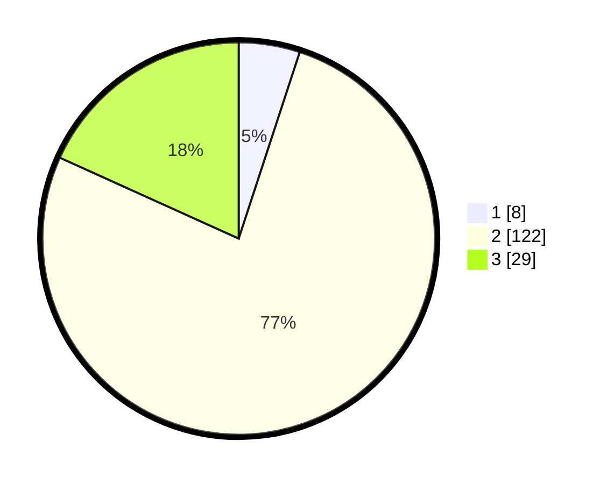

# Hasil

## Grafik

## Tabel

| No. | Nama Paslon    | Suara | Suara (raw) | Persentase |
|:--- |:-------------- | -----:| -----------:| ----------:|
| 1   | ANIES MUHAIMIN | 8     | [8][p-1]    | 5,03       |
| 2   | PRABOWO GIBRAN | 122   | [122][p-2]  | 76,73      |
| 3   | GANJAR MAHFUD  | 29    | [29][p-3]   | 18,24      |

[p-1]: https://github.com/gigit-pemilu/pemilu-2024-35-jawa-timur/blob/main/pilpres/hitung-suara/sub/35-jawa-timur/sub/07-malang/sub/07-poncokusumo/sub/2002-sumberejo/sub/016-tps/sub/paslon-1.txt
[p-2]: https://github.com/gigit-pemilu/pemilu-2024-35-jawa-timur/blob/main/pilpres/hitung-suara/sub/35-jawa-timur/sub/07-malang/sub/07-poncokusumo/sub/2002-sumberejo/sub/016-tps/sub/paslon-2.txt
[p-3]: https://github.com/gigit-pemilu/pemilu-2024-35-jawa-timur/blob/main/pilpres/hitung-suara/sub/35-jawa-timur/sub/07-malang/sub/07-poncokusumo/sub/2002-sumberejo/sub/016-tps/sub/paslon-3.txt

## Foto C Plano

https://sirekap-obj-formc.kpu.go.id/166f/pemilu/ppwp/35/07/07/20/02/3507072002016-20240215-021157--7ad710e4-90d3-46e7-bb72-994e0aa832a1.jpg

https://sirekap-obj-formc.kpu.go.id/166f/pemilu/ppwp/35/07/07/20/02/3507072002016-20240215-020908--10bf06ed-7607-45f4-8600-a9824dacd1e7.jpg

https://sirekap-obj-formc.kpu.go.id/166f/pemilu/ppwp/35/07/07/20/02/3507072002016-20240215-021335--955d6915-6b56-4c41-9949-41160bfbced6.jpg

## Metadata

| Key        | Value               |
| ---------- | ------------------- |
| Time Stamp | 2024-02-25 12:00:00 |

