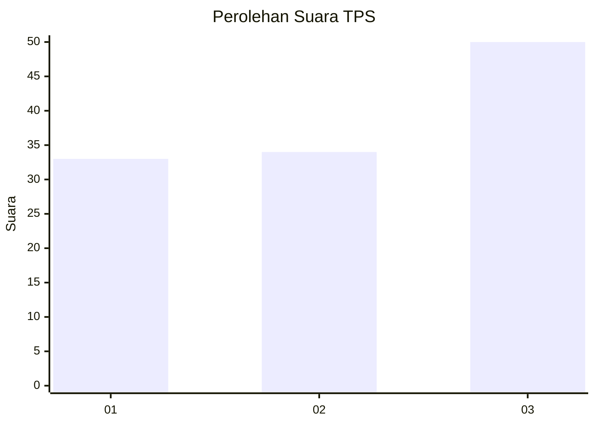
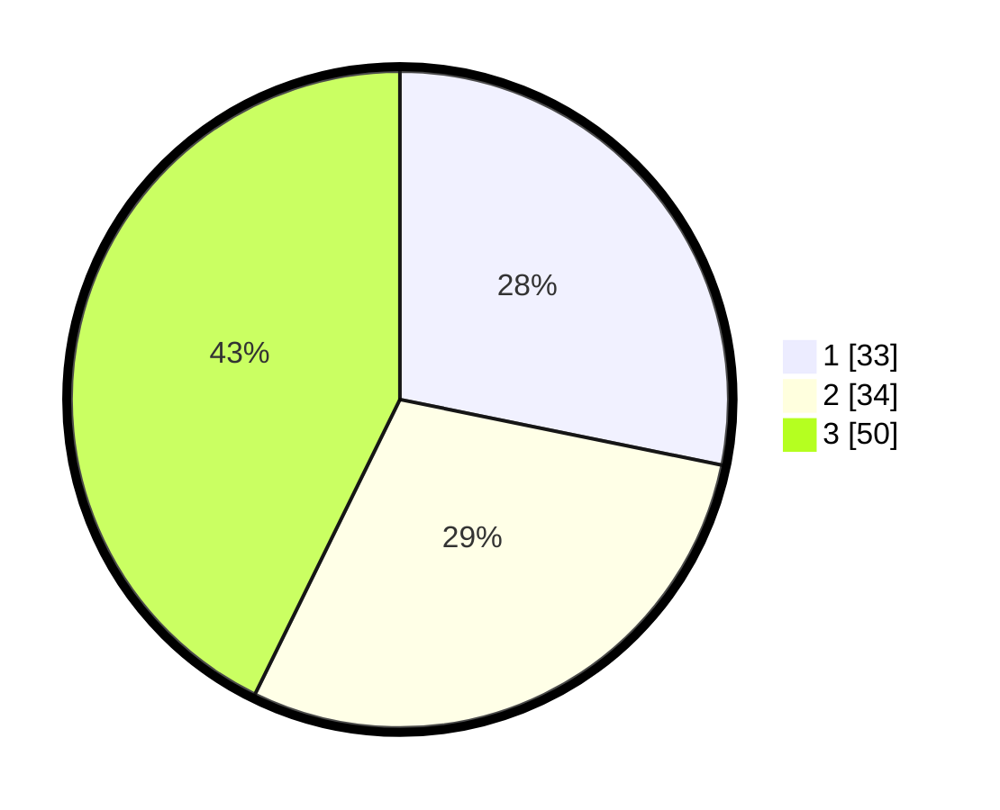

# Hasil

## Grafik

## Tabel

| No. | Nama Paslon    | Suara | Suara (raw) | Persentase |
|:--- |:-------------- | -----:| -----------:| ----------:|
| 1   | ANIES MUHAIMIN | 33    | [33][p-1]   | 28,21      |
| 2   | PRABOWO GIBRAN | 34    | [34][p-2]   | 29,06      |
| 3   | GANJAR MAHFUD  | 50    | [50][p-3]   | 42,74      |

[p-1]: https://github.com/gigit-pemilu/pemilu-2024/blob/main/pilpres/hitung-suara/sub/35-jawa-timur/sub/07-malang/sub/07-poncokusumo/sub/2005-wonorejo/sub/004-tps/sub/paslon-1.txt
[p-2]: https://github.com/gigit-pemilu/pemilu-2024/blob/main/pilpres/hitung-suara/sub/35-jawa-timur/sub/07-malang/sub/07-poncokusumo/sub/2005-wonorejo/sub/004-tps/sub/paslon-2.txt
[p-3]: https://github.com/gigit-pemilu/pemilu-2024/blob/main/pilpres/hitung-suara/sub/35-jawa-timur/sub/07-malang/sub/07-poncokusumo/sub/2005-wonorejo/sub/004-tps/sub/paslon-3.txt

## Foto C Plano

https://sirekap-obj-formc.kpu.go.id/0578/pemilu/ppwp/35/07/07/20/05/3507072005004-20240219-175516--6c0a08c4-ae3e-4af8-90bf-ce314c2591a4.jpg

https://sirekap-obj-formc.kpu.go.id/0578/pemilu/ppwp/35/07/07/20/05/3507072005004-20240219-175554--21702538-2718-4048-adc5-5903bad58009.jpg

https://sirekap-obj-formc.kpu.go.id/0578/pemilu/ppwp/35/07/07/20/05/3507072005004-20240219-175651--1a044b4b-4a32-49d8-9bcf-24abe4935c52.jpg

## Metadata

| Key        | Value               |
| ---------- | ------------------- |
| Time Stamp | 2024-02-19 18:00:00 |

## DATA PEMILIH TETAP

Jumlah pemilih dalam DPT: **0**.
 * L: **242**.
 * P: **243**.

## DATA PENGGUNA HAK PILIH

Jumlah pengguna hak pilih dalam DPT: **0**.
 * L: **223**.
 * P: **226**.

Jumlah pengguna hak pilih dalam DPTb: **555**.
 * L: **0**.
 * P: **0**.

Jumlah pengguna hak pilih dalam DPK: **727**.
 * L: **828**.
 * P: **222**.

Jumlah pengguna hak pilih: **249**.
 * L: **223**.
 * P: **222**.

## JUMLAH SUARA SAH DAN TIDAK SAH

JUMLAH SELURUH SUARA SAH: **233**.

JUMLAH SUARA TIDAK SAH: **11**.

JUMLAH SELURUH SUARA SAH DAN SUARA TIDAK SAH: **224**.

