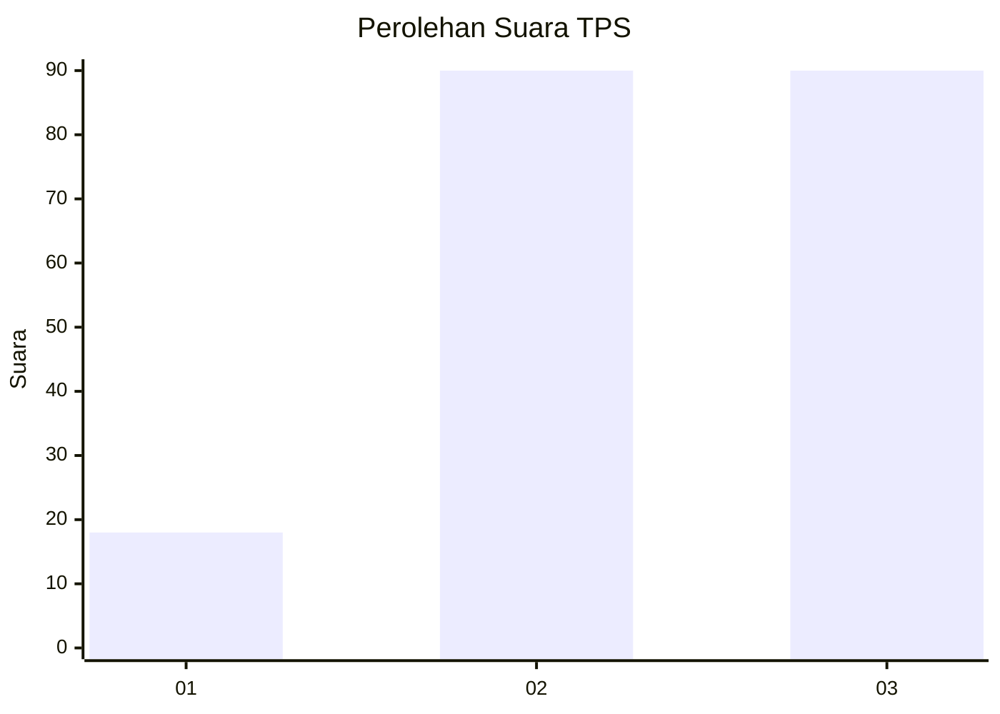
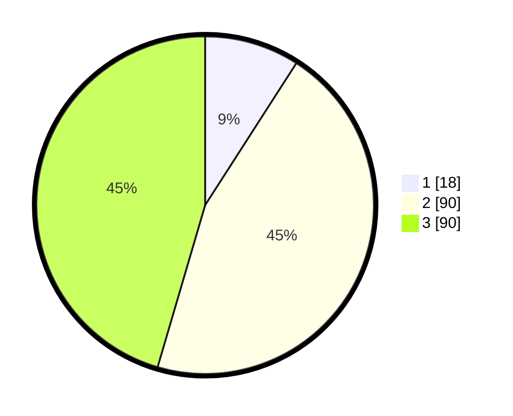

# Hasil

## Grafik

## Tabel

| No. | Nama Paslon    | Suara | Suara (raw) | Persentase |
|:--- |:-------------- | -----:| -----------:| ----------:|
| 1   | ANIES MUHAIMIN | 18    | [18][p-1]   | 9,09       |
| 2   | PRABOWO GIBRAN | 90    | [90][p-2]   | 45,45      |
| 3   | GANJAR MAHFUD  | 90    | [90][p-3]   | 45,45      |

[p-1]: https://github.com/gigit-pemilu/pemilu-2024-35-jawa-timur/blob/main/pilpres/hitung-suara/sub/35-jawa-timur/sub/07-malang/sub/07-poncokusumo/sub/2013-belung/sub/018-tps/sub/paslon-1.txt
[p-2]: https://github.com/gigit-pemilu/pemilu-2024-35-jawa-timur/blob/main/pilpres/hitung-suara/sub/35-jawa-timur/sub/07-malang/sub/07-poncokusumo/sub/2013-belung/sub/018-tps/sub/paslon-2.txt
[p-3]: https://github.com/gigit-pemilu/pemilu-2024-35-jawa-timur/blob/main/pilpres/hitung-suara/sub/35-jawa-timur/sub/07-malang/sub/07-poncokusumo/sub/2013-belung/sub/018-tps/sub/paslon-3.txt

## Foto C Plano

https://sirekap-obj-formc.kpu.go.id/6989/pemilu/ppwp/35/07/07/20/13/3507072013018-20240220-130419--e55ea4a7-c1fb-4944-9085-fa2782b4dcfe.jpg

https://sirekap-obj-formc.kpu.go.id/6989/pemilu/ppwp/35/07/07/20/13/3507072013018-20240220-125942--7a182efe-bcaa-4650-a346-c5673f450891.jpg

https://sirekap-obj-formc.kpu.go.id/6989/pemilu/ppwp/35/07/07/20/13/3507072013018-20240220-130539--d8e174f6-bbe4-4472-bf7e-13ef1ef8dcba.jpg

## Metadata

| Key        | Value               |
| ---------- | ------------------- |
| Time Stamp | 2024-02-25 03:00:00 |

