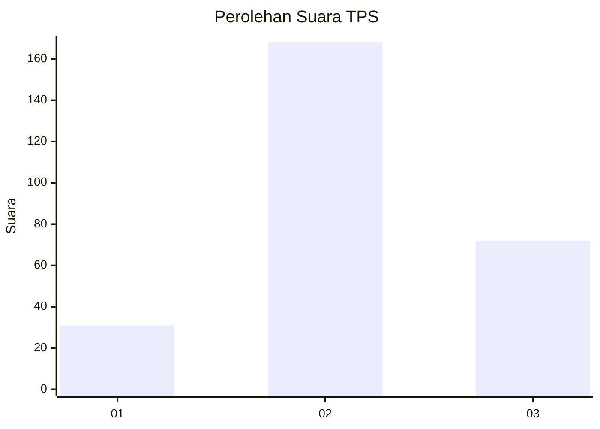
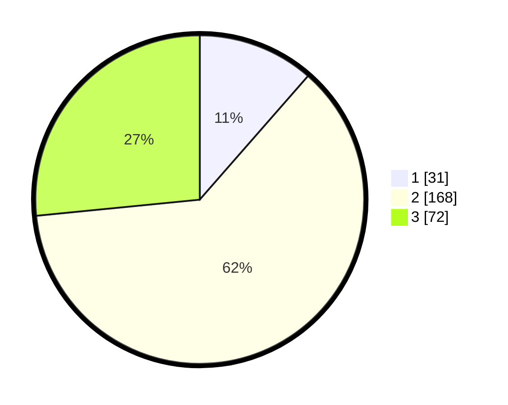

# Hasil

## Grafik

## Tabel

| No. | Nama Paslon    | Suara | Suara (raw) | Persentase |
|:--- |:-------------- | -----:| -----------:| ----------:|
| 1   | ANIES MUHAIMIN | 31    | [31][p-1]   | 11,44      |
| 2   | PRABOWO GIBRAN | 168   | [168][p-2]  | 61,99      |
| 3   | GANJAR MAHFUD  | 72    | [72][p-3]   | 26,57      |

[p-1]: https://github.com/gigit-pemilu/pemilu-2024-35-jawa-timur/blob/main/pilpres/hitung-suara/sub/35-jawa-timur/sub/07-malang/sub/07-poncokusumo/sub/2014-wringinanom/sub/006-tps/sub/paslon-1.txt
[p-2]: https://github.com/gigit-pemilu/pemilu-2024-35-jawa-timur/blob/main/pilpres/hitung-suara/sub/35-jawa-timur/sub/07-malang/sub/07-poncokusumo/sub/2014-wringinanom/sub/006-tps/sub/paslon-2.txt
[p-3]: https://github.com/gigit-pemilu/pemilu-2024-35-jawa-timur/blob/main/pilpres/hitung-suara/sub/35-jawa-timur/sub/07-malang/sub/07-poncokusumo/sub/2014-wringinanom/sub/006-tps/sub/paslon-3.txt

## Foto C Plano

https://sirekap-obj-formc.kpu.go.id/92fb/pemilu/ppwp/35/07/07/20/14/3507072014006-20240215-014806--3b98dddf-7e26-4b71-a260-43ca519f4897.jpg

https://sirekap-obj-formc.kpu.go.id/92fb/pemilu/ppwp/35/07/07/20/14/3507072014006-20240215-020516--d64c5291-0bfe-4a96-949e-e1af1efb37e6.jpg

https://sirekap-obj-formc.kpu.go.id/92fb/pemilu/ppwp/35/07/07/20/14/3507072014006-20240215-015014--360ddbf9-e4c1-4e0b-a856-6e3a1b6346de.jpg

## Metadata

| Key        | Value               |
| ---------- | ------------------- |
| Time Stamp | 2024-02-17 10:30:03 |

