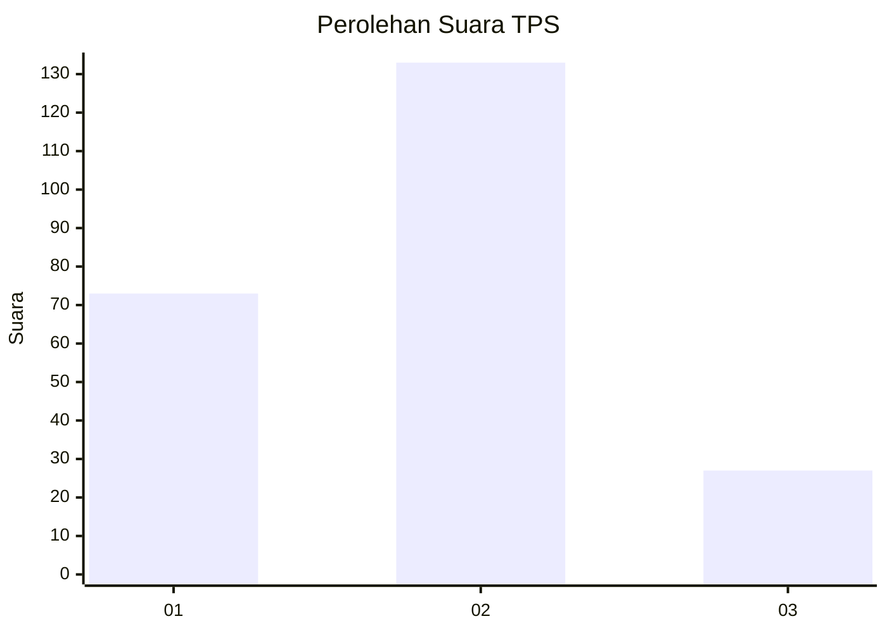
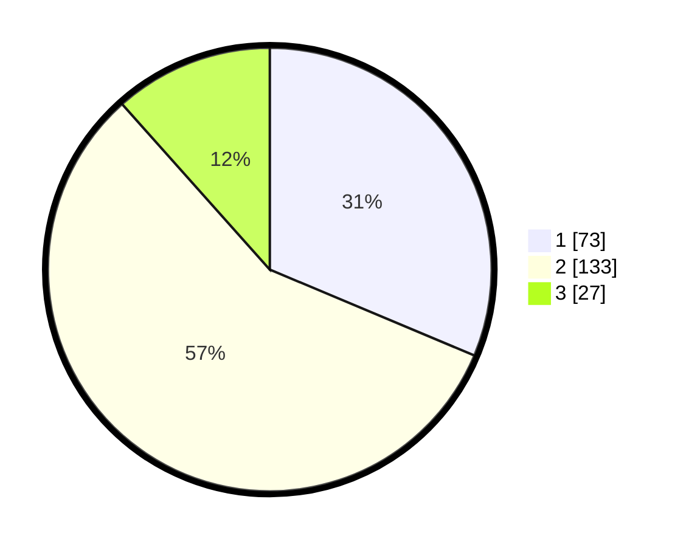

# Hasil

## Grafik

## Tabel

| No. | Nama Paslon    | Suara | Suara (raw) | Persentase |
|:--- |:-------------- | -----:| -----------:| ----------:|
| 1   | ANIES MUHAIMIN | 73    | [73][p-1]   | 31,33      |
| 2   | PRABOWO GIBRAN | 133   | [133][p-2]  | 57,08      |
| 3   | GANJAR MAHFUD  | 27    | [27][p-3]   | 11,59      |

[p-1]: https://github.com/gigit-pemilu/pemilu-2024-35-jawa-timur/blob/main/pilpres/hitung-suara/sub/35-jawa-timur/sub/07-malang/sub/07-poncokusumo/sub/2016-gubugklakah/sub/002-tps/sub/paslon-1.txt
[p-2]: https://github.com/gigit-pemilu/pemilu-2024-35-jawa-timur/blob/main/pilpres/hitung-suara/sub/35-jawa-timur/sub/07-malang/sub/07-poncokusumo/sub/2016-gubugklakah/sub/002-tps/sub/paslon-2.txt
[p-3]: https://github.com/gigit-pemilu/pemilu-2024-35-jawa-timur/blob/main/pilpres/hitung-suara/sub/35-jawa-timur/sub/07-malang/sub/07-poncokusumo/sub/2016-gubugklakah/sub/002-tps/sub/paslon-3.txt

## Foto C Plano

https://sirekap-obj-formc.kpu.go.id/9fa2/pemilu/ppwp/35/07/07/20/16/3507072016002-20240218-095953--84d4f37b-dc71-4813-9b41-43bd60afe8d1.jpg

https://sirekap-obj-formc.kpu.go.id/9fa2/pemilu/ppwp/35/07/07/20/16/3507072016002-20240218-095954--b5e388af-c48b-4556-a60a-4b46c444b8f4.jpg

https://sirekap-obj-formc.kpu.go.id/9fa2/pemilu/ppwp/35/07/07/20/16/3507072016002-20240218-095953--669b531f-89af-46b6-a382-2f0af0e6d1b1.jpg

## Metadata

| Key        | Value               |
| ---------- | ------------------- |
| Time Stamp | 2024-02-21 21:00:04 |

## DATA PEMILIH TETAP

Jumlah pemilih dalam DPT: **268**.
 * L: **127**.
 * P: **141**.

## DATA PENGGUNA HAK PILIH

Jumlah pengguna hak pilih dalam DPT: **230**.
 * L: **126**.
 * P: **104**.

Jumlah pengguna hak pilih dalam DPTb: **11**.
 * L: **11**.
 * P: **0**.

Jumlah pengguna hak pilih dalam DPK: **1**.
 * L: **0**.
 * P: **1**.

Jumlah pengguna hak pilih: **242**.
 * L: **137**.
 * P: **105**.

## JUMLAH SUARA SAH DAN TIDAK SAH

JUMLAH SELURUH SUARA SAH: **233**.

JUMLAH SUARA TIDAK SAH: **9**.

JUMLAH SELURUH SUARA SAH DAN SUARA TIDAK SAH: **242**.

