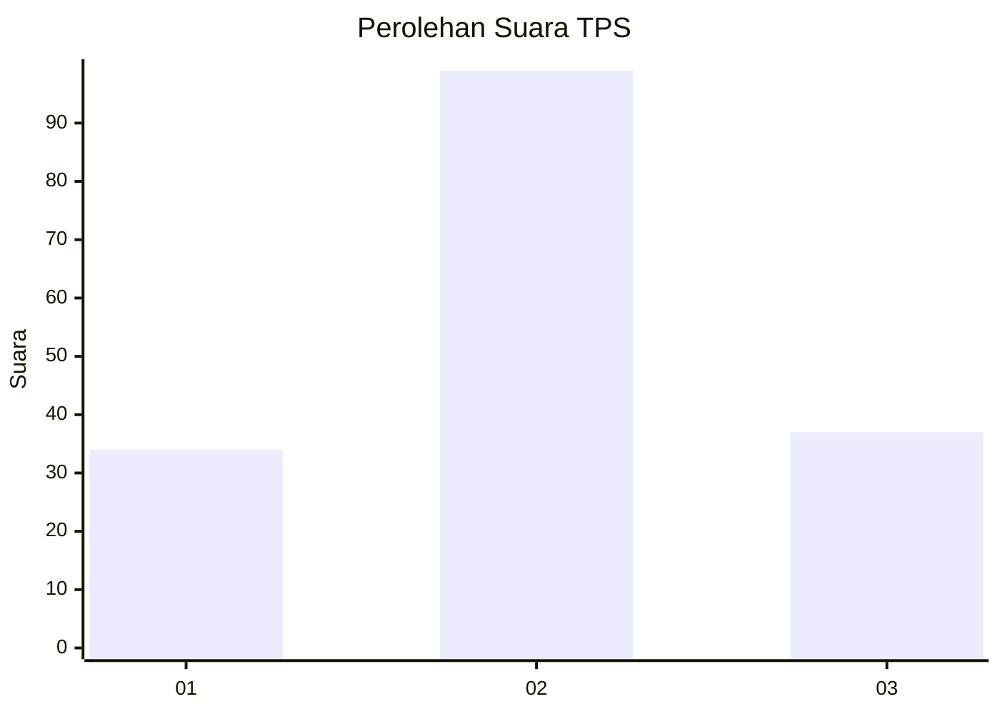
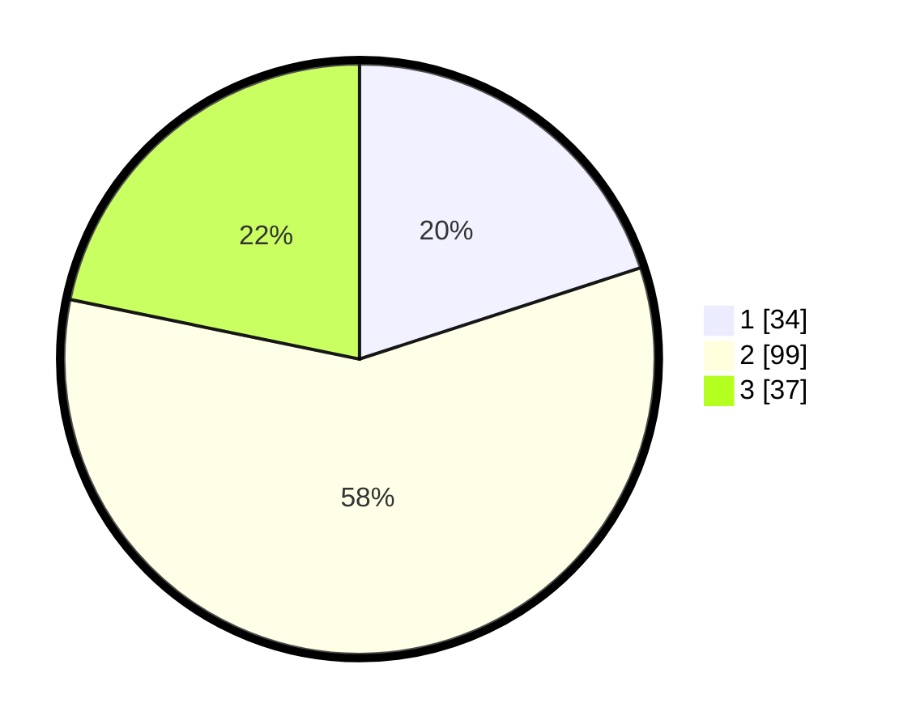

# Hasil

## Grafik

## Tabel

| No. | Nama Paslon    | Suara | Suara (raw) | Persentase |
|:--- |:-------------- | -----:| -----------:| ----------:|
| 1   | ANIES MUHAIMIN | 34    | [34][p-1]   | 20,00      |
| 2   | PRABOWO GIBRAN | 99    | [99][p-2]   | 58,24      |
| 3   | GANJAR MAHFUD  | 37    | [37][p-3]   | 21,76      |

[p-1]: https://github.com/gigit-pemilu/pemilu-2024/blob/main/pilpres/hitung-suara/sub/35-jawa-timur/sub/07-malang/sub/08-wajak/sub/2001-sumberputih/sub/008-tps/sub/paslon-1.txt
[p-2]: https://github.com/gigit-pemilu/pemilu-2024/blob/main/pilpres/hitung-suara/sub/35-jawa-timur/sub/07-malang/sub/08-wajak/sub/2001-sumberputih/sub/008-tps/sub/paslon-2.txt
[p-3]: https://github.com/gigit-pemilu/pemilu-2024/blob/main/pilpres/hitung-suara/sub/35-jawa-timur/sub/07-malang/sub/08-wajak/sub/2001-sumberputih/sub/008-tps/sub/paslon-3.txt

## Foto C Plano

https://sirekap-obj-formc.kpu.go.id/0217/pemilu/ppwp/35/07/08/20/01/3507082001008-20240215-000719--cf402c07-4d4d-4413-b670-f92e6a9cf02c.jpg

https://sirekap-obj-formc.kpu.go.id/0217/pemilu/ppwp/35/07/08/20/01/3507082001008-20240215-030530--42347244-b560-4d41-ba34-00f7dff4069e.jpg

https://sirekap-obj-formc.kpu.go.id/0217/pemilu/ppwp/35/07/08/20/01/3507082001008-20240215-002500--d9847c8f-f26b-4a9e-929a-8dc240ec229b.jpg

## Metadata

| Key        | Value               |
| ---------- | ------------------- |
| Time Stamp | 2024-02-24 22:31:28 |

