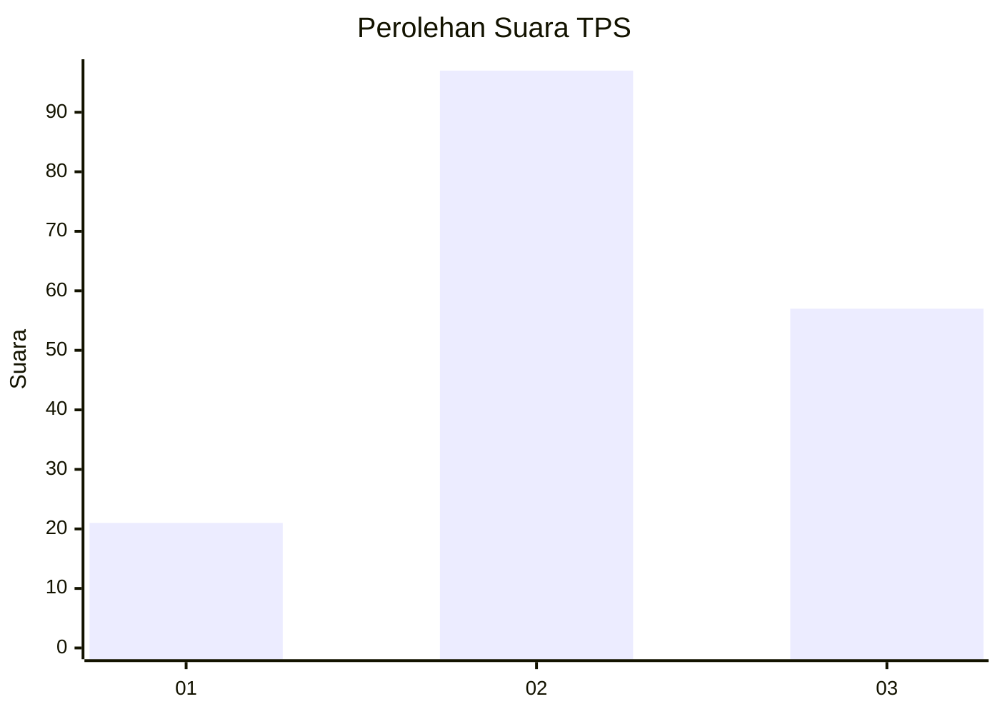
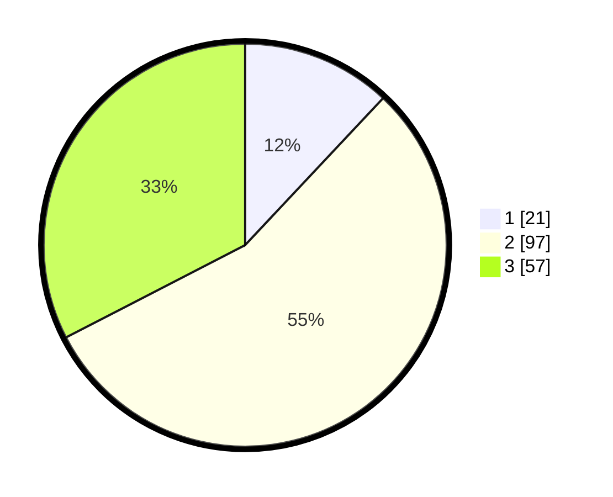

# Hasil

## Grafik

## Tabel

| No. | Nama Paslon    | Suara | Suara (raw) | Persentase |
|:--- |:-------------- | -----:| -----------:| ----------:|
| 1   | ANIES MUHAIMIN | 21    | [21][p-1]   | 12,00      |
| 2   | PRABOWO GIBRAN | 97    | [97][p-2]   | 55,43      |
| 3   | GANJAR MAHFUD  | 57    | [57][p-3]   | 32,57      |

[p-1]: https://github.com/gigit-pemilu/pemilu-2024/blob/main/pilpres/hitung-suara/sub/35-jawa-timur/sub/07-malang/sub/08-wajak/sub/2001-sumberputih/sub/010-tps/sub/paslon-1.txt
[p-2]: https://github.com/gigit-pemilu/pemilu-2024/blob/main/pilpres/hitung-suara/sub/35-jawa-timur/sub/07-malang/sub/08-wajak/sub/2001-sumberputih/sub/010-tps/sub/paslon-2.txt
[p-3]: https://github.com/gigit-pemilu/pemilu-2024/blob/main/pilpres/hitung-suara/sub/35-jawa-timur/sub/07-malang/sub/08-wajak/sub/2001-sumberputih/sub/010-tps/sub/paslon-3.txt

## Foto C Plano

https://sirekap-obj-formc.kpu.go.id/dfb9/pemilu/ppwp/35/07/08/20/01/3507082001010-20240214-222230--db86ace6-3a49-4162-ac62-9e565ae243dd.jpg

https://sirekap-obj-formc.kpu.go.id/dfb9/pemilu/ppwp/35/07/08/20/01/3507082001010-20240214-222242--efacc2fd-98c7-4765-9604-f51250d66584.jpg

https://sirekap-obj-formc.kpu.go.id/dfb9/pemilu/ppwp/35/07/08/20/01/3507082001010-20240214-222252--905f6f9e-63f0-4875-ae68-59f3bf8bbf57.jpg

## Metadata

| Key        | Value               |
| ---------- | ------------------- |
| Time Stamp | 2024-02-19 06:16:00 |

