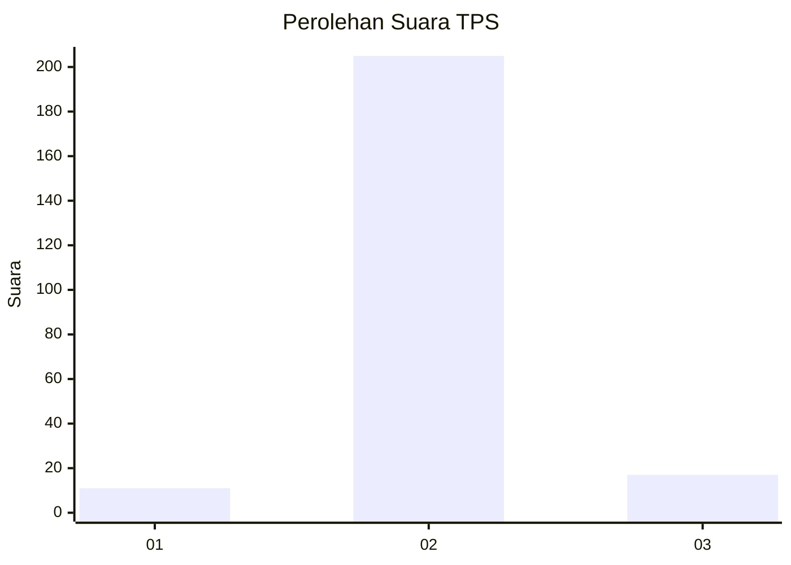
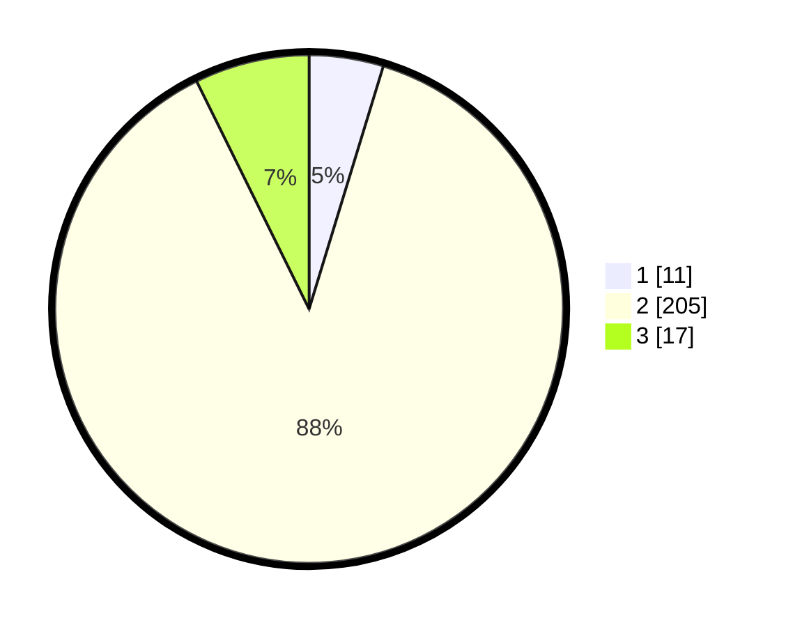

# Hasil

## Grafik

## Tabel

| No. | Nama Paslon    | Suara | Suara (raw) | Persentase |
|:--- |:-------------- | -----:| -----------:| ----------:|
| 1   | ANIES MUHAIMIN | 11    | [11][p-1]   | 4,72       |
| 2   | PRABOWO GIBRAN | 205   | [205][p-2]  | 87,98      |
| 3   | GANJAR MAHFUD  | 17    | [17][p-3]   | 7,30       |

[p-1]: https://github.com/gigit-pemilu/pemilu-2024/blob/main/pilpres/hitung-suara/sub/35-jawa-timur/sub/07-malang/sub/08-wajak/sub/2001-sumberputih/sub/016-tps/sub/paslon-1.txt
[p-2]: https://github.com/gigit-pemilu/pemilu-2024/blob/main/pilpres/hitung-suara/sub/35-jawa-timur/sub/07-malang/sub/08-wajak/sub/2001-sumberputih/sub/016-tps/sub/paslon-2.txt
[p-3]: https://github.com/gigit-pemilu/pemilu-2024/blob/main/pilpres/hitung-suara/sub/35-jawa-timur/sub/07-malang/sub/08-wajak/sub/2001-sumberputih/sub/016-tps/sub/paslon-3.txt

## Foto C Plano

https://sirekap-obj-formc.kpu.go.id/692f/pemilu/ppwp/35/07/08/20/01/3507082001016-20240215-010256--3b233263-4e17-4893-94c3-7053e8c89b1a.jpg

https://sirekap-obj-formc.kpu.go.id/692f/pemilu/ppwp/35/07/08/20/01/3507082001016-20240215-010637--5e34f5fa-8d92-495f-8402-912f28ff0b4f.jpg

https://sirekap-obj-formc.kpu.go.id/692f/pemilu/ppwp/35/07/08/20/01/3507082001016-20240215-010845--bf4ba0f5-d889-49d3-b7fe-1c8768979256.jpg

## Metadata

| Key        | Value               |
| ---------- | ------------------- |
| Time Stamp | 2024-02-24 22:31:28 |

