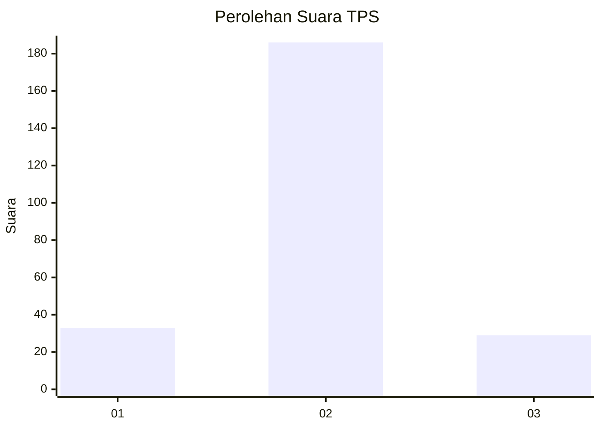
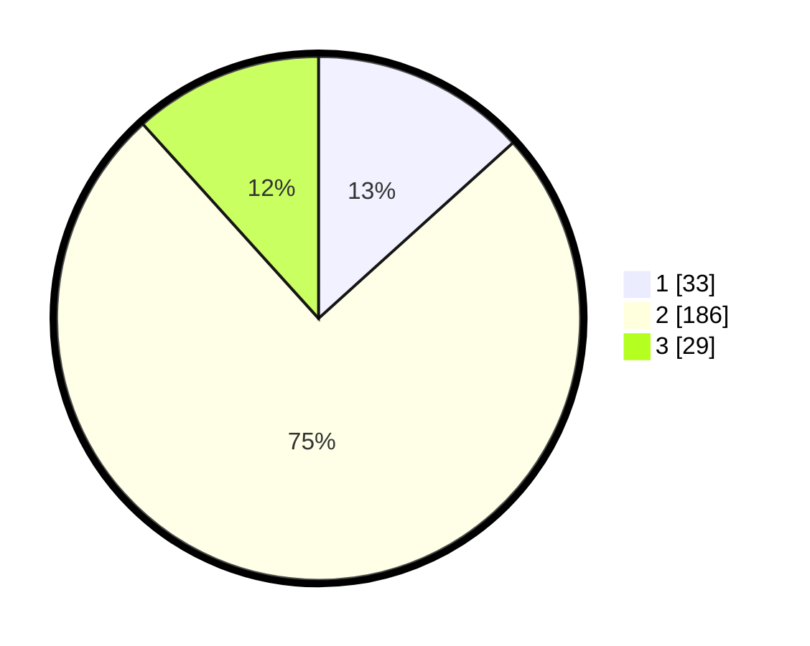

# Hasil

## Grafik

## Tabel

| No. | Nama Paslon    | Suara | Suara (raw) | Persentase |
|:--- |:-------------- | -----:| -----------:| ----------:|
| 1   | ANIES MUHAIMIN | 33    | [33][p-1]   | 13,31      |
| 2   | PRABOWO GIBRAN | 186   | [186][p-2]  | 75,00      |
| 3   | GANJAR MAHFUD  | 29    | [29][p-3]   | 11,69      |

[p-1]: https://github.com/gigit-pemilu/pemilu-2024/blob/main/pilpres/hitung-suara/sub/35-jawa-timur/sub/07-malang/sub/08-wajak/sub/2002-wonoayu/sub/001-tps/sub/paslon-1.txt
[p-2]: https://github.com/gigit-pemilu/pemilu-2024/blob/main/pilpres/hitung-suara/sub/35-jawa-timur/sub/07-malang/sub/08-wajak/sub/2002-wonoayu/sub/001-tps/sub/paslon-2.txt
[p-3]: https://github.com/gigit-pemilu/pemilu-2024/blob/main/pilpres/hitung-suara/sub/35-jawa-timur/sub/07-malang/sub/08-wajak/sub/2002-wonoayu/sub/001-tps/sub/paslon-3.txt

## Foto C Plano

https://sirekap-obj-formc.kpu.go.id/ef3b/pemilu/ppwp/35/07/08/20/02/3507082002001-20240218-184837--2e811adf-9fae-4710-9436-f615bdea4916.jpg

https://sirekap-obj-formc.kpu.go.id/ef3b/pemilu/ppwp/35/07/08/20/02/3507082002001-20240217-062857--76a96be3-2eaa-4e71-abfe-c3ec8b52152e.jpg

https://sirekap-obj-formc.kpu.go.id/ef3b/pemilu/ppwp/35/07/08/20/02/3507082002001-20240217-062915--5a41fed2-8a71-4802-b5c8-fa87ee3efd2e.jpg

## Metadata

| Key        | Value               |
| ---------- | ------------------- |
| Time Stamp | 2024-02-19 06:16:00 |

