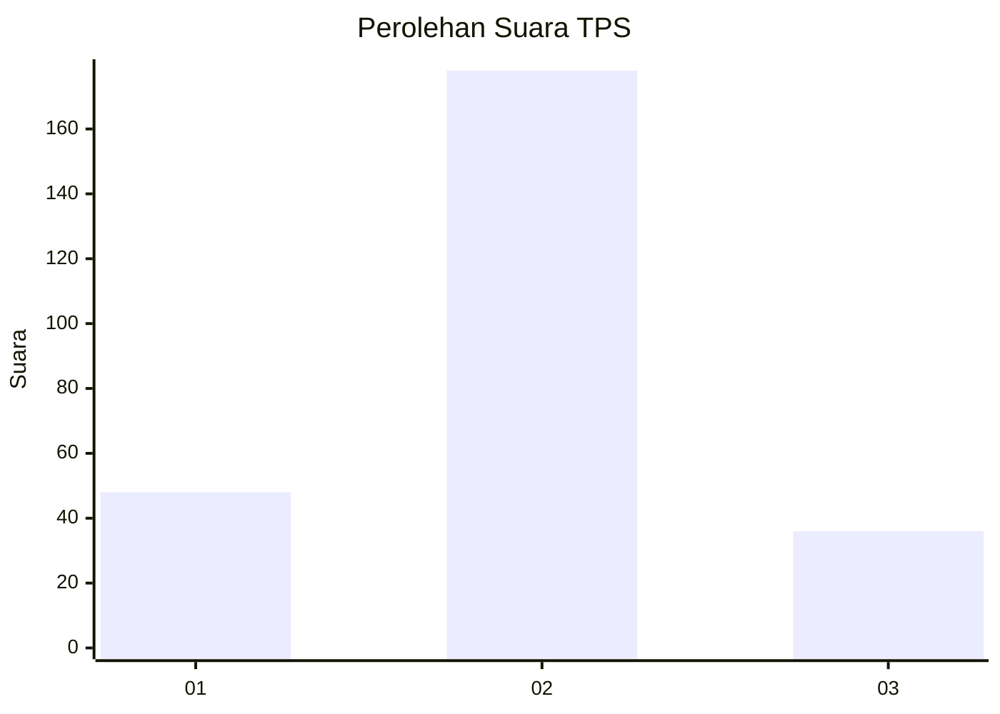
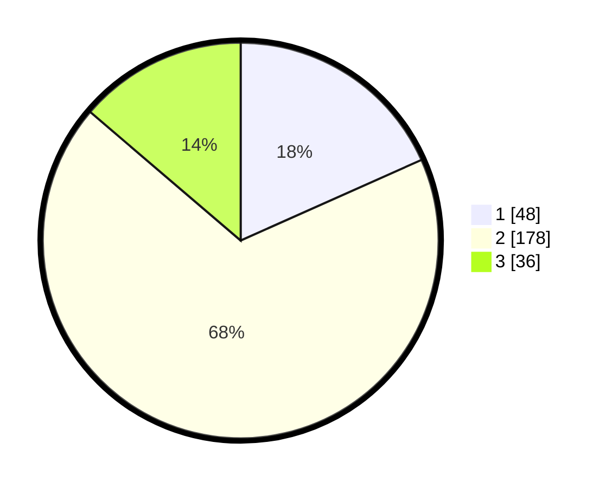

# Hasil

## Grafik

## Tabel

| No. | Nama Paslon    | Suara | Suara (raw) | Persentase |
|:--- |:-------------- | -----:| -----------:| ----------:|
| 1   | ANIES MUHAIMIN | 48    | [48][p-1]   | 18,32      |
| 2   | PRABOWO GIBRAN | 178   | [178][p-2]  | 67,94      |
| 3   | GANJAR MAHFUD  | 36    | [36][p-3]   | 13,74      |

[p-1]: https://github.com/gigit-pemilu/pemilu-2024/blob/main/pilpres/hitung-suara/sub/35-jawa-timur/sub/07-malang/sub/08-wajak/sub/2002-wonoayu/sub/003-tps/sub/paslon-1.txt
[p-2]: https://github.com/gigit-pemilu/pemilu-2024/blob/main/pilpres/hitung-suara/sub/35-jawa-timur/sub/07-malang/sub/08-wajak/sub/2002-wonoayu/sub/003-tps/sub/paslon-2.txt
[p-3]: https://github.com/gigit-pemilu/pemilu-2024/blob/main/pilpres/hitung-suara/sub/35-jawa-timur/sub/07-malang/sub/08-wajak/sub/2002-wonoayu/sub/003-tps/sub/paslon-3.txt

## Foto C Plano

https://sirekap-obj-formc.kpu.go.id/f23c/pemilu/ppwp/35/07/08/20/02/3507082002003-20240218-193223--a395eaee-7b15-450e-90b0-fd6db12386bf.jpg

https://sirekap-obj-formc.kpu.go.id/f23c/pemilu/ppwp/35/07/08/20/02/3507082002003-20240214-230256--433b1bac-252a-4846-bc81-0d4af796bc73.jpg

https://sirekap-obj-formc.kpu.go.id/f23c/pemilu/ppwp/35/07/08/20/02/3507082002003-20240214-230334--83d7c2a6-3c6d-4cb3-9310-a86618541c13.jpg

## Metadata

| Key        | Value               |
| ---------- | ------------------- |
| Time Stamp | 2024-02-19 06:16:00 |

