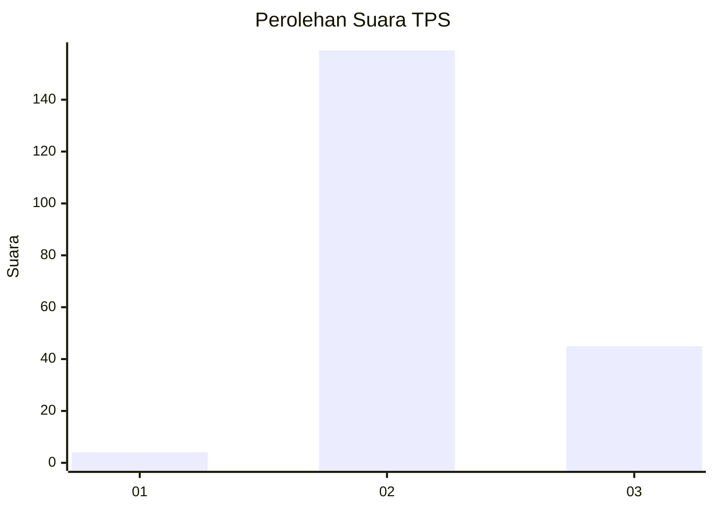

# Hasil

## Grafik

## Tabel

| No. | Nama Paslon    | Suara | Suara (raw) | Persentase |
|:--- |:-------------- | -----:| -----------:| ----------:|
| 1   | ANIES MUHAIMIN | 4     | [4][p-1]    | 1,92       |
| 2   | PRABOWO GIBRAN | 159   | [159][p-2]  | 76,44      |
| 3   | GANJAR MAHFUD  | 45    | [45][p-3]   | 21,63      |

[p-1]: https://github.com/gigit-pemilu/pemilu-2024/blob/main/pilpres/hitung-suara/sub/35-jawa-timur/sub/07-malang/sub/08-wajak/sub/2003-bambang/sub/004-tps/sub/paslon-1.txt
[p-2]: https://github.com/gigit-pemilu/pemilu-2024/blob/main/pilpres/hitung-suara/sub/35-jawa-timur/sub/07-malang/sub/08-wajak/sub/2003-bambang/sub/004-tps/sub/paslon-2.txt
[p-3]: https://github.com/gigit-pemilu/pemilu-2024/blob/main/pilpres/hitung-suara/sub/35-jawa-timur/sub/07-malang/sub/08-wajak/sub/2003-bambang/sub/004-tps/sub/paslon-3.txt

## Foto C Plano

https://sirekap-obj-formc.kpu.go.id/dff5/pemilu/ppwp/35/07/08/20/03/3507082003004-20240214-233330--535226fe-4d7d-40ae-9465-1a6e93ab1925.jpg

https://sirekap-obj-formc.kpu.go.id/dff5/pemilu/ppwp/35/07/08/20/03/3507082003004-20240214-234804--1d35f53b-35db-4562-bb0c-3310b2bf9065.jpg

https://sirekap-obj-formc.kpu.go.id/dff5/pemilu/ppwp/35/07/08/20/03/3507082003004-20240214-234909--f7a98fd4-7a25-48b4-ba44-8fbebdaaadeb.jpg

## Metadata

| Key        | Value               |
| ---------- | ------------------- |
| Time Stamp | 2024-02-25 16:00:00 |

