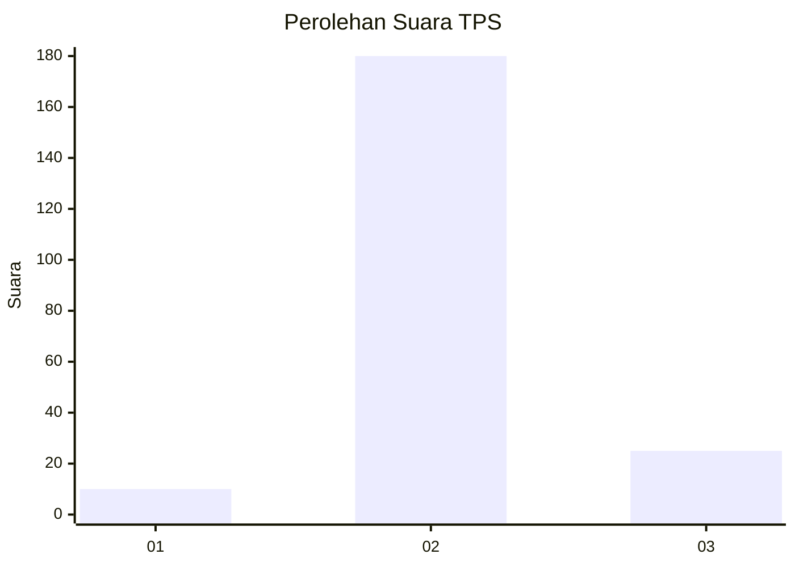
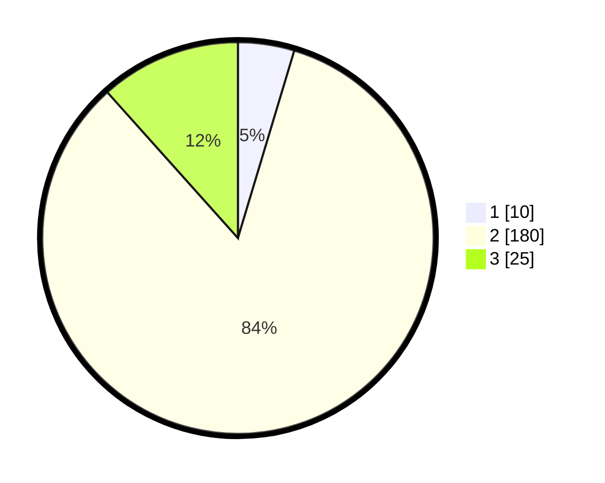

# Hasil

## Grafik

## Tabel

| No. | Nama Paslon    | Suara | Suara (raw) | Persentase |
|:--- |:-------------- | -----:| -----------:| ----------:|
| 1   | ANIES MUHAIMIN | 10    | [10][p-1]   | 4,65       |
| 2   | PRABOWO GIBRAN | 180   | [180][p-2]  | 83,72      |
| 3   | GANJAR MAHFUD  | 25    | [25][p-3]   | 11,63      |

[p-1]: https://github.com/gigit-pemilu/pemilu-2024-35-jawa-timur/blob/main/pilpres/hitung-suara/sub/35-jawa-timur/sub/07-malang/sub/08-wajak/sub/2003-bambang/sub/006-tps/sub/paslon-1.txt
[p-2]: https://github.com/gigit-pemilu/pemilu-2024-35-jawa-timur/blob/main/pilpres/hitung-suara/sub/35-jawa-timur/sub/07-malang/sub/08-wajak/sub/2003-bambang/sub/006-tps/sub/paslon-2.txt
[p-3]: https://github.com/gigit-pemilu/pemilu-2024-35-jawa-timur/blob/main/pilpres/hitung-suara/sub/35-jawa-timur/sub/07-malang/sub/08-wajak/sub/2003-bambang/sub/006-tps/sub/paslon-3.txt

## Foto C Plano

https://sirekap-obj-formc.kpu.go.id/91b1/pemilu/ppwp/35/07/08/20/03/3507082003006-20240215-013301--17bdd8e4-d6b0-4bbc-b199-fa4a64da5cef.jpg

https://sirekap-obj-formc.kpu.go.id/91b1/pemilu/ppwp/35/07/08/20/03/3507082003006-20240215-013611--5e0f7bc8-4333-462a-aca1-291a6c096d0f.jpg

https://sirekap-obj-formc.kpu.go.id/91b1/pemilu/ppwp/35/07/08/20/03/3507082003006-20240215-013727--bd5d813f-bddf-4e89-98ef-f84a89fbcc58.jpg

## Metadata

| Key        | Value               |
| ---------- | ------------------- |
| Time Stamp | 2024-02-24 22:31:28 |

