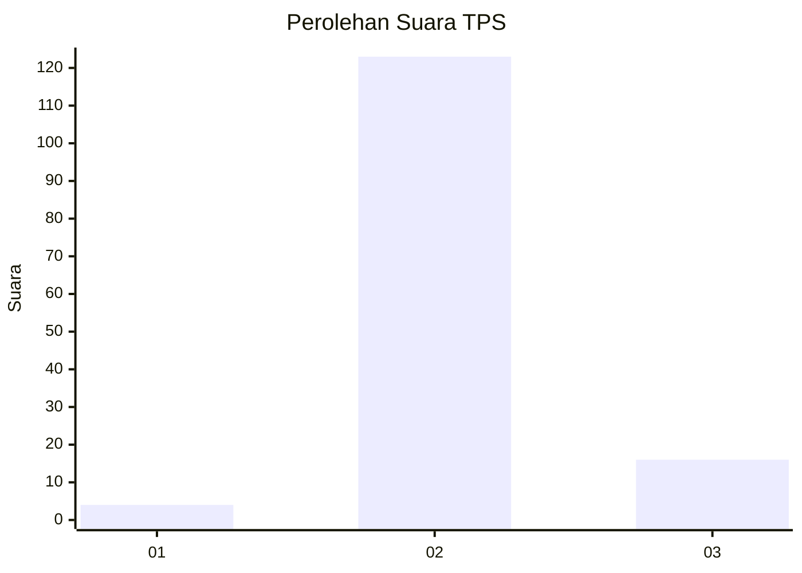
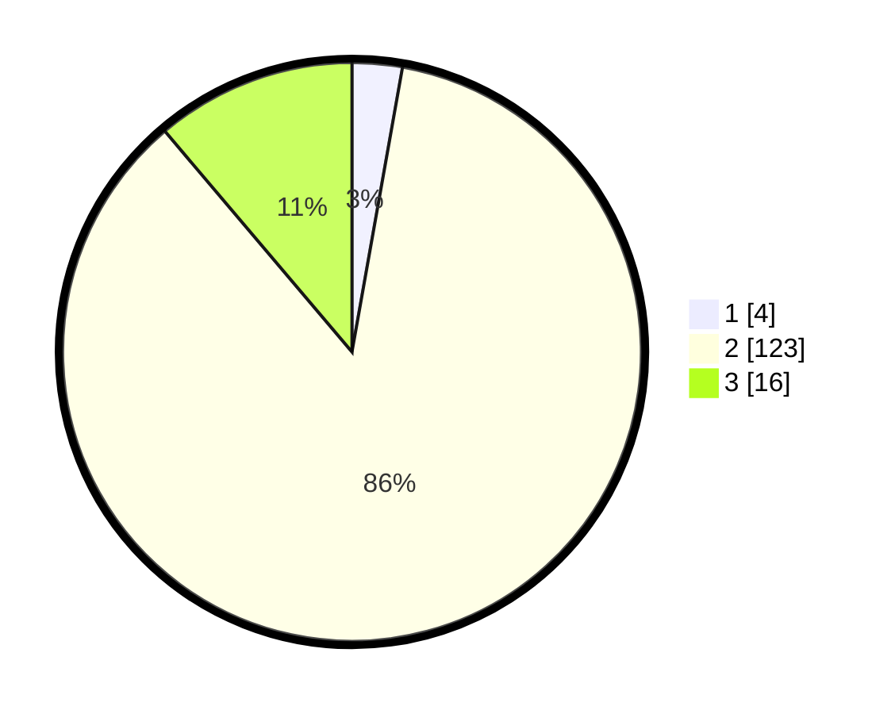

# Hasil

## Grafik

## Tabel

| No. | Nama Paslon    | Suara | Suara (raw) | Persentase |
|:--- |:-------------- | -----:| -----------:| ----------:|
| 1   | ANIES MUHAIMIN | 4     | [4][p-1]    | 2,80       |
| 2   | PRABOWO GIBRAN | 123   | [123][p-2]  | 86,01      |
| 3   | GANJAR MAHFUD  | 16    | [16][p-3]   | 11,19      |

[p-1]: https://github.com/gigit-pemilu/pemilu-2024/blob/main/pilpres/hitung-suara/sub/35-jawa-timur/sub/07-malang/sub/08-wajak/sub/2003-bambang/sub/010-tps/sub/paslon-1.txt
[p-2]: https://github.com/gigit-pemilu/pemilu-2024/blob/main/pilpres/hitung-suara/sub/35-jawa-timur/sub/07-malang/sub/08-wajak/sub/2003-bambang/sub/010-tps/sub/paslon-2.txt
[p-3]: https://github.com/gigit-pemilu/pemilu-2024/blob/main/pilpres/hitung-suara/sub/35-jawa-timur/sub/07-malang/sub/08-wajak/sub/2003-bambang/sub/010-tps/sub/paslon-3.txt

## Foto C Plano

https://sirekap-obj-formc.kpu.go.id/2bc0/pemilu/ppwp/35/07/08/20/03/3507082003010-20240215-052436--330f99d0-7a90-4f61-a747-795e68fcf883.jpg

https://sirekap-obj-formc.kpu.go.id/2bc0/pemilu/ppwp/35/07/08/20/03/3507082003010-20240215-052456--2735ec75-5ff3-417b-938c-3de91c953692.jpg

https://sirekap-obj-formc.kpu.go.id/2bc0/pemilu/ppwp/35/07/08/20/03/3507082003010-20240215-052503--75059d1b-946c-48b6-8334-e8568ebbc823.jpg

## Metadata

| Key        | Value               |
| ---------- | ------------------- |
| Time Stamp | 2024-02-24 22:31:28 |

