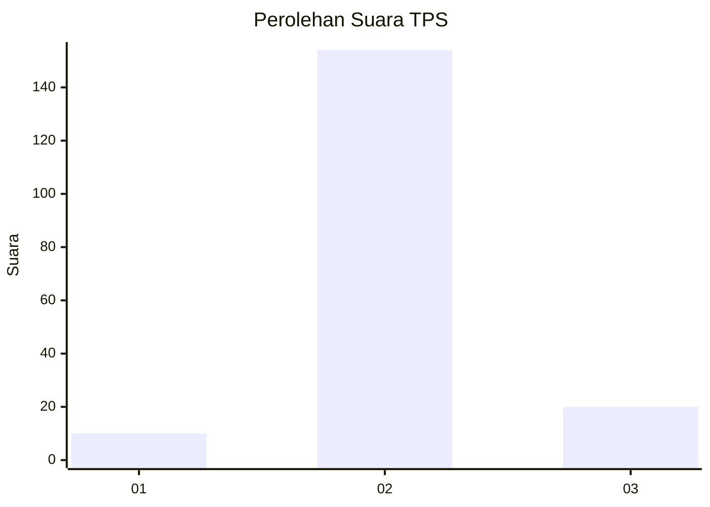
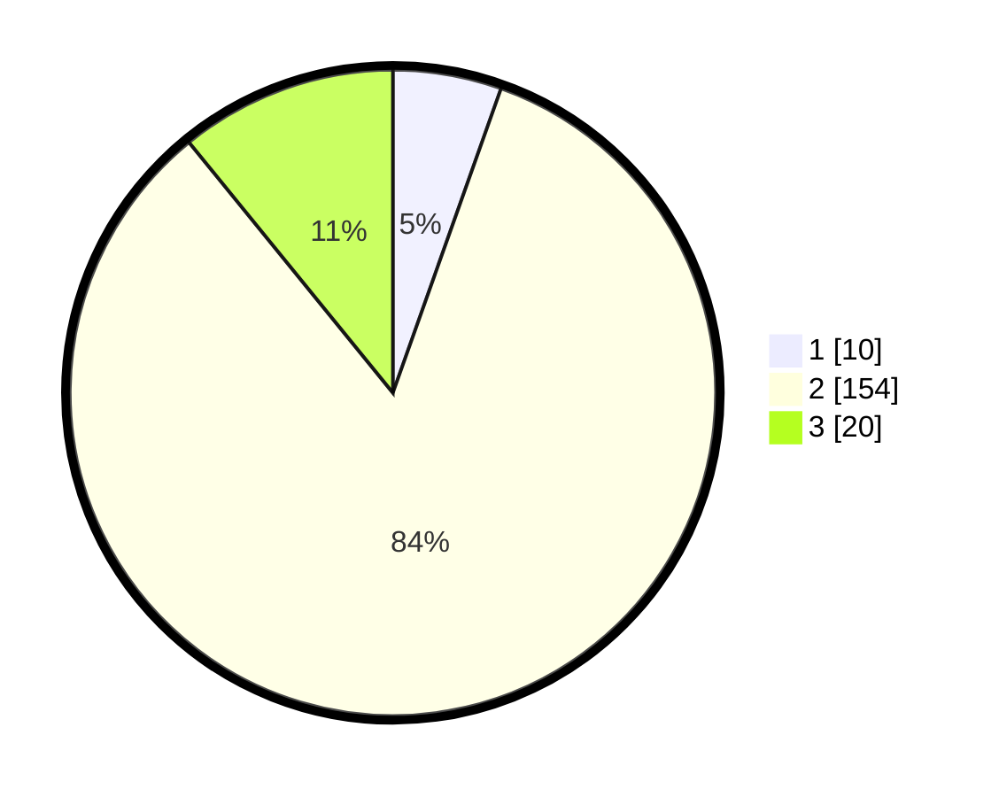

# Hasil

## Grafik

## Tabel

| No. | Nama Paslon    | Suara | Suara (raw) | Persentase |
|:--- |:-------------- | -----:| -----------:| ----------:|
| 1   | ANIES MUHAIMIN | 10    | [10][p-1]   | 5,43       |
| 2   | PRABOWO GIBRAN | 154   | [154][p-2]  | 83,70      |
| 3   | GANJAR MAHFUD  | 20    | [20][p-3]   | 10,87      |

[p-1]: https://github.com/gigit-pemilu/pemilu-2024/blob/main/pilpres/hitung-suara/sub/35-jawa-timur/sub/07-malang/sub/08-wajak/sub/2003-bambang/sub/011-tps/sub/paslon-1.txt
[p-2]: https://github.com/gigit-pemilu/pemilu-2024/blob/main/pilpres/hitung-suara/sub/35-jawa-timur/sub/07-malang/sub/08-wajak/sub/2003-bambang/sub/011-tps/sub/paslon-2.txt
[p-3]: https://github.com/gigit-pemilu/pemilu-2024/blob/main/pilpres/hitung-suara/sub/35-jawa-timur/sub/07-malang/sub/08-wajak/sub/2003-bambang/sub/011-tps/sub/paslon-3.txt

## Foto C Plano

https://sirekap-obj-formc.kpu.go.id/4763/pemilu/ppwp/35/07/08/20/03/3507082003011-20240215-014342--7f51f8e4-f2dd-4ec6-bdc9-2083d8366019.jpg

https://sirekap-obj-formc.kpu.go.id/4763/pemilu/ppwp/35/07/08/20/03/3507082003011-20240215-014659--b9c945a1-6a1e-4b40-8aa5-24e701b385f9.jpg

https://sirekap-obj-formc.kpu.go.id/4763/pemilu/ppwp/35/07/08/20/03/3507082003011-20240215-014945--901725bb-4e28-4f67-a8ad-9530ed1f9ef0.jpg

## Metadata

| Key        | Value               |
| ---------- | ------------------- |
| Time Stamp | 2024-02-25 11:00:00 |

