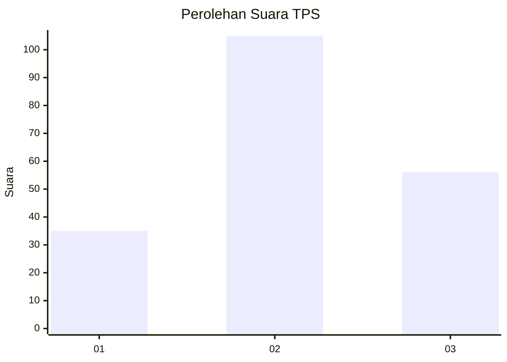
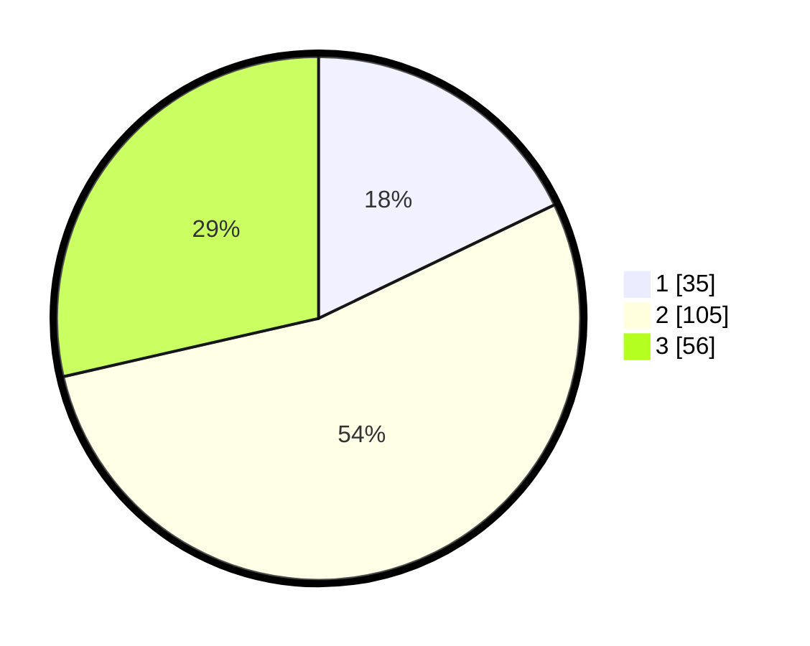

# Hasil

## Grafik

## Tabel

| No. | Nama Paslon    | Suara | Suara (raw) | Persentase |
|:--- |:-------------- | -----:| -----------:| ----------:|
| 1   | ANIES MUHAIMIN | 35    | [35][p-1]   | 17,86      |
| 2   | PRABOWO GIBRAN | 105   | [105][p-2]  | 53,57      |
| 3   | GANJAR MAHFUD  | 56    | [56][p-3]   | 28,57      |

[p-1]: https://github.com/gigit-pemilu/pemilu-2024/blob/main/pilpres/hitung-suara/sub/35-jawa-timur/sub/07-malang/sub/08-wajak/sub/2005-dadapan/sub/003-tps/sub/paslon-1.txt
[p-2]: https://github.com/gigit-pemilu/pemilu-2024/blob/main/pilpres/hitung-suara/sub/35-jawa-timur/sub/07-malang/sub/08-wajak/sub/2005-dadapan/sub/003-tps/sub/paslon-2.txt
[p-3]: https://github.com/gigit-pemilu/pemilu-2024/blob/main/pilpres/hitung-suara/sub/35-jawa-timur/sub/07-malang/sub/08-wajak/sub/2005-dadapan/sub/003-tps/sub/paslon-3.txt

## Foto C Plano

https://sirekap-obj-formc.kpu.go.id/e489/pemilu/ppwp/35/07/08/20/05/3507082005003-20240218-194858--afe988a0-304b-40b2-9e42-92179a73ff5f.jpg

https://sirekap-obj-formc.kpu.go.id/e489/pemilu/ppwp/35/07/08/20/05/3507082005003-20240218-194136--22f4481b-f63b-4e50-9703-4cb1fcf1bd00.jpg

https://sirekap-obj-formc.kpu.go.id/e489/pemilu/ppwp/35/07/08/20/05/3507082005003-20240218-194747--e1dc68e6-eb40-4c92-b0ba-11f6185cf2c6.jpg

## Metadata

| Key        | Value               |
| ---------- | ------------------- |
| Time Stamp | 2024-02-25 17:00:00 |

