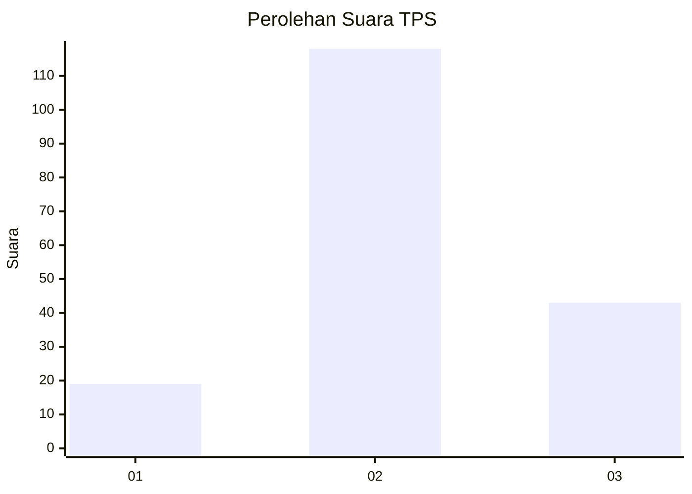
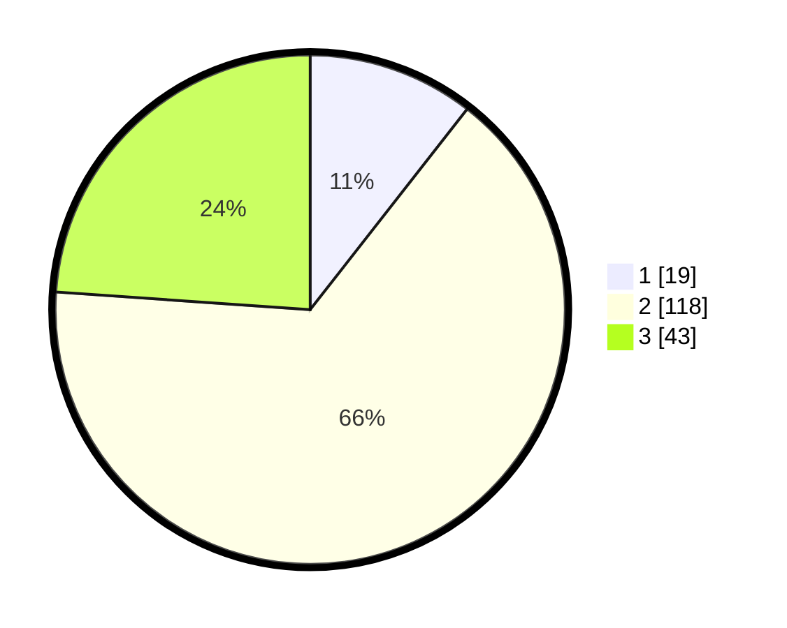

# Hasil

## Grafik

## Tabel

| No. | Nama Paslon    | Suara | Suara (raw) | Persentase |
|:--- |:-------------- | -----:| -----------:| ----------:|
| 1   | ANIES MUHAIMIN | 19    | [19][p-1]   | 10,56      |
| 2   | PRABOWO GIBRAN | 118   | [118][p-2]  | 65,56      |
| 3   | GANJAR MAHFUD  | 43    | [43][p-3]   | 23,89      |

[p-1]: https://github.com/gigit-pemilu/pemilu-2024-35-jawa-timur/blob/main/pilpres/hitung-suara/sub/35-jawa-timur/sub/07-malang/sub/08-wajak/sub/2005-dadapan/sub/007-tps/sub/paslon-1.txt
[p-2]: https://github.com/gigit-pemilu/pemilu-2024-35-jawa-timur/blob/main/pilpres/hitung-suara/sub/35-jawa-timur/sub/07-malang/sub/08-wajak/sub/2005-dadapan/sub/007-tps/sub/paslon-2.txt
[p-3]: https://github.com/gigit-pemilu/pemilu-2024-35-jawa-timur/blob/main/pilpres/hitung-suara/sub/35-jawa-timur/sub/07-malang/sub/08-wajak/sub/2005-dadapan/sub/007-tps/sub/paslon-3.txt

## Foto C Plano

https://sirekap-obj-formc.kpu.go.id/41cb/pemilu/ppwp/35/07/08/20/05/3507082005007-20240218-194905--98a2b4ec-85e3-4c31-a656-90d63df011e8.jpg

https://sirekap-obj-formc.kpu.go.id/41cb/pemilu/ppwp/35/07/08/20/05/3507082005007-20240218-194137--5d367bc4-c9dd-4d56-a16a-76435126c550.jpg

https://sirekap-obj-formc.kpu.go.id/41cb/pemilu/ppwp/35/07/08/20/05/3507082005007-20240218-194350--fac41985-3623-4cc7-87ee-78896ba8d218.jpg

## Metadata

| Key        | Value               |
| ---------- | ------------------- |
| Time Stamp | 2024-02-25 22:00:00 |

