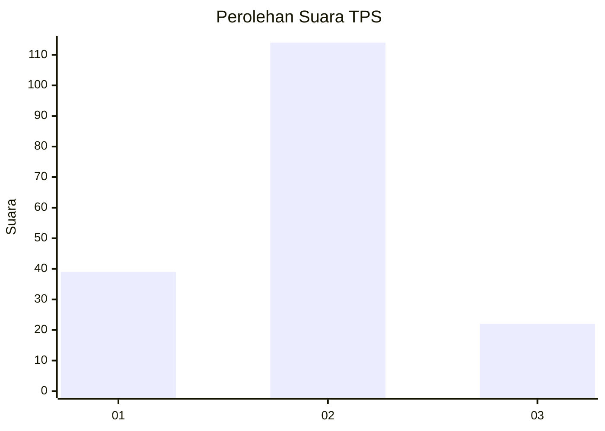
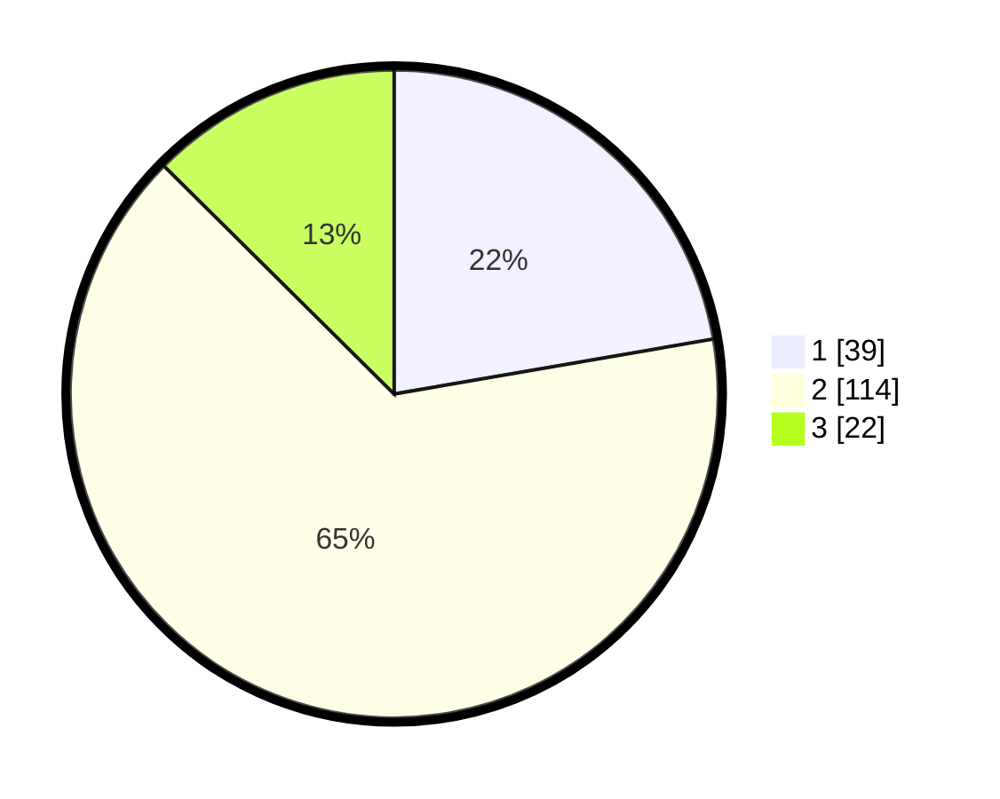

# Hasil

## Grafik

## Tabel

| No. | Nama Paslon    | Suara | Suara (raw) | Persentase |
|:--- |:-------------- | -----:| -----------:| ----------:|
| 1   | ANIES MUHAIMIN | 39    | [39][p-1]   | 22,29      |
| 2   | PRABOWO GIBRAN | 114   | [114][p-2]  | 65,14      |
| 3   | GANJAR MAHFUD  | 22    | [22][p-3]   | 12,57      |

[p-1]: https://github.com/gigit-pemilu/pemilu-2024/blob/main/pilpres/hitung-suara/sub/35-jawa-timur/sub/07-malang/sub/08-wajak/sub/2005-dadapan/sub/010-tps/sub/paslon-1.txt
[p-2]: https://github.com/gigit-pemilu/pemilu-2024/blob/main/pilpres/hitung-suara/sub/35-jawa-timur/sub/07-malang/sub/08-wajak/sub/2005-dadapan/sub/010-tps/sub/paslon-2.txt
[p-3]: https://github.com/gigit-pemilu/pemilu-2024/blob/main/pilpres/hitung-suara/sub/35-jawa-timur/sub/07-malang/sub/08-wajak/sub/2005-dadapan/sub/010-tps/sub/paslon-3.txt

## Foto C Plano

https://sirekap-obj-formc.kpu.go.id/516a/pemilu/ppwp/35/07/08/20/05/3507082005010-20240219-214203--2539563e-4738-4cd0-ba36-b951910d49aa.jpg

https://sirekap-obj-formc.kpu.go.id/516a/pemilu/ppwp/35/07/08/20/05/3507082005010-20240214-222111--b34dd41f-5c80-41b7-8a39-5b6267c11f41.jpg

https://sirekap-obj-formc.kpu.go.id/516a/pemilu/ppwp/35/07/08/20/05/3507082005010-20240219-214256--371498f5-691e-469a-8c87-1e14c89c3731.jpg

## Metadata

| Key        | Value               |
| ---------- | ------------------- |
| Time Stamp | 2024-02-19 22:00:00 |

