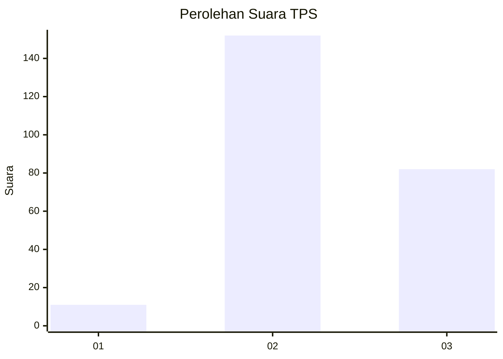
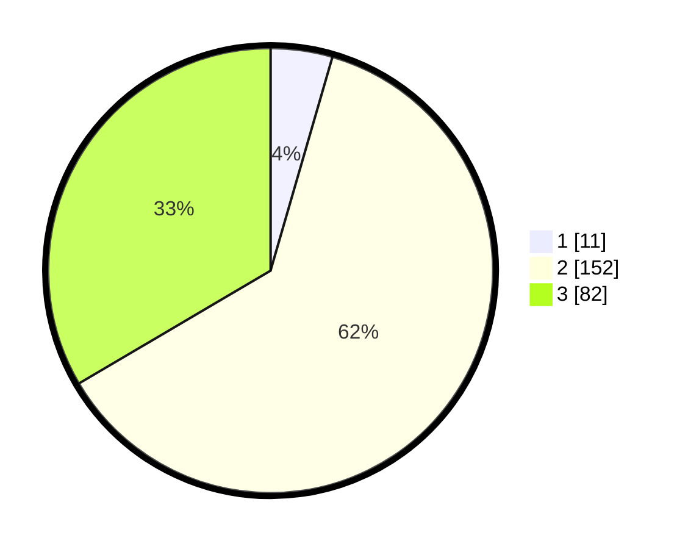

# Hasil

## Grafik

## Tabel

| No. | Nama Paslon    | Suara | Suara (raw) | Persentase |
|:--- |:-------------- | -----:| -----------:| ----------:|
| 1   | ANIES MUHAIMIN | 11    | [11][p-1]   | 4,49       |
| 2   | PRABOWO GIBRAN | 152   | [152][p-2]  | 62,04      |
| 3   | GANJAR MAHFUD  | 82    | [82][p-3]   | 33,47      |

[p-1]: https://github.com/gigit-pemilu/pemilu-2024-35-jawa-timur/blob/main/pilpres/hitung-suara/sub/35-jawa-timur/sub/07-malang/sub/08-wajak/sub/2005-dadapan/sub/012-tps/sub/paslon-1.txt
[p-2]: https://github.com/gigit-pemilu/pemilu-2024-35-jawa-timur/blob/main/pilpres/hitung-suara/sub/35-jawa-timur/sub/07-malang/sub/08-wajak/sub/2005-dadapan/sub/012-tps/sub/paslon-2.txt
[p-3]: https://github.com/gigit-pemilu/pemilu-2024-35-jawa-timur/blob/main/pilpres/hitung-suara/sub/35-jawa-timur/sub/07-malang/sub/08-wajak/sub/2005-dadapan/sub/012-tps/sub/paslon-3.txt

## Foto C Plano

https://sirekap-obj-formc.kpu.go.id/1b41/pemilu/ppwp/35/07/08/20/05/3507082005012-20240218-195938--2ed04ae0-7922-4cb2-905e-c917331185a7.jpg

https://sirekap-obj-formc.kpu.go.id/1b41/pemilu/ppwp/35/07/08/20/05/3507082005012-20240218-200037--5f579b22-85f9-4184-b489-cbd5f5bd978e.jpg

https://sirekap-obj-formc.kpu.go.id/1b41/pemilu/ppwp/35/07/08/20/05/3507082005012-20240218-200152--93d64dcf-4945-42a2-9a25-c82b52115d8a.jpg

## Metadata

| Key        | Value               |
| ---------- | ------------------- |
| Time Stamp | 2024-02-25 15:00:00 |

