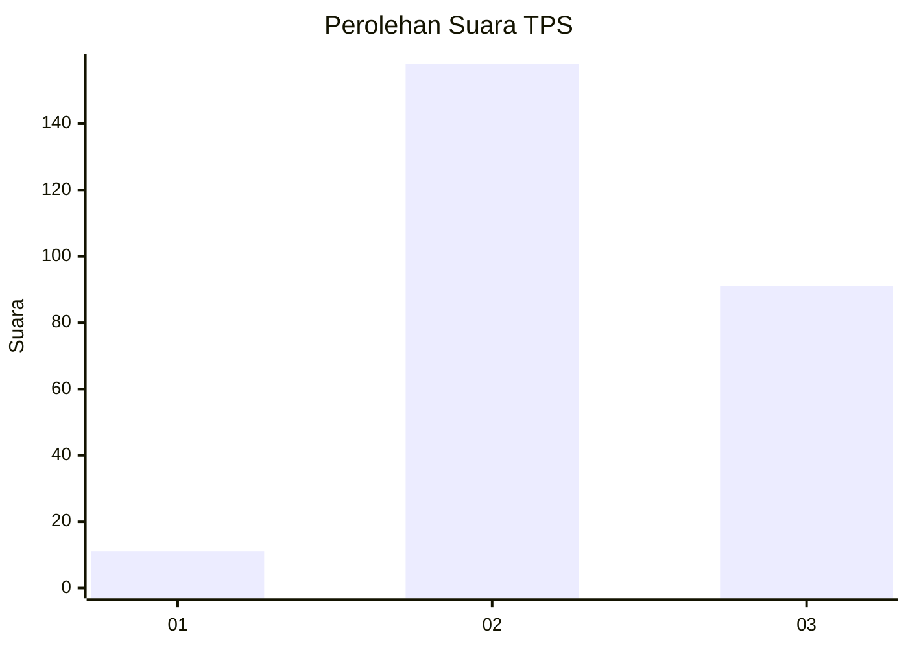
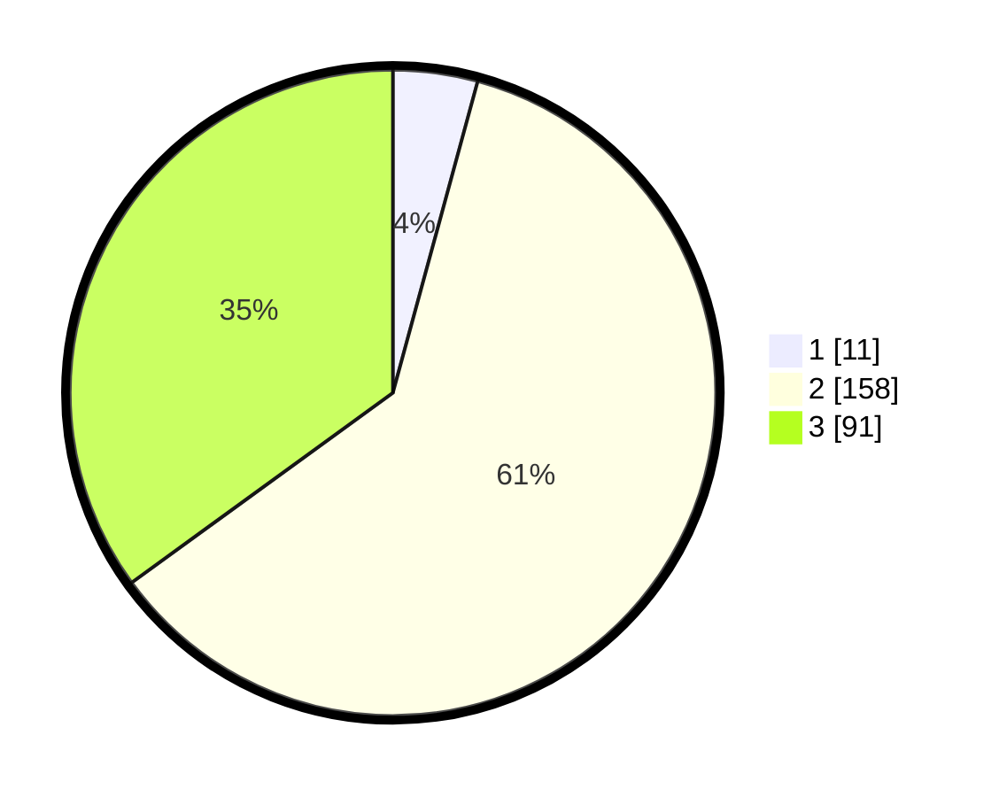

# Hasil

## Grafik

## Tabel

| No. | Nama Paslon    | Suara | Suara (raw) | Persentase |
|:--- |:-------------- | -----:| -----------:| ----------:|
| 1   | ANIES MUHAIMIN | 11    | [11][p-1]   | 4,23       |
| 2   | PRABOWO GIBRAN | 158   | [158][p-2]  | 60,77      |
| 3   | GANJAR MAHFUD  | 91    | [91][p-3]   | 35,00      |

[p-1]: https://github.com/gigit-pemilu/pemilu-2024-35-jawa-timur/blob/main/pilpres/hitung-suara/sub/35-jawa-timur/sub/07-malang/sub/08-wajak/sub/2005-dadapan/sub/013-tps/sub/paslon-1.txt
[p-2]: https://github.com/gigit-pemilu/pemilu-2024-35-jawa-timur/blob/main/pilpres/hitung-suara/sub/35-jawa-timur/sub/07-malang/sub/08-wajak/sub/2005-dadapan/sub/013-tps/sub/paslon-2.txt
[p-3]: https://github.com/gigit-pemilu/pemilu-2024-35-jawa-timur/blob/main/pilpres/hitung-suara/sub/35-jawa-timur/sub/07-malang/sub/08-wajak/sub/2005-dadapan/sub/013-tps/sub/paslon-3.txt

## Foto C Plano

https://sirekap-obj-formc.kpu.go.id/b5e0/pemilu/ppwp/35/07/08/20/05/3507082005013-20240218-195156--9d80a00e-40fb-42c7-9e0f-00d986fa464a.jpg

https://sirekap-obj-formc.kpu.go.id/b5e0/pemilu/ppwp/35/07/08/20/05/3507082005013-20240218-195332--84c58eeb-9e7c-4cd6-8c4f-d4163d9630a2.jpg

https://sirekap-obj-formc.kpu.go.id/b5e0/pemilu/ppwp/35/07/08/20/05/3507082005013-20240218-195518--03116e75-8111-444c-8799-547dec38a975.jpg

## Metadata

| Key        | Value               |
| ---------- | ------------------- |
| Time Stamp | 2024-02-24 22:31:28 |

