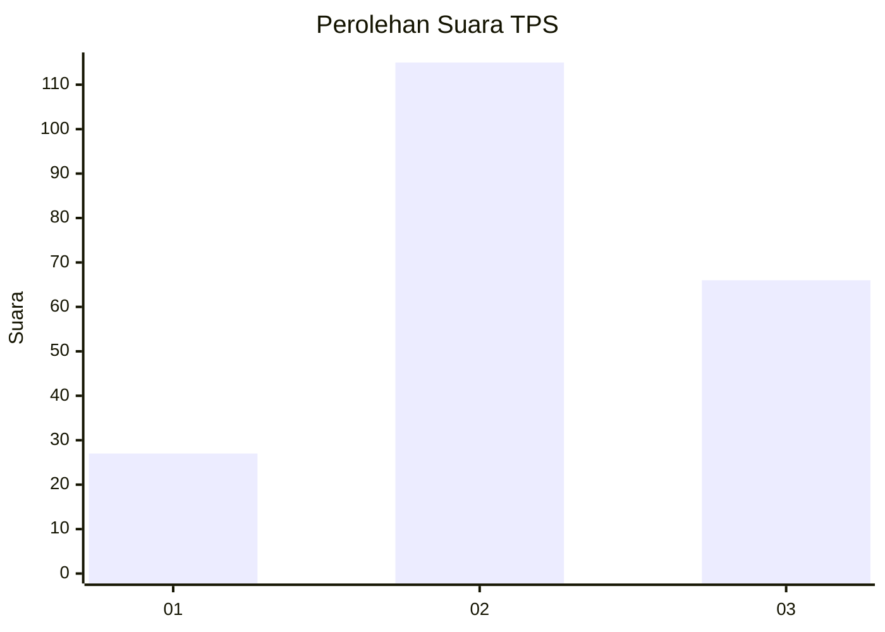
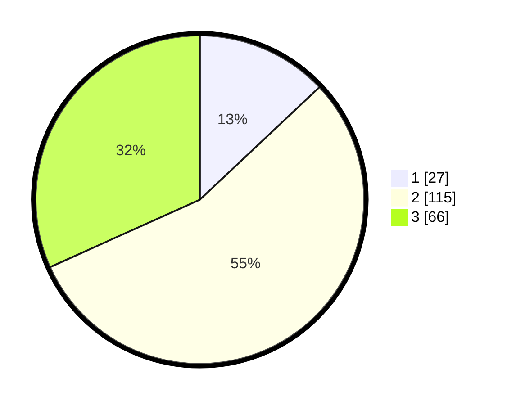

# Hasil

## Grafik

## Tabel

| No. | Nama Paslon    | Suara | Suara (raw) | Persentase |
|:--- |:-------------- | -----:| -----------:| ----------:|
| 1   | ANIES MUHAIMIN | 27    | [27][p-1]   | 12,98      |
| 2   | PRABOWO GIBRAN | 115   | [115][p-2]  | 55,29      |
| 3   | GANJAR MAHFUD  | 66    | [66][p-3]   | 31,73      |

[p-1]: https://github.com/gigit-pemilu/pemilu-2024/blob/main/pilpres/hitung-suara/sub/35-jawa-timur/sub/07-malang/sub/08-wajak/sub/2005-dadapan/sub/015-tps/sub/paslon-1.txt
[p-2]: https://github.com/gigit-pemilu/pemilu-2024/blob/main/pilpres/hitung-suara/sub/35-jawa-timur/sub/07-malang/sub/08-wajak/sub/2005-dadapan/sub/015-tps/sub/paslon-2.txt
[p-3]: https://github.com/gigit-pemilu/pemilu-2024/blob/main/pilpres/hitung-suara/sub/35-jawa-timur/sub/07-malang/sub/08-wajak/sub/2005-dadapan/sub/015-tps/sub/paslon-3.txt

## Foto C Plano

https://sirekap-obj-formc.kpu.go.id/375e/pemilu/ppwp/35/07/08/20/05/3507082005015-20240218-195749--a8d3a8d6-d2bd-426d-bd6c-4c94d5ab2ba8.jpg

https://sirekap-obj-formc.kpu.go.id/375e/pemilu/ppwp/35/07/08/20/05/3507082005015-20240218-195853--09758525-769e-4ac8-8fae-53b6b808ebe2.jpg

https://sirekap-obj-formc.kpu.go.id/375e/pemilu/ppwp/35/07/08/20/05/3507082005015-20240218-200016--812b29a8-cc7c-4da5-8877-bc6c999b6b3c.jpg

## Metadata

| Key        | Value               |
| ---------- | ------------------- |
| Time Stamp | 2024-02-24 22:31:28 |

