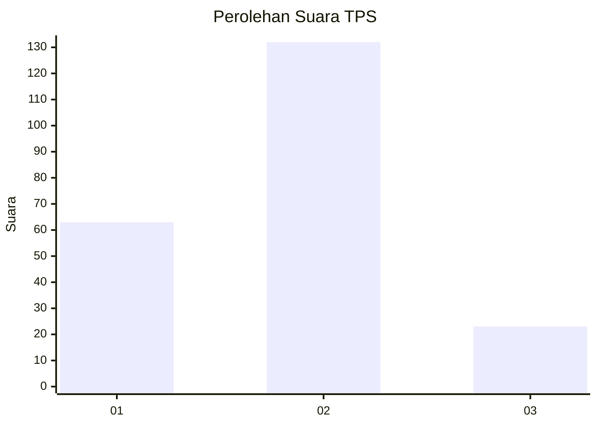
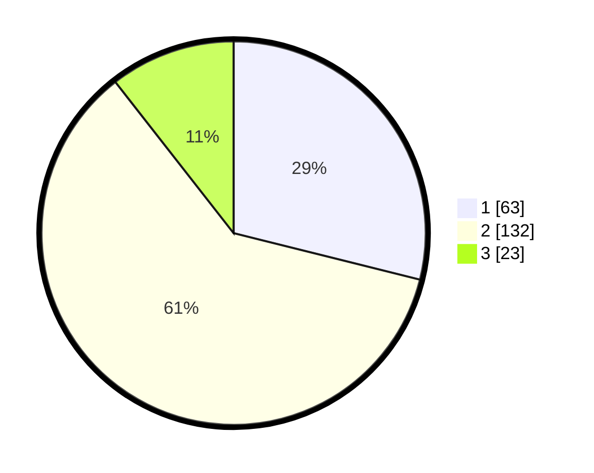

# Hasil

## Grafik

## Tabel

| No. | Nama Paslon    | Suara | Suara (raw) | Persentase |
|:--- |:-------------- | -----:| -----------:| ----------:|
| 1   | ANIES MUHAIMIN | 63    | [63][p-1]   | 28,90      |
| 2   | PRABOWO GIBRAN | 132   | [132][p-2]  | 60,55      |
| 3   | GANJAR MAHFUD  | 23    | [23][p-3]   | 10,55      |

[p-1]: https://github.com/gigit-pemilu/pemilu-2024-35-jawa-timur/blob/main/pilpres/hitung-suara/sub/35-jawa-timur/sub/07-malang/sub/08-wajak/sub/2006-patokpicis/sub/001-tps/sub/paslon-1.txt
[p-2]: https://github.com/gigit-pemilu/pemilu-2024-35-jawa-timur/blob/main/pilpres/hitung-suara/sub/35-jawa-timur/sub/07-malang/sub/08-wajak/sub/2006-patokpicis/sub/001-tps/sub/paslon-2.txt
[p-3]: https://github.com/gigit-pemilu/pemilu-2024-35-jawa-timur/blob/main/pilpres/hitung-suara/sub/35-jawa-timur/sub/07-malang/sub/08-wajak/sub/2006-patokpicis/sub/001-tps/sub/paslon-3.txt

## Foto C Plano

https://sirekap-obj-formc.kpu.go.id/d459/pemilu/ppwp/35/07/08/20/06/3507082006001-20240218-205650--0529b924-3cbd-4852-9a7e-bfddd66a0781.jpg

https://sirekap-obj-formc.kpu.go.id/d459/pemilu/ppwp/35/07/08/20/06/3507082006001-20240218-211337--ddb215ba-4ceb-434f-aa49-62a27bb5af74.jpg

https://sirekap-obj-formc.kpu.go.id/d459/pemilu/ppwp/35/07/08/20/06/3507082006001-20240218-205130--7ff89c47-0272-4f02-9e53-017172f87faf.jpg

## Metadata

| Key        | Value               |
| ---------- | ------------------- |
| Time Stamp | 2024-02-22 09:00:00 |

