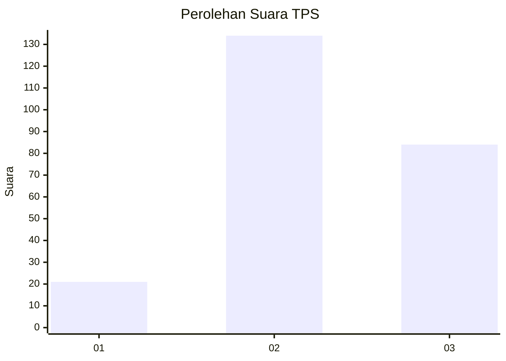
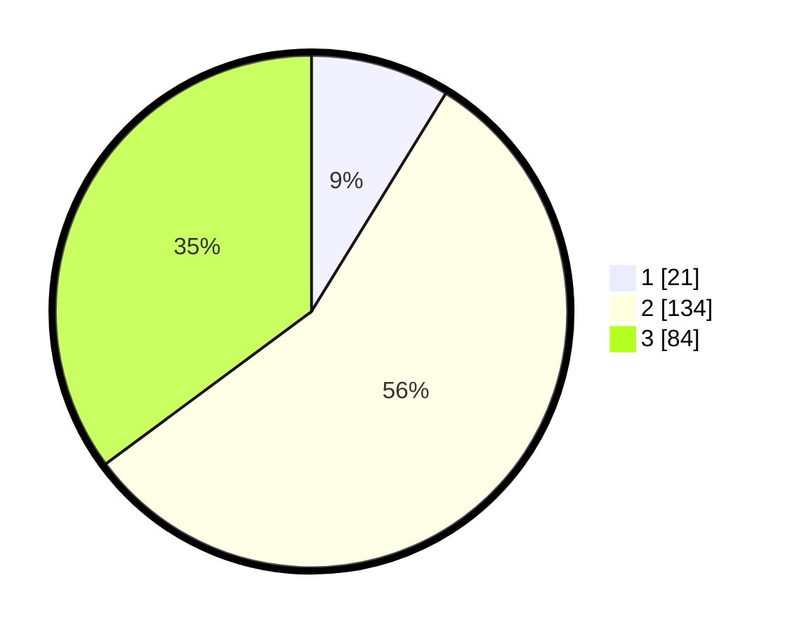

# Hasil

## Grafik

## Tabel

| No. | Nama Paslon    | Suara | Suara (raw) | Persentase |
|:--- |:-------------- | -----:| -----------:| ----------:|
| 1   | ANIES MUHAIMIN | 21    | [21][p-1]   | 8,79       |
| 2   | PRABOWO GIBRAN | 134   | [134][p-2]  | 56,07      |
| 3   | GANJAR MAHFUD  | 84    | [84][p-3]   | 35,15      |

[p-1]: https://github.com/gigit-pemilu/pemilu-2024-35-jawa-timur/blob/main/pilpres/hitung-suara/sub/35-jawa-timur/sub/07-malang/sub/08-wajak/sub/2009-sukolilo/sub/001-tps/sub/paslon-1.txt
[p-2]: https://github.com/gigit-pemilu/pemilu-2024-35-jawa-timur/blob/main/pilpres/hitung-suara/sub/35-jawa-timur/sub/07-malang/sub/08-wajak/sub/2009-sukolilo/sub/001-tps/sub/paslon-2.txt
[p-3]: https://github.com/gigit-pemilu/pemilu-2024-35-jawa-timur/blob/main/pilpres/hitung-suara/sub/35-jawa-timur/sub/07-malang/sub/08-wajak/sub/2009-sukolilo/sub/001-tps/sub/paslon-3.txt

## Foto C Plano

https://sirekap-obj-formc.kpu.go.id/e23f/pemilu/ppwp/35/07/08/20/09/3507082009001-20240219-112507--ae4d8bfc-9ee0-4a11-bd2e-0735c2fbe803.jpg

https://sirekap-obj-formc.kpu.go.id/e23f/pemilu/ppwp/35/07/08/20/09/3507082009001-20240218-174556--148dce50-dc8a-4675-871c-7922d489cd9c.jpg

https://sirekap-obj-formc.kpu.go.id/e23f/pemilu/ppwp/35/07/08/20/09/3507082009001-20240218-181412--a7706872-9aa8-4c00-badf-e2f7cfb3cd2a.jpg

## Metadata

| Key        | Value               |
| ---------- | ------------------- |
| Time Stamp | 2024-02-25 20:00:00 |

