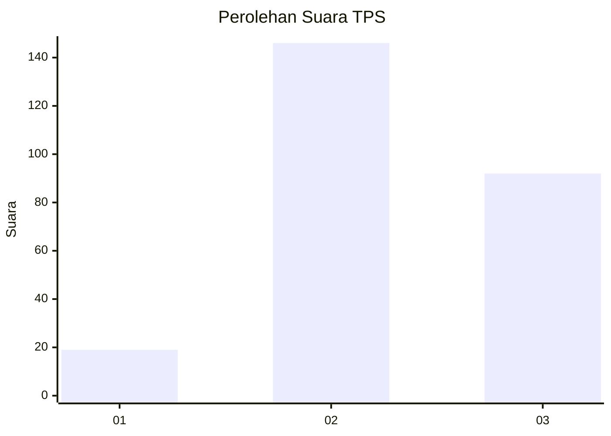
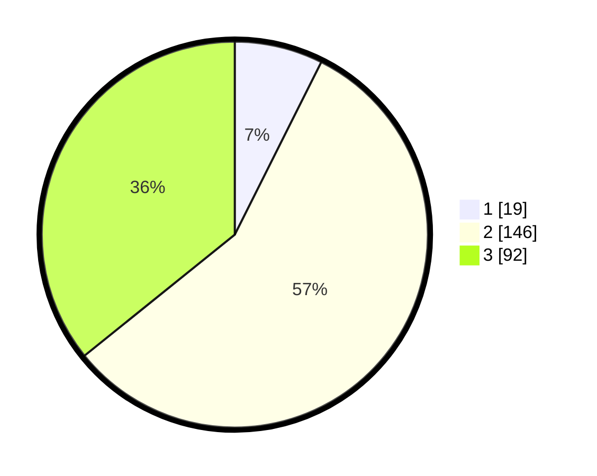

# Hasil

## Grafik

## Tabel

| No. | Nama Paslon    | Suara | Suara (raw) | Persentase |
|:--- |:-------------- | -----:| -----------:| ----------:|
| 1   | ANIES MUHAIMIN | 19    | [19][p-1]   | 7,39       |
| 2   | PRABOWO GIBRAN | 146   | [146][p-2]  | 56,81      |
| 3   | GANJAR MAHFUD  | 92    | [92][p-3]   | 35,80      |

[p-1]: https://github.com/gigit-pemilu/pemilu-2024-35-jawa-timur/blob/main/pilpres/hitung-suara/sub/35-jawa-timur/sub/07-malang/sub/08-wajak/sub/2010-kidangbang/sub/002-tps/sub/paslon-1.txt
[p-2]: https://github.com/gigit-pemilu/pemilu-2024-35-jawa-timur/blob/main/pilpres/hitung-suara/sub/35-jawa-timur/sub/07-malang/sub/08-wajak/sub/2010-kidangbang/sub/002-tps/sub/paslon-2.txt
[p-3]: https://github.com/gigit-pemilu/pemilu-2024-35-jawa-timur/blob/main/pilpres/hitung-suara/sub/35-jawa-timur/sub/07-malang/sub/08-wajak/sub/2010-kidangbang/sub/002-tps/sub/paslon-3.txt

## Foto C Plano

https://sirekap-obj-formc.kpu.go.id/5960/pemilu/ppwp/35/07/08/20/10/3507082010002-20240214-190339--d7919564-0a83-4d41-801c-b6f46019ab43.jpg

https://sirekap-obj-formc.kpu.go.id/5960/pemilu/ppwp/35/07/08/20/10/3507082010002-20240214-192447--ca009117-464c-4a62-83ff-5276b5d6799d.jpg

## Metadata

| Key        | Value               |
| ---------- | ------------------- |
| Time Stamp | 2024-02-15 07:00:44 |

