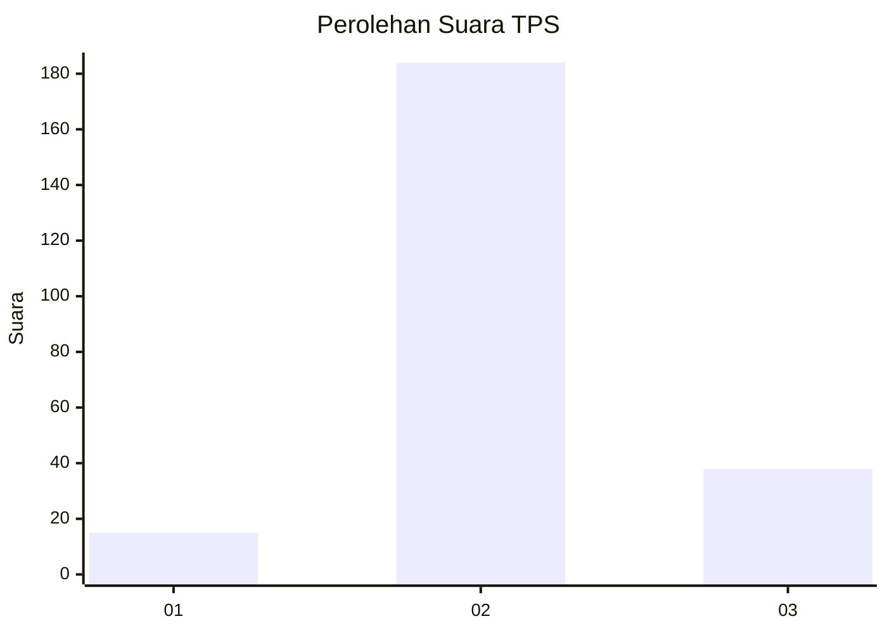
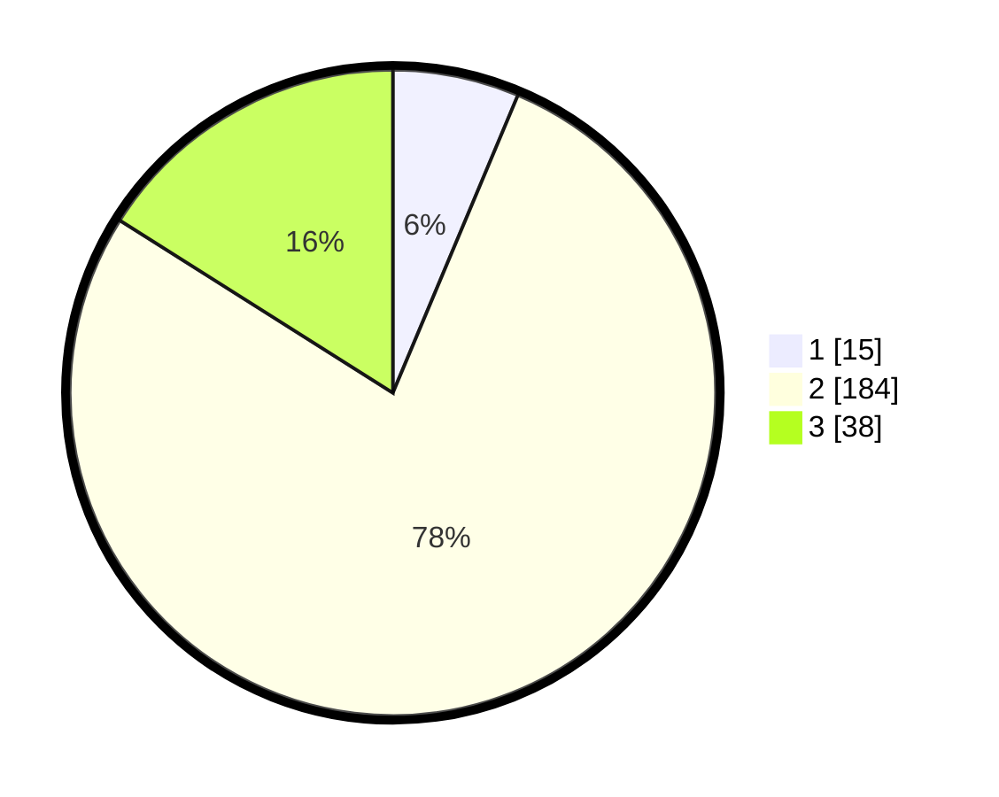

# Hasil

## Grafik

## Tabel

| No. | Nama Paslon    | Suara | Suara (raw) | Persentase |
|:--- |:-------------- | -----:| -----------:| ----------:|
| 1   | ANIES MUHAIMIN | 15    | [15][p-1]   | 6,33       |
| 2   | PRABOWO GIBRAN | 184   | [184][p-2]  | 77,64      |
| 3   | GANJAR MAHFUD  | 38    | [38][p-3]   | 16,03      |

[p-1]: https://github.com/gigit-pemilu/pemilu-2024/blob/main/pilpres/hitung-suara/sub/35-jawa-timur/sub/07-malang/sub/08-wajak/sub/2010-kidangbang/sub/004-tps/sub/paslon-1.txt
[p-2]: https://github.com/gigit-pemilu/pemilu-2024/blob/main/pilpres/hitung-suara/sub/35-jawa-timur/sub/07-malang/sub/08-wajak/sub/2010-kidangbang/sub/004-tps/sub/paslon-2.txt
[p-3]: https://github.com/gigit-pemilu/pemilu-2024/blob/main/pilpres/hitung-suara/sub/35-jawa-timur/sub/07-malang/sub/08-wajak/sub/2010-kidangbang/sub/004-tps/sub/paslon-3.txt

## Foto C Plano

https://sirekap-obj-formc.kpu.go.id/f661/pemilu/ppwp/35/07/08/20/10/3507082010004-20240218-172501--b37bef0a-5892-4a20-85ec-6c721c56ef53.jpg

https://sirekap-obj-formc.kpu.go.id/f661/pemilu/ppwp/35/07/08/20/10/3507082010004-20240218-172743--34313989-ec58-4441-acc1-0a40abe9de9b.jpg

https://sirekap-obj-formc.kpu.go.id/f661/pemilu/ppwp/35/07/08/20/10/3507082010004-20240218-172936--2ee62de3-85f5-4d08-bbce-88a1dbd9b2d6.jpg

## Metadata

| Key        | Value               |
| ---------- | ------------------- |
| Time Stamp | 2024-02-24 22:31:28 |

