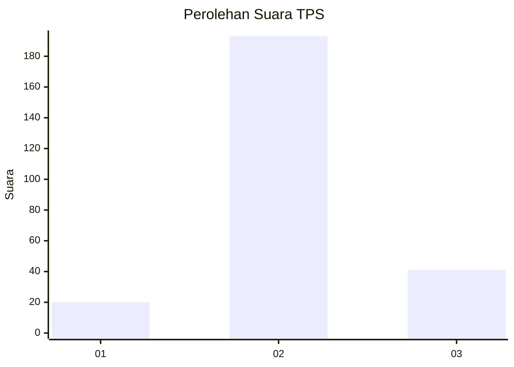
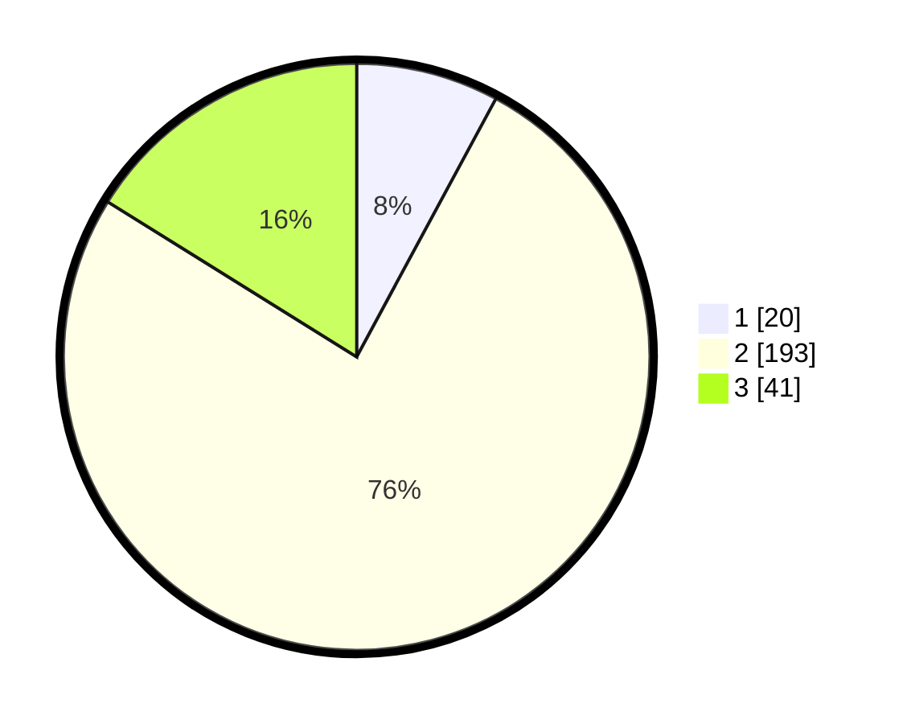

# Hasil

## Grafik

## Tabel

| No. | Nama Paslon    | Suara | Suara (raw) | Persentase |
|:--- |:-------------- | -----:| -----------:| ----------:|
| 1   | ANIES MUHAIMIN | 20    | [20][p-1]   | 7,87       |
| 2   | PRABOWO GIBRAN | 193   | [193][p-2]  | 75,98      |
| 3   | GANJAR MAHFUD  | 41    | [41][p-3]   | 16,14      |

[p-1]: https://github.com/gigit-pemilu/pemilu-2024-35-jawa-timur/blob/main/pilpres/hitung-suara/sub/35-jawa-timur/sub/07-malang/sub/08-wajak/sub/2010-kidangbang/sub/006-tps/sub/paslon-1.txt
[p-2]: https://github.com/gigit-pemilu/pemilu-2024-35-jawa-timur/blob/main/pilpres/hitung-suara/sub/35-jawa-timur/sub/07-malang/sub/08-wajak/sub/2010-kidangbang/sub/006-tps/sub/paslon-2.txt
[p-3]: https://github.com/gigit-pemilu/pemilu-2024-35-jawa-timur/blob/main/pilpres/hitung-suara/sub/35-jawa-timur/sub/07-malang/sub/08-wajak/sub/2010-kidangbang/sub/006-tps/sub/paslon-3.txt

## Foto C Plano

https://sirekap-obj-formc.kpu.go.id/2a10/pemilu/ppwp/35/07/08/20/10/3507082010006-20240214-230529--bab16cc2-c849-49cb-96bb-a407ba3e8334.jpg

https://sirekap-obj-formc.kpu.go.id/2a10/pemilu/ppwp/35/07/08/20/10/3507082010006-20240214-230700--1f20970d-bc67-4865-8964-0f3e9a247a4f.jpg

https://sirekap-obj-formc.kpu.go.id/2a10/pemilu/ppwp/35/07/08/20/10/3507082010006-20240214-230727--b48b2586-df6d-4772-8ae7-08bcc07bfa38.jpg

## Metadata

| Key        | Value               |
| ---------- | ------------------- |
| Time Stamp | 2024-02-25 16:00:00 |

