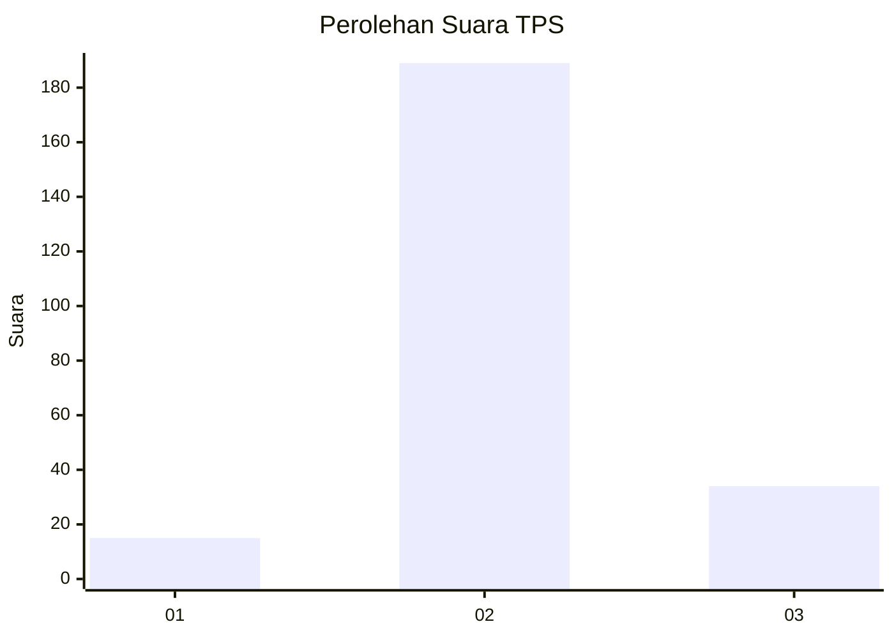

# Hasil

## Grafik

## Tabel

| No. | Nama Paslon    | Suara | Suara (raw) | Persentase |
|:--- |:-------------- | -----:| -----------:| ----------:|
| 1   | ANIES MUHAIMIN | 15    | [15][p-1]   | 6,30       |
| 2   | PRABOWO GIBRAN | 189   | [189][p-2]  | 79,41      |
| 3   | GANJAR MAHFUD  | 34    | [34][p-3]   | 14,29      |

[p-1]: https://github.com/gigit-pemilu/pemilu-2024-35-jawa-timur/blob/main/pilpres/hitung-suara/sub/35-jawa-timur/sub/07-malang/sub/08-wajak/sub/2010-kidangbang/sub/007-tps/sub/paslon-1.txt
[p-2]: https://github.com/gigit-pemilu/pemilu-2024-35-jawa-timur/blob/main/pilpres/hitung-suara/sub/35-jawa-timur/sub/07-malang/sub/08-wajak/sub/2010-kidangbang/sub/007-tps/sub/paslon-2.txt
[p-3]: https://github.com/gigit-pemilu/pemilu-2024-35-jawa-timur/blob/main/pilpres/hitung-suara/sub/35-jawa-timur/sub/07-malang/sub/08-wajak/sub/2010-kidangbang/sub/007-tps/sub/paslon-3.txt

## Foto C Plano

https://sirekap-obj-formc.kpu.go.id/385f/pemilu/ppwp/35/07/08/20/10/3507082010007-20240215-003501--5510332d-f951-45a5-8673-8276aaca1404.jpg

https://sirekap-obj-formc.kpu.go.id/385f/pemilu/ppwp/35/07/08/20/10/3507082010007-20240215-003915--2b338239-6c57-4164-b9d4-6e3d3f1f6dda.jpg

https://sirekap-obj-formc.kpu.go.id/385f/pemilu/ppwp/35/07/08/20/10/3507082010007-20240215-004122--277025c6-fa6d-4a61-be08-4ae381327300.jpg

## Metadata

| Key        | Value               |
| ---------- | ------------------- |
| Time Stamp | 2024-02-19 06:16:00 |

