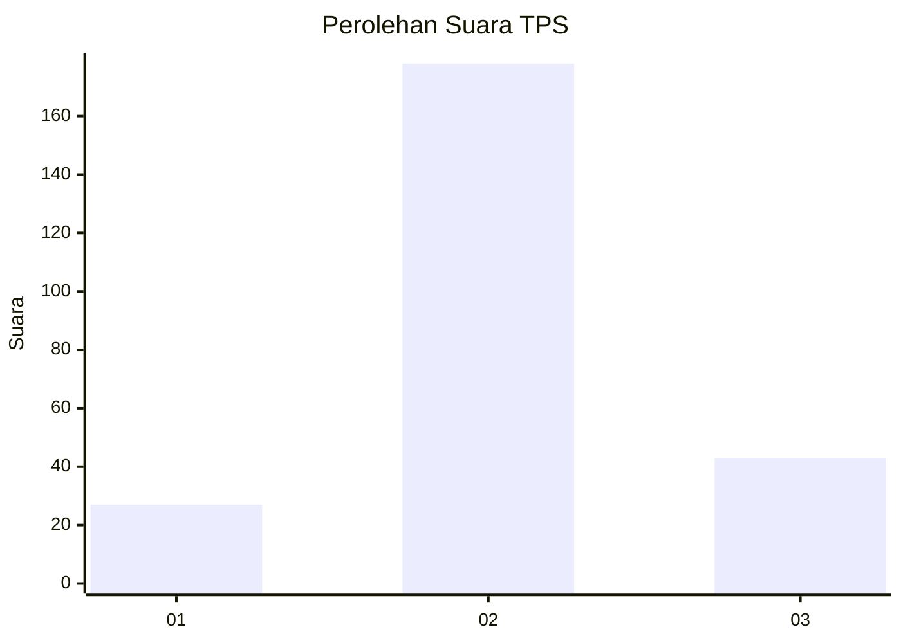
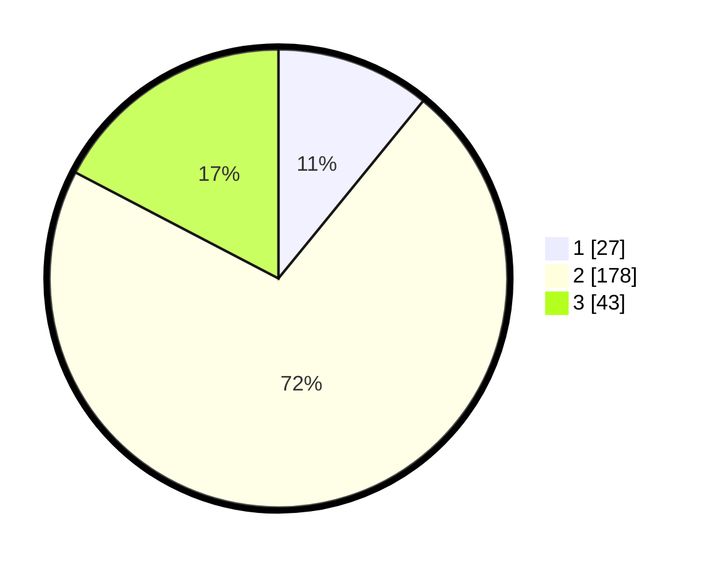

# Hasil

## Grafik

## Tabel

| No. | Nama Paslon    | Suara | Suara (raw) | Persentase |
|:--- |:-------------- | -----:| -----------:| ----------:|
| 1   | ANIES MUHAIMIN | 27    | [27][p-1]   | 10,89      |
| 2   | PRABOWO GIBRAN | 178   | [178][p-2]  | 71,77      |
| 3   | GANJAR MAHFUD  | 43    | [43][p-3]   | 17,34      |

[p-1]: https://github.com/gigit-pemilu/pemilu-2024/blob/main/pilpres/hitung-suara/sub/35-jawa-timur/sub/07-malang/sub/08-wajak/sub/2010-kidangbang/sub/009-tps/sub/paslon-1.txt
[p-2]: https://github.com/gigit-pemilu/pemilu-2024/blob/main/pilpres/hitung-suara/sub/35-jawa-timur/sub/07-malang/sub/08-wajak/sub/2010-kidangbang/sub/009-tps/sub/paslon-2.txt
[p-3]: https://github.com/gigit-pemilu/pemilu-2024/blob/main/pilpres/hitung-suara/sub/35-jawa-timur/sub/07-malang/sub/08-wajak/sub/2010-kidangbang/sub/009-tps/sub/paslon-3.txt

## Foto C Plano

https://sirekap-obj-formc.kpu.go.id/29f6/pemilu/ppwp/35/07/08/20/10/3507082010009-20240214-235130--493958f2-3759-4264-a543-79e5a941967e.jpg

https://sirekap-obj-formc.kpu.go.id/29f6/pemilu/ppwp/35/07/08/20/10/3507082010009-20240215-000128--2aa9a66c-4d0d-495d-bff1-df7edabea06f.jpg

https://sirekap-obj-formc.kpu.go.id/29f6/pemilu/ppwp/35/07/08/20/10/3507082010009-20240214-235930--50005dca-a194-4574-9206-1002b7dd645d.jpg

## Metadata

| Key        | Value               |
| ---------- | ------------------- |
| Time Stamp | 2024-02-19 06:16:00 |

