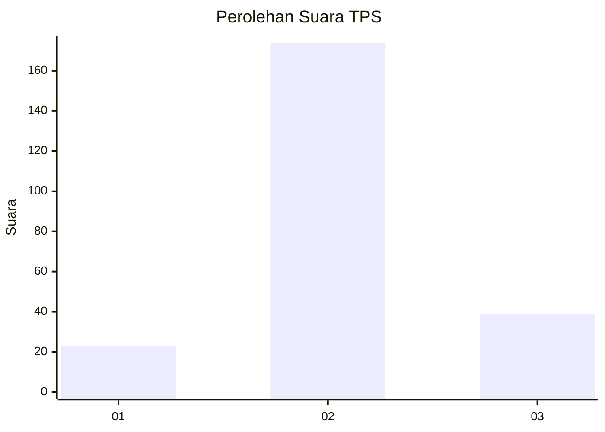
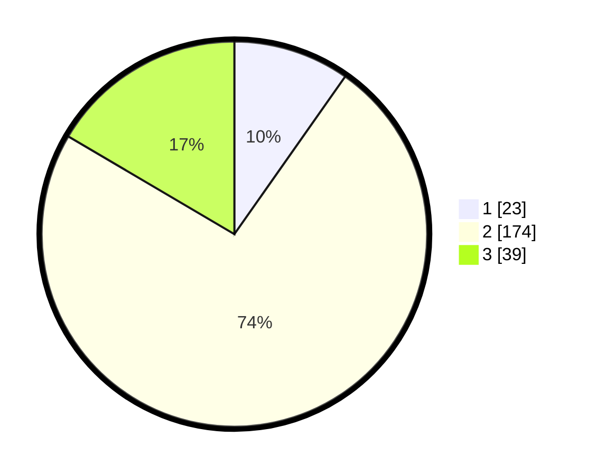

# Hasil

## Grafik

## Tabel

| No. | Nama Paslon    | Suara | Suara (raw) | Persentase |
|:--- |:-------------- | -----:| -----------:| ----------:|
| 1   | ANIES MUHAIMIN | 23    | [23][p-1]   | 9,75       |
| 2   | PRABOWO GIBRAN | 174   | [174][p-2]  | 73,73      |
| 3   | GANJAR MAHFUD  | 39    | [39][p-3]   | 16,53      |

[p-1]: https://github.com/gigit-pemilu/pemilu-2024-35-jawa-timur/blob/main/pilpres/hitung-suara/sub/35-jawa-timur/sub/07-malang/sub/08-wajak/sub/2010-kidangbang/sub/018-tps/sub/paslon-1.txt
[p-2]: https://github.com/gigit-pemilu/pemilu-2024-35-jawa-timur/blob/main/pilpres/hitung-suara/sub/35-jawa-timur/sub/07-malang/sub/08-wajak/sub/2010-kidangbang/sub/018-tps/sub/paslon-2.txt
[p-3]: https://github.com/gigit-pemilu/pemilu-2024-35-jawa-timur/blob/main/pilpres/hitung-suara/sub/35-jawa-timur/sub/07-malang/sub/08-wajak/sub/2010-kidangbang/sub/018-tps/sub/paslon-3.txt

## Foto C Plano

https://sirekap-obj-formc.kpu.go.id/e128/pemilu/ppwp/35/07/08/20/10/3507082010018-20240215-034907--d5f497ce-6b24-4656-93c3-3810859f3329.jpg

https://sirekap-obj-formc.kpu.go.id/e128/pemilu/ppwp/35/07/08/20/10/3507082010018-20240215-034916--6c5834d3-37b5-47f5-9b9b-42847f09e9f8.jpg

https://sirekap-obj-formc.kpu.go.id/e128/pemilu/ppwp/35/07/08/20/10/3507082010018-20240215-034922--f17fcc22-bf27-45ae-baf0-762d202a0b2a.jpg

## Metadata

| Key        | Value               |
| ---------- | ------------------- |
| Time Stamp | 2024-02-15 09:00:24 |

