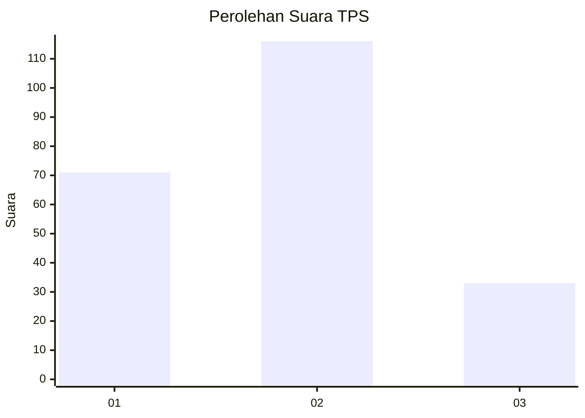
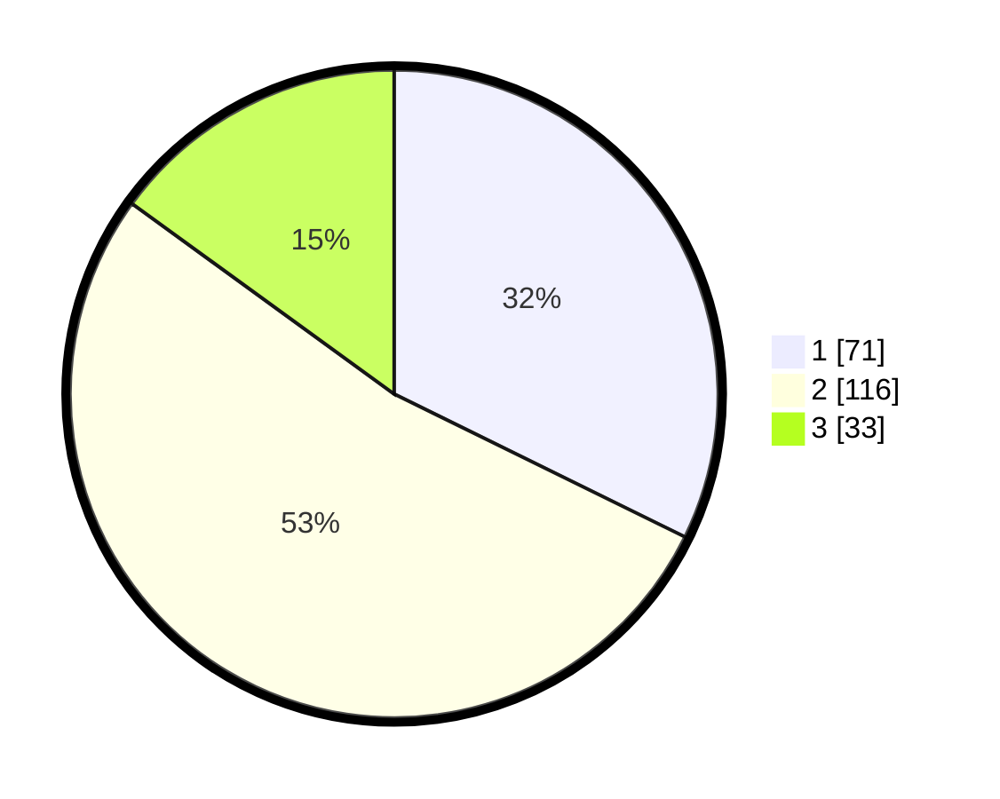

# Hasil

## Grafik

## Tabel

| No. | Nama Paslon    | Suara | Suara (raw) | Persentase |
|:--- |:-------------- | -----:| -----------:| ----------:|
| 1   | ANIES MUHAIMIN | 71    | [71][p-1]   | 32,27      |
| 2   | PRABOWO GIBRAN | 116   | [116][p-2]  | 52,73      |
| 3   | GANJAR MAHFUD  | 33    | [33][p-3]   | 15,00      |

[p-1]: https://github.com/gigit-pemilu/pemilu-2024/blob/main/pilpres/hitung-suara/sub/35-jawa-timur/sub/07-malang/sub/08-wajak/sub/2012-wajak/sub/002-tps/sub/paslon-1.txt
[p-2]: https://github.com/gigit-pemilu/pemilu-2024/blob/main/pilpres/hitung-suara/sub/35-jawa-timur/sub/07-malang/sub/08-wajak/sub/2012-wajak/sub/002-tps/sub/paslon-2.txt
[p-3]: https://github.com/gigit-pemilu/pemilu-2024/blob/main/pilpres/hitung-suara/sub/35-jawa-timur/sub/07-malang/sub/08-wajak/sub/2012-wajak/sub/002-tps/sub/paslon-3.txt

## Foto C Plano

https://sirekap-obj-formc.kpu.go.id/ee69/pemilu/ppwp/35/07/08/20/12/3507082012002-20240219-084039--6935fd32-998e-4453-822c-19b6a90f73b5.jpg

https://sirekap-obj-formc.kpu.go.id/ee69/pemilu/ppwp/35/07/08/20/12/3507082012002-20240219-084136--555c83f4-2fd7-4bab-be2c-9ab3fad64494.jpg

https://sirekap-obj-formc.kpu.go.id/ee69/pemilu/ppwp/35/07/08/20/12/3507082012002-20240219-084626--e0595a23-6ce0-49f2-bb6a-879439093baa.jpg

## Metadata

| Key        | Value               |
| ---------- | ------------------- |
| Time Stamp | 2024-02-25 17:00:00 |

