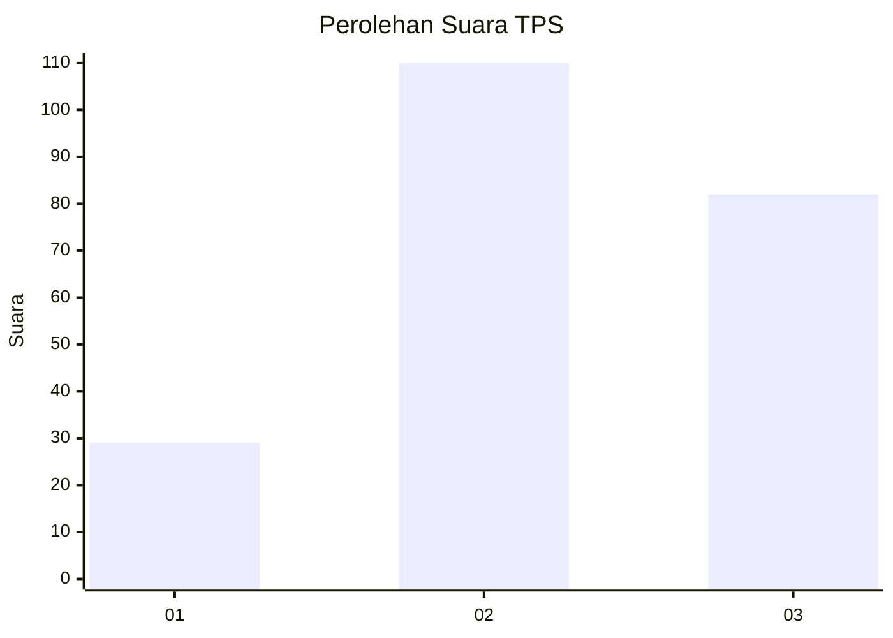
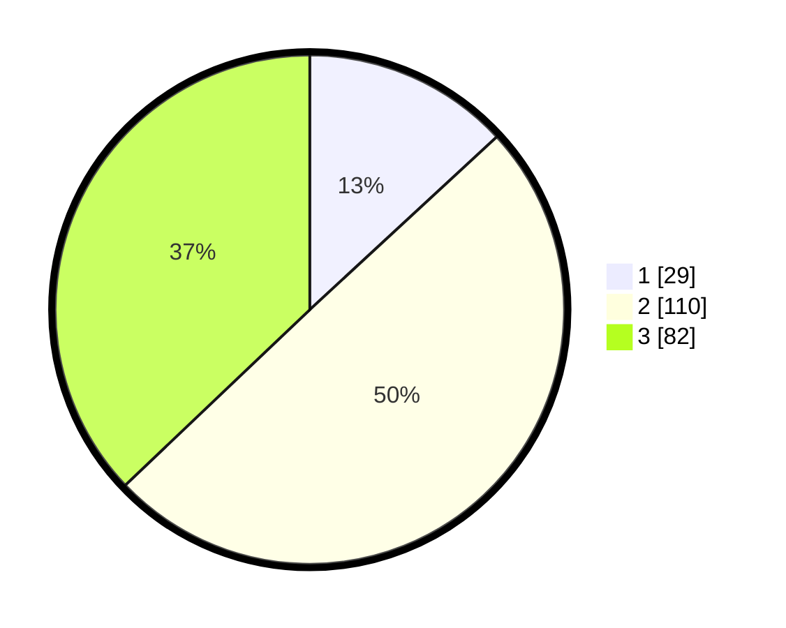

# Hasil

## Grafik

## Tabel

| No. | Nama Paslon    | Suara | Suara (raw) | Persentase |
|:--- |:-------------- | -----:| -----------:| ----------:|
| 1   | ANIES MUHAIMIN | 29    | [29][p-1]   | 13,12      |
| 2   | PRABOWO GIBRAN | 110   | [110][p-2]  | 49,77      |
| 3   | GANJAR MAHFUD  | 82    | [82][p-3]   | 37,10      |

[p-1]: https://github.com/gigit-pemilu/pemilu-2024-35-jawa-timur/blob/main/pilpres/hitung-suara/sub/35-jawa-timur/sub/07-malang/sub/08-wajak/sub/2012-wajak/sub/004-tps/sub/paslon-1.txt
[p-2]: https://github.com/gigit-pemilu/pemilu-2024-35-jawa-timur/blob/main/pilpres/hitung-suara/sub/35-jawa-timur/sub/07-malang/sub/08-wajak/sub/2012-wajak/sub/004-tps/sub/paslon-2.txt
[p-3]: https://github.com/gigit-pemilu/pemilu-2024-35-jawa-timur/blob/main/pilpres/hitung-suara/sub/35-jawa-timur/sub/07-malang/sub/08-wajak/sub/2012-wajak/sub/004-tps/sub/paslon-3.txt

## Foto C Plano

https://sirekap-obj-formc.kpu.go.id/389a/pemilu/ppwp/35/07/08/20/12/3507082012004-20240218-212324--cd751055-f345-468b-a2e2-d093d910bc85.jpg

https://sirekap-obj-formc.kpu.go.id/389a/pemilu/ppwp/35/07/08/20/12/3507082012004-20240218-212436--3b093078-52c9-4335-ae6f-1a51b5e416dd.jpg

https://sirekap-obj-formc.kpu.go.id/389a/pemilu/ppwp/35/07/08/20/12/3507082012004-20240218-212519--9a10b955-93df-48ff-808e-80563145e884.jpg

## Metadata

| Key        | Value               |
| ---------- | ------------------- |
| Time Stamp | 2024-02-24 22:31:28 |

