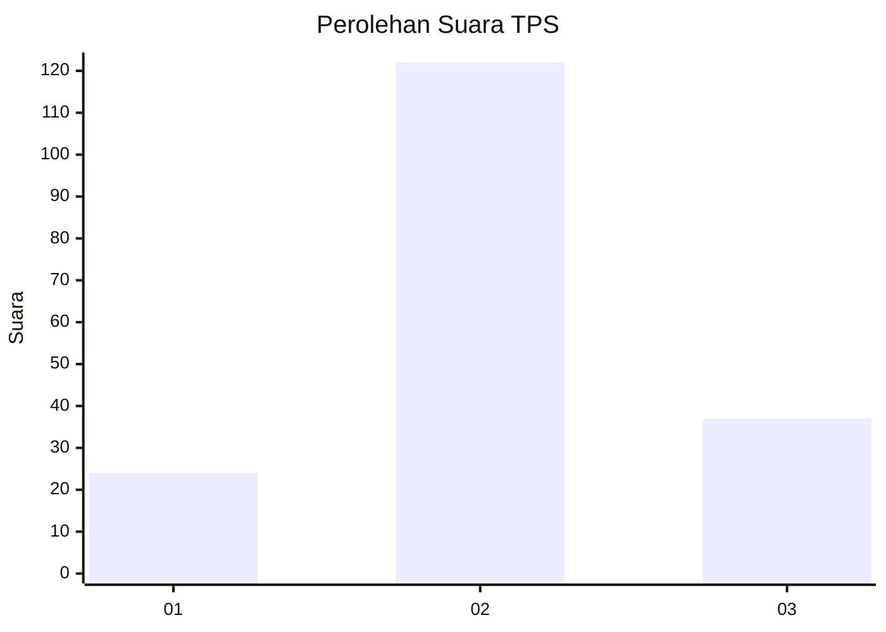
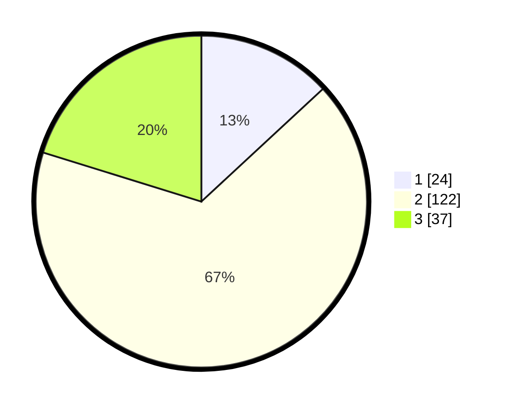

# Hasil

## Grafik

## Tabel

| No. | Nama Paslon    | Suara | Suara (raw) | Persentase |
|:--- |:-------------- | -----:| -----------:| ----------:|
| 1   | ANIES MUHAIMIN | 24    | [24][p-1]   | 13,11      |
| 2   | PRABOWO GIBRAN | 122   | [122][p-2]  | 66,67      |
| 3   | GANJAR MAHFUD  | 37    | [37][p-3]   | 20,22      |

[p-1]: https://github.com/gigit-pemilu/pemilu-2024-35-jawa-timur/blob/main/pilpres/hitung-suara/sub/35-jawa-timur/sub/07-malang/sub/08-wajak/sub/2012-wajak/sub/008-tps/sub/paslon-1.txt
[p-2]: https://github.com/gigit-pemilu/pemilu-2024-35-jawa-timur/blob/main/pilpres/hitung-suara/sub/35-jawa-timur/sub/07-malang/sub/08-wajak/sub/2012-wajak/sub/008-tps/sub/paslon-2.txt
[p-3]: https://github.com/gigit-pemilu/pemilu-2024-35-jawa-timur/blob/main/pilpres/hitung-suara/sub/35-jawa-timur/sub/07-malang/sub/08-wajak/sub/2012-wajak/sub/008-tps/sub/paslon-3.txt

## Foto C Plano

https://sirekap-obj-formc.kpu.go.id/02e5/pemilu/ppwp/35/07/08/20/12/3507082012008-20240218-202644--a909d365-7275-4a67-a8e1-08f9d15bf328.jpg

https://sirekap-obj-formc.kpu.go.id/02e5/pemilu/ppwp/35/07/08/20/12/3507082012008-20240218-201510--25cda2a0-76b4-4d28-ab03-9f42aab71321.jpg

https://sirekap-obj-formc.kpu.go.id/02e5/pemilu/ppwp/35/07/08/20/12/3507082012008-20240218-201657--1b4146e7-302c-426a-8b8d-71ed52f029b6.jpg

## Metadata

| Key        | Value               |
| ---------- | ------------------- |
| Time Stamp | 2024-02-25 11:00:00 |

