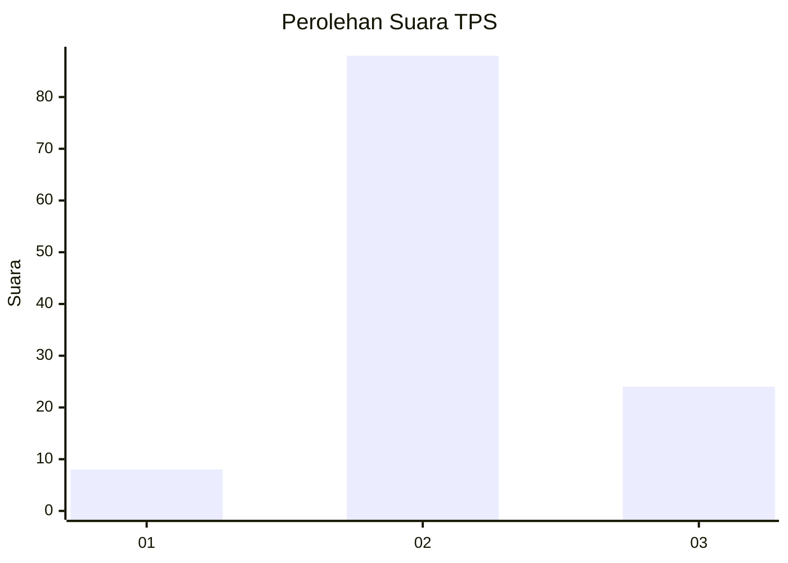

# Hasil

## Grafik

## Tabel

| No. | Nama Paslon    | Suara | Suara (raw) | Persentase |
|:--- |:-------------- | -----:| -----------:| ----------:|
| 1   | ANIES MUHAIMIN | 8     | [8][p-1]    | 6,67       |
| 2   | PRABOWO GIBRAN | 88    | [88][p-2]   | 73,33      |
| 3   | GANJAR MAHFUD  | 24    | [24][p-3]   | 20,00      |

[p-1]: https://github.com/gigit-pemilu/pemilu-2024-35-jawa-timur/blob/main/pilpres/hitung-suara/sub/35-jawa-timur/sub/07-malang/sub/08-wajak/sub/2012-wajak/sub/013-tps/sub/paslon-1.txt
[p-2]: https://github.com/gigit-pemilu/pemilu-2024-35-jawa-timur/blob/main/pilpres/hitung-suara/sub/35-jawa-timur/sub/07-malang/sub/08-wajak/sub/2012-wajak/sub/013-tps/sub/paslon-2.txt
[p-3]: https://github.com/gigit-pemilu/pemilu-2024-35-jawa-timur/blob/main/pilpres/hitung-suara/sub/35-jawa-timur/sub/07-malang/sub/08-wajak/sub/2012-wajak/sub/013-tps/sub/paslon-3.txt

## Foto C Plano

https://sirekap-obj-formc.kpu.go.id/4ca0/pemilu/ppwp/35/07/08/20/12/3507082012013-20240218-201655--17d28a32-8610-459e-9cb5-19a7ee7c87ee.jpg

https://sirekap-obj-formc.kpu.go.id/4ca0/pemilu/ppwp/35/07/08/20/12/3507082012013-20240218-201804--8a0be63c-76bc-4c78-a003-5aec241f3bd8.jpg

https://sirekap-obj-formc.kpu.go.id/4ca0/pemilu/ppwp/35/07/08/20/12/3507082012013-20240218-201857--c95d7a30-8386-4b4c-a29b-e05b48b0f966.jpg

## Metadata

| Key        | Value               |
| ---------- | ------------------- |
| Time Stamp | 2024-02-25 11:00:00 |

