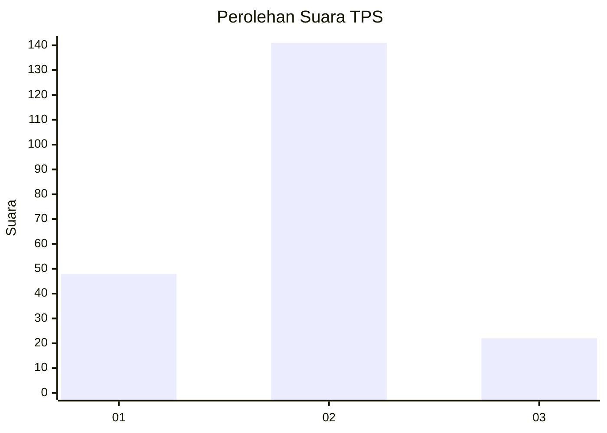

# Hasil

## Grafik

## Tabel

| No. | Nama Paslon    | Suara | Suara (raw) | Persentase |
|:--- |:-------------- | -----:| -----------:| ----------:|
| 1   | ANIES MUHAIMIN | 48    | [48][p-1]   | 22,75      |
| 2   | PRABOWO GIBRAN | 141   | [141][p-2]  | 66,82      |
| 3   | GANJAR MAHFUD  | 22    | [22][p-3]   | 10,43      |

[p-1]: https://github.com/gigit-pemilu/pemilu-2024/blob/main/pilpres/hitung-suara/sub/35-jawa-timur/sub/07-malang/sub/08-wajak/sub/2012-wajak/sub/015-tps/sub/paslon-1.txt
[p-2]: https://github.com/gigit-pemilu/pemilu-2024/blob/main/pilpres/hitung-suara/sub/35-jawa-timur/sub/07-malang/sub/08-wajak/sub/2012-wajak/sub/015-tps/sub/paslon-2.txt
[p-3]: https://github.com/gigit-pemilu/pemilu-2024/blob/main/pilpres/hitung-suara/sub/35-jawa-timur/sub/07-malang/sub/08-wajak/sub/2012-wajak/sub/015-tps/sub/paslon-3.txt

## Foto C Plano

https://sirekap-obj-formc.kpu.go.id/0b73/pemilu/ppwp/35/07/08/20/12/3507082012015-20240218-201720--4111237c-8411-4ab5-a371-f39b0d7a7948.jpg

https://sirekap-obj-formc.kpu.go.id/0b73/pemilu/ppwp/35/07/08/20/12/3507082012015-20240218-201929--f5ae3899-86ba-4334-a69d-df07d31e0df5.jpg

https://sirekap-obj-formc.kpu.go.id/0b73/pemilu/ppwp/35/07/08/20/12/3507082012015-20240218-202051--cb6a862f-9cfe-46fd-8d0e-870384013ac2.jpg

## Metadata

| Key        | Value               |
| ---------- | ------------------- |
| Time Stamp | 2024-02-24 22:31:28 |

