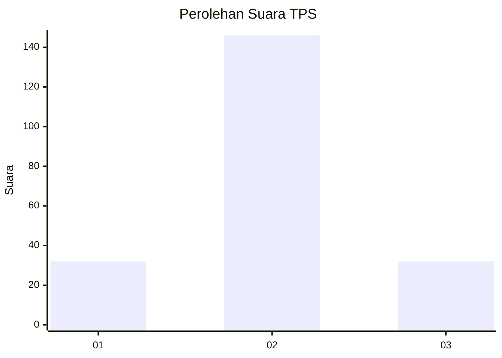

# Hasil

## Grafik

## Tabel

| No. | Nama Paslon    | Suara | Suara (raw) | Persentase |
|:--- |:-------------- | -----:| -----------:| ----------:|
| 1   | ANIES MUHAIMIN | 32    | [32][p-1]   | 15,24      |
| 2   | PRABOWO GIBRAN | 146   | [146][p-2]  | 69,52      |
| 3   | GANJAR MAHFUD  | 32    | [32][p-3]   | 15,24      |

[p-1]: https://github.com/gigit-pemilu/pemilu-2024/blob/main/pilpres/hitung-suara/sub/35-jawa-timur/sub/07-malang/sub/08-wajak/sub/2012-wajak/sub/029-tps/sub/paslon-1.txt
[p-2]: https://github.com/gigit-pemilu/pemilu-2024/blob/main/pilpres/hitung-suara/sub/35-jawa-timur/sub/07-malang/sub/08-wajak/sub/2012-wajak/sub/029-tps/sub/paslon-2.txt
[p-3]: https://github.com/gigit-pemilu/pemilu-2024/blob/main/pilpres/hitung-suara/sub/35-jawa-timur/sub/07-malang/sub/08-wajak/sub/2012-wajak/sub/029-tps/sub/paslon-3.txt

## Foto C Plano

https://sirekap-obj-formc.kpu.go.id/96c2/pemilu/ppwp/35/07/08/20/12/3507082012029-20240218-220707--efaf1a1e-0ef3-4d1f-ba43-6a6b60e9e7b8.jpg

https://sirekap-obj-formc.kpu.go.id/96c2/pemilu/ppwp/35/07/08/20/12/3507082012029-20240218-220937--5e554bec-a6bc-466f-92e3-917e468f80e3.jpg

https://sirekap-obj-formc.kpu.go.id/96c2/pemilu/ppwp/35/07/08/20/12/3507082012029-20240218-221341--b310ac73-1ef6-44c6-bbc7-069504f00785.jpg

## Metadata

| Key        | Value               |
| ---------- | ------------------- |
| Time Stamp | 2024-02-25 18:00:00 |

