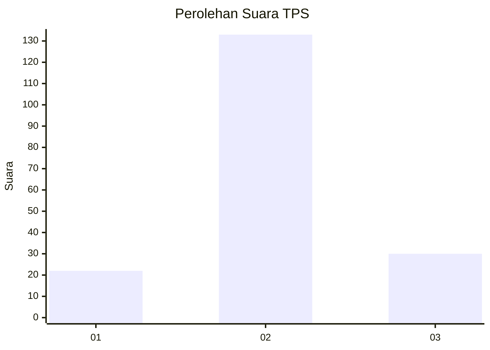
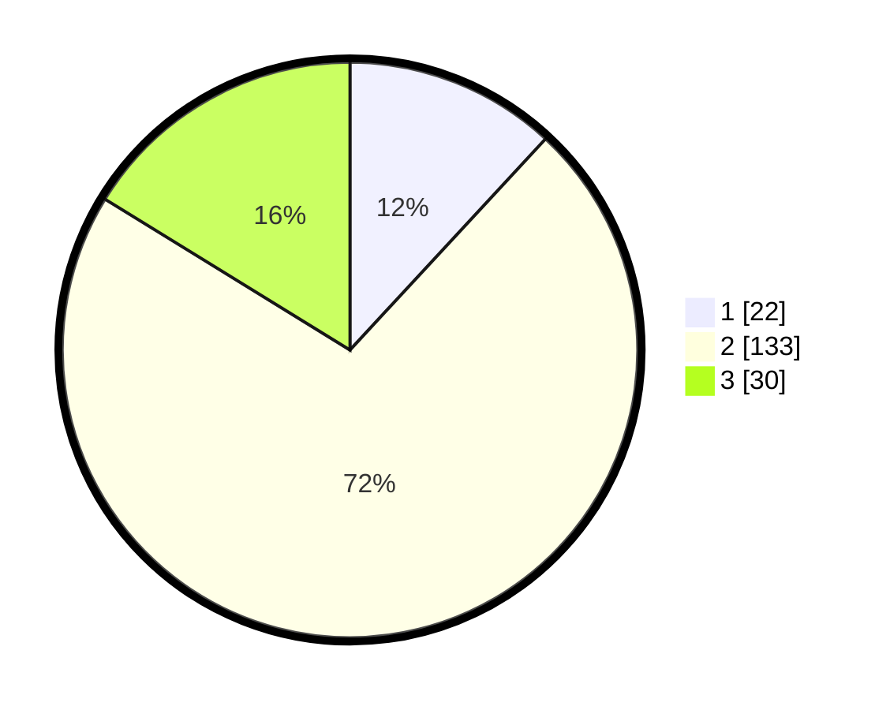

# Hasil

## Grafik

## Tabel

| No. | Nama Paslon    | Suara | Suara (raw) | Persentase |
|:--- |:-------------- | -----:| -----------:| ----------:|
| 1   | ANIES MUHAIMIN | 22    | [22][p-1]   | 11,89      |
| 2   | PRABOWO GIBRAN | 133   | [133][p-2]  | 71,89      |
| 3   | GANJAR MAHFUD  | 30    | [30][p-3]   | 16,22      |

[p-1]: https://github.com/gigit-pemilu/pemilu-2024/blob/main/pilpres/hitung-suara/sub/35-jawa-timur/sub/07-malang/sub/08-wajak/sub/2012-wajak/sub/038-tps/sub/paslon-1.txt
[p-2]: https://github.com/gigit-pemilu/pemilu-2024/blob/main/pilpres/hitung-suara/sub/35-jawa-timur/sub/07-malang/sub/08-wajak/sub/2012-wajak/sub/038-tps/sub/paslon-2.txt
[p-3]: https://github.com/gigit-pemilu/pemilu-2024/blob/main/pilpres/hitung-suara/sub/35-jawa-timur/sub/07-malang/sub/08-wajak/sub/2012-wajak/sub/038-tps/sub/paslon-3.txt

## Foto C Plano

https://sirekap-obj-formc.kpu.go.id/d0ac/pemilu/ppwp/35/07/08/20/12/3507082012038-20240218-203815--2de67157-a4d6-42ae-a9a9-cd6a9c9c2675.jpg

https://sirekap-obj-formc.kpu.go.id/d0ac/pemilu/ppwp/35/07/08/20/12/3507082012038-20240218-203937--e6fd09a2-6b2a-4c5f-8d0a-36101f607a1b.jpg

https://sirekap-obj-formc.kpu.go.id/d0ac/pemilu/ppwp/35/07/08/20/12/3507082012038-20240218-204109--0962c645-3193-44e9-9235-ed97392bae3e.jpg

## Metadata

| Key        | Value               |
| ---------- | ------------------- |
| Time Stamp | 2024-02-25 15:00:00 |

