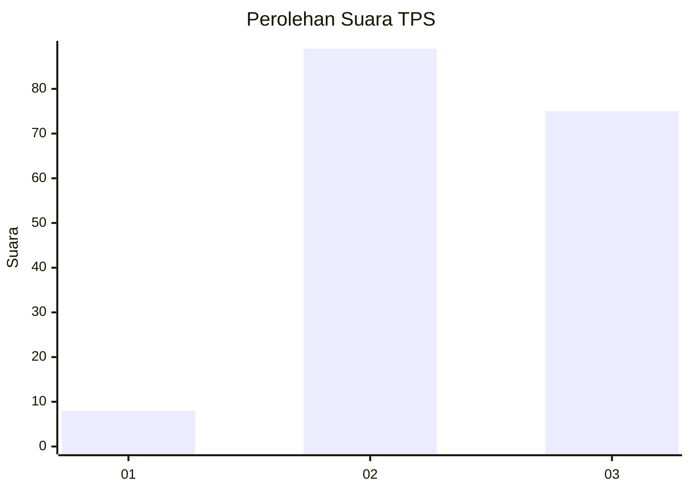
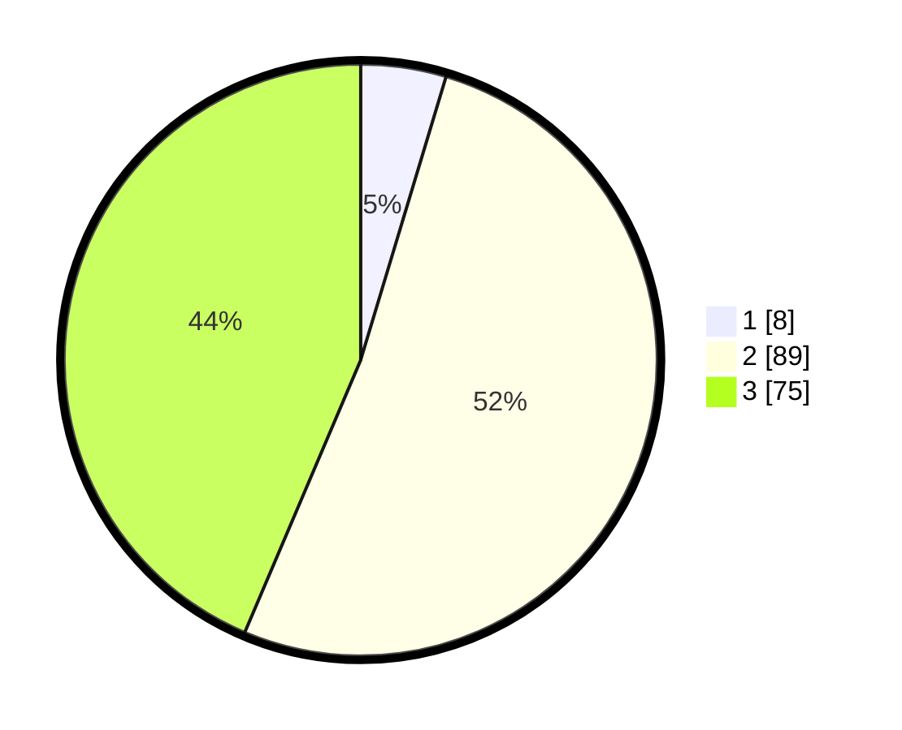

# Hasil

## Grafik

## Tabel

| No. | Nama Paslon    | Suara | Suara (raw) | Persentase |
|:--- |:-------------- | -----:| -----------:| ----------:|
| 1   | ANIES MUHAIMIN | 8     | [8][p-1]    | 4,65       |
| 2   | PRABOWO GIBRAN | 89    | [89][p-2]   | 51,74      |
| 3   | GANJAR MAHFUD  | 75    | [75][p-3]   | 43,60      |

[p-1]: https://github.com/gigit-pemilu/pemilu-2024-35-jawa-timur/blob/main/pilpres/hitung-suara/sub/35-jawa-timur/sub/07-malang/sub/08-wajak/sub/2012-wajak/sub/039-tps/sub/paslon-1.txt
[p-2]: https://github.com/gigit-pemilu/pemilu-2024-35-jawa-timur/blob/main/pilpres/hitung-suara/sub/35-jawa-timur/sub/07-malang/sub/08-wajak/sub/2012-wajak/sub/039-tps/sub/paslon-2.txt
[p-3]: https://github.com/gigit-pemilu/pemilu-2024-35-jawa-timur/blob/main/pilpres/hitung-suara/sub/35-jawa-timur/sub/07-malang/sub/08-wajak/sub/2012-wajak/sub/039-tps/sub/paslon-3.txt

## Foto C Plano

https://sirekap-obj-formc.kpu.go.id/2d74/pemilu/ppwp/35/07/08/20/12/3507082012039-20240218-201601--a822dc08-6f2e-4f43-af45-a464be051a74.jpg

https://sirekap-obj-formc.kpu.go.id/2d74/pemilu/ppwp/35/07/08/20/12/3507082012039-20240218-201718--ecab4a3c-64ca-4935-8bb2-54a6d89a26b3.jpg

https://sirekap-obj-formc.kpu.go.id/2d74/pemilu/ppwp/35/07/08/20/12/3507082012039-20240218-202000--5b2c536d-07c6-4b95-8e1f-74d60e36c056.jpg

## Metadata

| Key        | Value               |
| ---------- | ------------------- |
| Time Stamp | 2024-02-24 22:31:28 |

