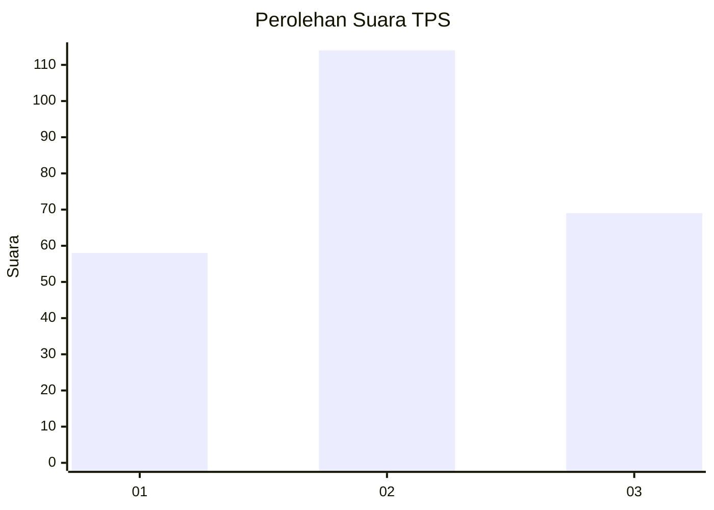
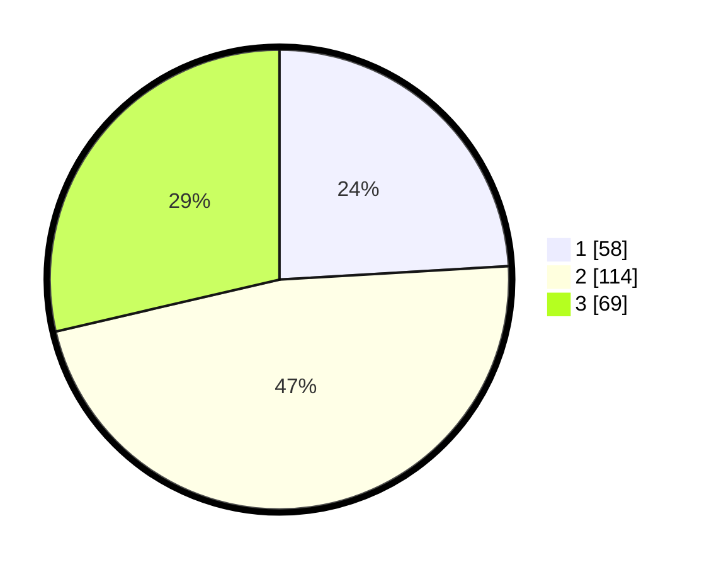

# Hasil

## Grafik

## Tabel

| No. | Nama Paslon    | Suara | Suara (raw) | Persentase |
|:--- |:-------------- | -----:| -----------:| ----------:|
| 1   | ANIES MUHAIMIN | 58    | [58][p-1]   | 24,07      |
| 2   | PRABOWO GIBRAN | 114   | [114][p-2]  | 47,30      |
| 3   | GANJAR MAHFUD  | 69    | [69][p-3]   | 28,63      |

[p-1]: https://github.com/gigit-pemilu/pemilu-2024-35-jawa-timur/blob/main/pilpres/hitung-suara/sub/35-jawa-timur/sub/07-malang/sub/08-wajak/sub/2013-ngembal/sub/001-tps/sub/paslon-1.txt
[p-2]: https://github.com/gigit-pemilu/pemilu-2024-35-jawa-timur/blob/main/pilpres/hitung-suara/sub/35-jawa-timur/sub/07-malang/sub/08-wajak/sub/2013-ngembal/sub/001-tps/sub/paslon-2.txt
[p-3]: https://github.com/gigit-pemilu/pemilu-2024-35-jawa-timur/blob/main/pilpres/hitung-suara/sub/35-jawa-timur/sub/07-malang/sub/08-wajak/sub/2013-ngembal/sub/001-tps/sub/paslon-3.txt

## Foto C Plano

https://sirekap-obj-formc.kpu.go.id/88b9/pemilu/ppwp/35/07/08/20/13/3507082013001-20240218-202324--6ab36397-f8b3-4039-abac-523b1c3ab06d.jpg

https://sirekap-obj-formc.kpu.go.id/88b9/pemilu/ppwp/35/07/08/20/13/3507082013001-20240218-202540--3e6dcd64-5519-485a-be73-12b319e658a7.jpg

https://sirekap-obj-formc.kpu.go.id/88b9/pemilu/ppwp/35/07/08/20/13/3507082013001-20240218-202821--26992782-bf56-42c4-b75d-ee0d3b870909.jpg

## Metadata

| Key        | Value               |
| ---------- | ------------------- |
| Time Stamp | 2024-02-24 22:31:28 |

