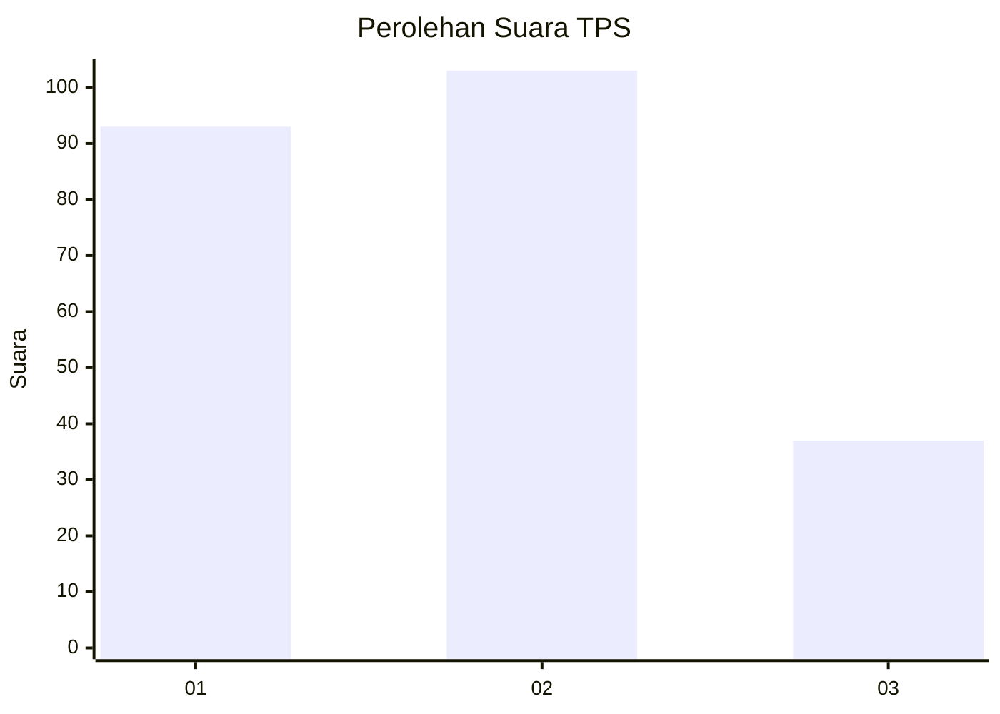
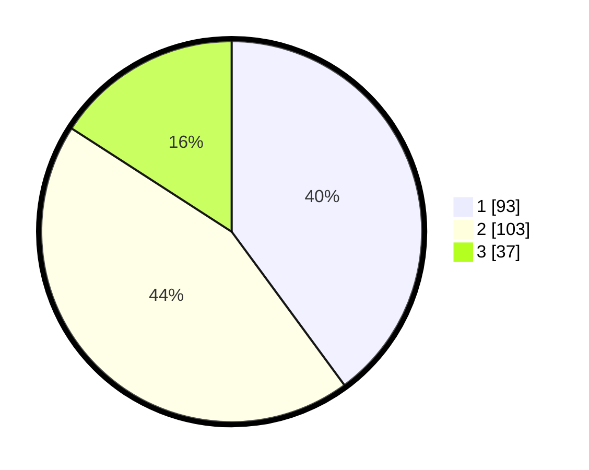

# Hasil

## Grafik

## Tabel

| No. | Nama Paslon    | Suara | Suara (raw) | Persentase |
|:--- |:-------------- | -----:| -----------:| ----------:|
| 1   | ANIES MUHAIMIN | 93    | [93][p-1]   | 39,91      |
| 2   | PRABOWO GIBRAN | 103   | [103][p-2]  | 44,21      |
| 3   | GANJAR MAHFUD  | 37    | [37][p-3]   | 15,88      |

[p-1]: https://github.com/gigit-pemilu/pemilu-2024/blob/main/pilpres/hitung-suara/sub/35-jawa-timur/sub/07-malang/sub/08-wajak/sub/2013-ngembal/sub/002-tps/sub/paslon-1.txt
[p-2]: https://github.com/gigit-pemilu/pemilu-2024/blob/main/pilpres/hitung-suara/sub/35-jawa-timur/sub/07-malang/sub/08-wajak/sub/2013-ngembal/sub/002-tps/sub/paslon-2.txt
[p-3]: https://github.com/gigit-pemilu/pemilu-2024/blob/main/pilpres/hitung-suara/sub/35-jawa-timur/sub/07-malang/sub/08-wajak/sub/2013-ngembal/sub/002-tps/sub/paslon-3.txt

## Foto C Plano

https://sirekap-obj-formc.kpu.go.id/00e6/pemilu/ppwp/35/07/08/20/13/3507082013002-20240218-204308--20a3eabe-326f-4b0e-94ec-01a4b186766d.jpg

https://sirekap-obj-formc.kpu.go.id/00e6/pemilu/ppwp/35/07/08/20/13/3507082013002-20240218-205027--bf192cff-0e91-4a45-901f-9404baf46698.jpg

https://sirekap-obj-formc.kpu.go.id/00e6/pemilu/ppwp/35/07/08/20/13/3507082013002-20240218-210027--b0e7e217-88d6-4b8e-9c49-fc1eba9da70e.jpg

## Metadata

| Key        | Value               |
| ---------- | ------------------- |
| Time Stamp | 2024-02-24 22:31:28 |

