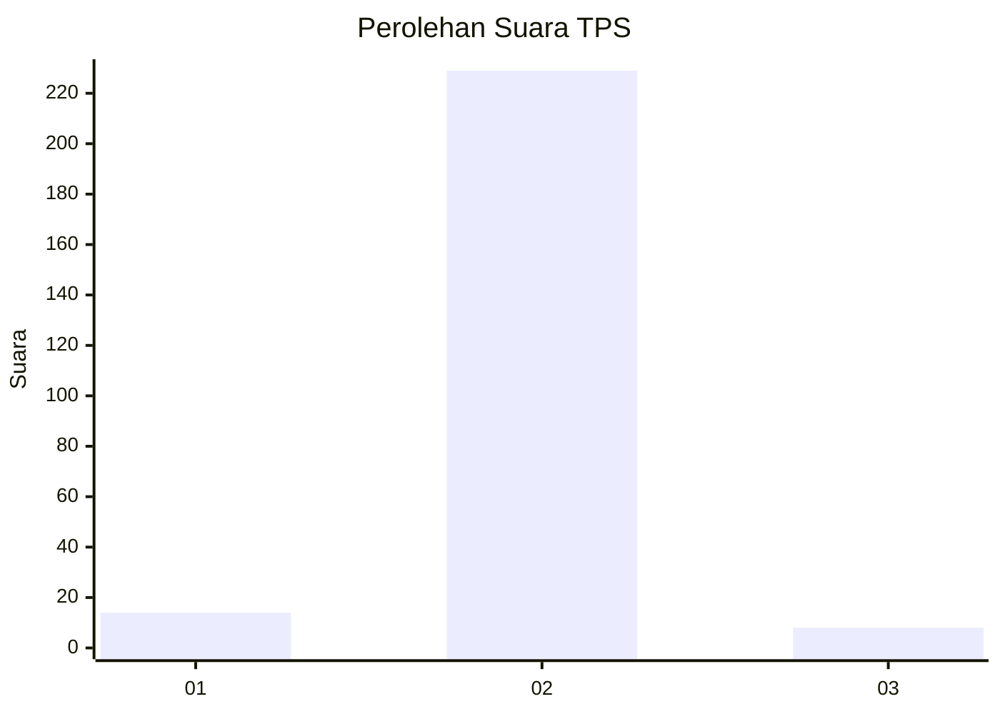
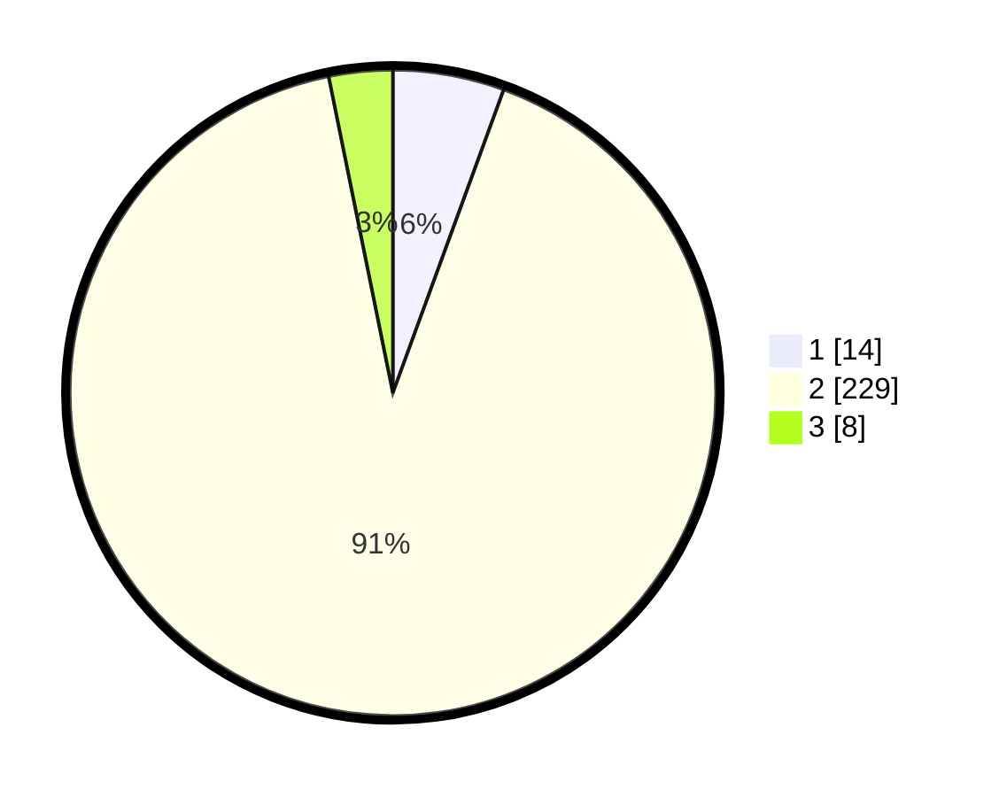

# Hasil

## Grafik

## Tabel

| No. | Nama Paslon    | Suara | Suara (raw) | Persentase |
|:--- |:-------------- | -----:| -----------:| ----------:|
| 1   | ANIES MUHAIMIN | 14    | [14][p-1]   | 5,58       |
| 2   | PRABOWO GIBRAN | 229   | [229][p-2]  | 91,24      |
| 3   | GANJAR MAHFUD  | 8     | [8][p-3]    | 3,19       |

[p-1]: https://github.com/gigit-pemilu/pemilu-2024/blob/main/pilpres/hitung-suara/sub/35-jawa-timur/sub/07-malang/sub/08-wajak/sub/2013-ngembal/sub/004-tps/sub/paslon-1.txt
[p-2]: https://github.com/gigit-pemilu/pemilu-2024/blob/main/pilpres/hitung-suara/sub/35-jawa-timur/sub/07-malang/sub/08-wajak/sub/2013-ngembal/sub/004-tps/sub/paslon-2.txt
[p-3]: https://github.com/gigit-pemilu/pemilu-2024/blob/main/pilpres/hitung-suara/sub/35-jawa-timur/sub/07-malang/sub/08-wajak/sub/2013-ngembal/sub/004-tps/sub/paslon-3.txt

## Foto C Plano

https://sirekap-obj-formc.kpu.go.id/1022/pemilu/ppwp/35/07/08/20/13/3507082013004-20240218-203535--f66c3681-a27d-4666-b92f-ef89aa09f9a1.jpg

https://sirekap-obj-formc.kpu.go.id/1022/pemilu/ppwp/35/07/08/20/13/3507082013004-20240218-215125--0a880b6b-b796-47df-825d-d1794565d563.jpg

https://sirekap-obj-formc.kpu.go.id/1022/pemilu/ppwp/35/07/08/20/13/3507082013004-20240218-221128--9c5ef2ca-f449-45d4-9f05-867f9a509a36.jpg

## Metadata

| Key        | Value               |
| ---------- | ------------------- |
| Time Stamp | 2024-02-24 22:31:28 |

