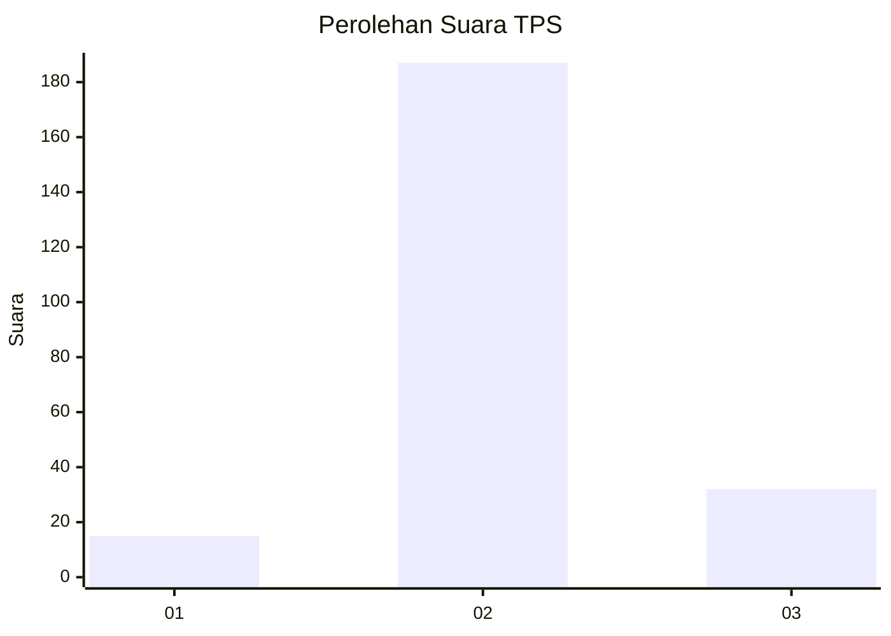
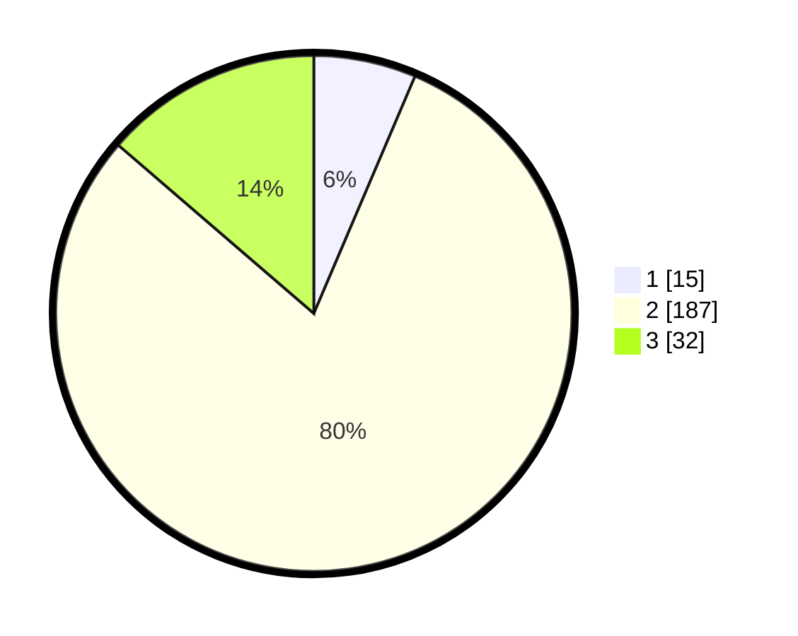

# Hasil

## Grafik

## Tabel

| No. | Nama Paslon    | Suara | Suara (raw) | Persentase |
|:--- |:-------------- | -----:| -----------:| ----------:|
| 1   | ANIES MUHAIMIN | 15    | [15][p-1]   | 6,41       |
| 2   | PRABOWO GIBRAN | 187   | [187][p-2]  | 79,91      |
| 3   | GANJAR MAHFUD  | 32    | [32][p-3]   | 13,68      |

[p-1]: https://github.com/gigit-pemilu/pemilu-2024-35-jawa-timur/blob/main/pilpres/hitung-suara/sub/35-jawa-timur/sub/07-malang/sub/08-wajak/sub/2013-ngembal/sub/007-tps/sub/paslon-1.txt
[p-2]: https://github.com/gigit-pemilu/pemilu-2024-35-jawa-timur/blob/main/pilpres/hitung-suara/sub/35-jawa-timur/sub/07-malang/sub/08-wajak/sub/2013-ngembal/sub/007-tps/sub/paslon-2.txt
[p-3]: https://github.com/gigit-pemilu/pemilu-2024-35-jawa-timur/blob/main/pilpres/hitung-suara/sub/35-jawa-timur/sub/07-malang/sub/08-wajak/sub/2013-ngembal/sub/007-tps/sub/paslon-3.txt

## Foto C Plano

https://sirekap-obj-formc.kpu.go.id/0212/pemilu/ppwp/35/07/08/20/13/3507082013007-20240218-230257--84f2d94a-373c-4f69-8a9b-fe6b12971e0a.jpg

https://sirekap-obj-formc.kpu.go.id/0212/pemilu/ppwp/35/07/08/20/13/3507082013007-20240218-221147--2e31220a-1ac6-45bb-8056-9cf3ad6c31ad.jpg

https://sirekap-obj-formc.kpu.go.id/0212/pemilu/ppwp/35/07/08/20/13/3507082013007-20240218-221159--7055be12-f8ce-44a3-af61-e5b3542cf5e0.jpg

## Metadata

| Key        | Value               |
| ---------- | ------------------- |
| Time Stamp | 2024-02-25 12:00:00 |

